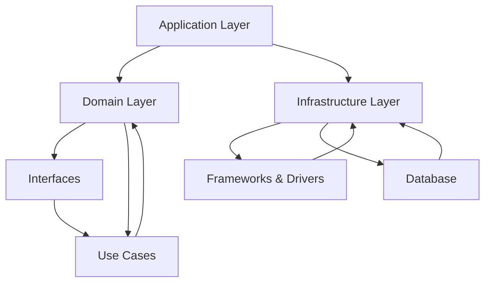

# copilot-software-architecture-demo

Este repositorio contiene el proyecto de demostración de las características y funcionalidades de GitHub Copilot aplicadas al desarrollo de arquitectura de software. Utilizando la herramienta GitHub Copilot Chat, se construyen una serie de documentos y lineamientos que permiten desarrollar un sistema de software desde cero.

El objetivo de este práctico de demostración es mostrar cómo utilizar GitHub Copilot para generar diagramas de caso de uso, de secuencia y de clases, así como construir una estructura base empleando la arquitectura hexagonal. Estas herramientas y enfoques permiten visualizar y diseñar eficientemente el sistema de software, facilitando la comunicación y colaboración entre los miembros del equipo de desarrollo. Además, GitHub Copilot agiliza el proceso de escritura de código al proporcionar sugerencias y completar automáticamente fragmentos de código, lo que aumenta la productividad y reduce los errores. Este práctico está orientado a ingenieros de sistemas con experiencia en arquitectura de software.

## Requisitos

- Visual Studio Code.
- [Extensión de diagramas PlantUML](https://marketplace.visualstudio.com/items?itemName=jebbs.plantuml#:~:text=Features.%20Preview%20Diagram,%20Press%20Alt%20+%20D%20to%20start%20PlantUML)
- [Extensión de diagramas Mermaid](https://marketplace.visualstudio.com/items?itemName=bierner.markdown-mermaid)
  
## Paso 1. Definiendo el contexto. 

Para las tareas de arquitectura, es importante proporcionar el contexto de lo que necesitamos que Copilot haga por nosotros, para ello es recomendable que se construyan prompts en donde indiquemos el tipo de usuario que hace uso de la herramienta, así como una explicación detallada y el rol que tomará Copilot para definir y construir la arquitectura de la aplicación que realizaremos.

Trabajaremos sobre los siguientes prompts base:

### Contexto base del usuario

Se define un contexto base, que le indique a GitHub Copilot el tipo de usuario que lo utiliza, su rol y una serie de tareas que se necesitan completar. De forma que GitHub Copilot ajuste el nivel de conocimiento, el área del conocimiento y los tipos de respuesta que serán devueltos.

> 💡 **Tip**
>
> Finalizar los prompts con una pregunta, es una buena práctica para que el modelo de lenguaje natural permanezca abierto a nuevos prompts, de forma que se establece una interacción humano-máquina más fluida y precisa.

**Prompt 1.**

`
¡Hola! Mi nombre es Pablo, soy Ingeniero de Software y tengo el rol de Arquitecto de Software en mi equipo. Quiero que me ayudes con algunas tareas relacionadas con la arquitectura y el diseño de software. ¿Eres capaz de hacer eso? Sé que puedes escribir código, así que estaba pensando que podrías ayudarme a crear documentación de un proyecto usando archivos markdown y también creando diagramas usando código con herramientas como Mermaid o PlantUML. Además, quiero generar estructuras de código con una arquitectura llamada "Arquitectura Hexagonal", no he definido qué lenguaje de programación vamos a usar pero probablemente será un lenguaje orientado a objetos. Los diagramas que tengo en mente son diagramas de casos de uso, diagramas de secuencia, diagramas de clases y tal vez un diagrama de relación de entidades. Probablemente necesitaré un par de diagramas UML más, pero estoy bien con los actuales. ¿Podrías ayudarme con esto? ¿Puedes ayudarme con estas tareas si te proporciono un contexto?
`

_Respuesta de Copilot_

```
Sí, puedo ayudarte con estas tareas. Por favor proporciona el contexto o los requisitos específicos para la documentación, diagramas o estructuras de código con los que necesitas ayuda.
```

Nótese, que Copilot queda abierto y disponible para completar solicitudes posteriores, esto es lo que se quiere lograr al proporcionar el contexto base.

### Contexto base de la problemática a resolver

Se define el contexto del software/módulo/sistema/aplicación que se requiera desarrollar, con el objetivo de proporcionar a Copilot la información necesaria para que nos ayude a generar la documentación correspondiente. En este punto es muy importante, tratar de proporcionar el mayor detalle posible, por lo que mientras más características, reglas de negocio y restricciones indiquemos, más eficientes serán las sugerencias que nos responda el modelo de lenguaje natural sobre el que funciona GitHub Copilot.

**Prompt 2.**

- [Prompt en Español](./context-prompt-es.md)
- [Prompt en Inglés](./context-prompt.md)

Al proporcionar todo el contexto de lo que el negocio nos ha indicado, GitHub Copilot nos debe responder algo como lo siguiente, indicando que tiene completo contexto de lo proporcionado.

_Respuesta de GitHub Copilot:_

`
Entendido. He procesado la información que proporcionaste. Los requisitos y reglas de negocio son claros, y entiendo los diferentes módulos que deben implementarse en la aplicación web. Por favor, procede con tus prompts subsecuentes, y te asistiré en consecuencia con la generación de los diagramas y documentación necesarios.
`

## Paso 2. Identificación de los actores y elementos del sistema.

### Identificación de los actores del sistema

En este punto identificaremos los actores dentro de la aplicación web, entendiendo que los actores son las diferentes entidades que interactúan entre sí dentro de un sistema y que se rigen por las reglas de negocio y restricciones del mismo.

> 🤓 Aclaratoria de sistema
>
> Siguiendo la definición formal de un sistema, como todo conjunto de elementos interrelacionados e interdependientes que funcionan en conjunto para lograr un objetivo común. Bajo esta premisa, una aplicación web es un sistema que entra bajo el paradigma de sistemas informáticos, por lo que nos referiremos a partir de este punto como "sistema" en lugar de "aplicación"

Le pediremos a Copilot que identifique a los actores mediante un prompt y que genere documentación sobre los mismos.

**Prompt 3.**

`
Dame una lista de los actores del sistema.
`
_Respuesta de Copilot:_

```md
**Usuario Registrado**
- Puede crear eventos.
- Puede ser invitado a eventos.
- Puede ver eventos a los que está invitado.
- Puede gestionar la información de su cuenta.
- Puede eliminar su cuenta (con restricciones).

**Usuario Organizador**
- Un tipo de usuario registrado que crea eventos.
- Puede modificar o eliminar sus propios eventos.
- Puede ver una lista de todos los asistentes a sus eventos.

**Usuario Asistente**
- Un tipo de usuario registrado que es invitado a eventos.
- Puede ver información básica sobre los eventos a los que está invitado.
- Puede aceptar o rechazar invitaciones a eventos.

**Usuario Administrador**
- Tiene control total sobre la aplicación.
- Puede ver todos los eventos dentro de la aplicación.
- Puede ver una lista de todos los usuarios en la plataforma.
- Puede agregar, eliminar y modificar usuarios.
- Puede eliminar y modificar cualquier evento.
```

### Identificación de elementos y objetos del sistema.

Le pedimos a Copilot que identifique elementos útiles como las entidades que conforman el sistema e interactúan entre sí.

**Prompt 4.**

`
Dame una lista de todas las entidades del sistema incluyendo actores.
`

__Respuesta de Copilot__

```
Aquí hay una lista de todas las entidades del sistema, incluyendo actores:

Actores:
- Usuario Registrado
- Usuario Organizador
- Usuario Asistente
- Usuario Administrador

Entidades:

- Usuario
Atributos: userId, username, email, fullName, age, countryOfResidence, phoneNumber, password, role (Registrado, Organizador, Asistente, Administrador)

- Evento
Atributos: eventId, title, description, date, organizerId, state (activo, finalizado), googleMeetLink

- Asistente
Atributos: attendeeId, eventId, userId, status (aceptado, rechazado)

- Invitación
Atributos: invitationId, eventId, userId, emailSent (boolean), response (aceptado, rechazado, pendiente)

Estas entidades y actores interactúan para cumplir con los requisitos y reglas de negocio del sistema.
```

Si se observa bien Copilot arroja una lista de entidades válidas que conforman parte de la aplicación web que se planea desarrollar, sin embargo hay algunos ajustes que podemos realizar como por ejemplo:

- Un usuario registrado puede tener realmente dos roles, como usuario o un usuario administrador.
- La restricción de usuario organizador o usuario asistente existe solamente por la relación entre el usuario y el evento.
- Un usuario organizador se puede identificar por ser el creador de ese evento con un atributo llamado creator_user en la entidad evento.
- Los usuarios asistentes se pueden identificar mediante una relación entre las entidades de usuario y evento siendo esta una relación de muchos a muchos, entendiendo que un evento puede tener muchos usuarios registrados y un usuario puede estar registrado en múltiples eventos.

Esta optimización se la hacemos saber a Copilot para que modifique las entidades y sus atributos.

**Prompt 5.**
```
Hiciste un buen análisis de los requisitos del sistema, pero hay algunos cambios que deben hacerse para optimizar esta arquitectura.

1. Un usuario registrado solo puede tener en realidad dos roles, usuario común y usuario administrador. Solo los usuarios comunes pueden registrarse, los usuarios administradores están integrados en el sistema como mencionamos anteriormente en los requisitos.

2. Un usuario organizador no es un rol, en realidad es una regla de negocio que se puede cumplir agregando un atributo "creator_user" en la entidad evento.

3. Una entidad Asistente no existe porque un Usuario puede ser tanto un organizador como un asistente, por lo que todos los asistentes se pueden identificar mediante una relación entre la entidad usuarios y la entidad eventos, esta relación es una relación de muchos a muchos porque un usuario puede organizar múltiples eventos y también un usuario puede estar registrado en múltiples eventos.

Toma en cuenta estas declaraciones y cambia las entidades, actores y atributos en consecuencia.
```

Proporcionados los cambios, Copilot debe responder algo similar a lo siguiente:

```
Basado en las optimizaciones proporcionadas, aquí está la lista actualizada de actores y entidades:

Actores

Usuario Común

- Puede crear eventos.
- Puede ser invitado a eventos.
- Puede ver eventos a los que está invitado.
- Puede gestionar la información de su cuenta.
- Puede eliminar su cuenta (con restricciones).

Usuario Administrador

- Tiene control total sobre la aplicación.
- Puede ver todos los eventos dentro de la aplicación.
- Puede ver una lista de todos los usuarios en la plataforma.
- Puede agregar, eliminar y modificar usuarios.
- Puede eliminar y modificar cualquier evento.

Entidades

- Usuario:
Atributos: userId, username, email, fullName, age, countryOfResidence, phoneNumber, password, role (común, administrador)

- Evento
Atributos: eventId, title, description, date, creatorUserId, state (activo, finalizado), googleMeetLink

- UserEvent
Atributos: userEventId, userId, eventId, status (aceptado, rechazado)
Estos cambios reflejan las optimizaciones simplificando los roles y relaciones dentro del sistema.
```

## Paso 3. Construcción del entorno de trabajo con el agente workspace.

Ya teniendo todo el contexto definido y tanto los actores como entidades del sistema identificadas. Le pedimos a GitHub Copilot que mediante el uso del agente @workspace /new una estructura de carpetas que siga la siguiente forma.

```
docs/
  |
  ---- Entities/
  |
  ---- Use Cases/
  |
  ---- Actors/
  |
  ---- Services/
  |
  ---- Diagrams/
```

**Prompt 6.**

`
@workspace /new Crea un nuevo proyecto llamado docs con las siguientes carpetas Entities, UseCases, Actors, Services y Diagrams. Este proyecto contendrá la documentación de la arquitectura de la aplicación en la que estamos trabajando.
`

## Paso 4. Construcción de la documentación de las entidades.

Le pedimos a GitHub Copilot que genere documentos markdown con la información de cada una de las entidades del sistema.

**Prompt 7.**

`
@workspace Quiero que crees un archivo de documentación markdown para cada una de las entidades del sistema. Estos archivos deben contener la siguiente información: Una descripción detallada de la entidad explicando qué hace. Una tabla que describa todos los atributos de esta entidad y su tipo de dato. Las reglas de negocio aplicadas a ellos y la relación con otras entidades descritas. Estos archivos deben ser archivos markdown.
`

En este caso generó los siguientes documentos:

_Respuesta de Copilot_

- Event.md

```md
# Evento

## Descripción
La entidad `Evento` representa un evento dentro del sistema. Incluye detalles como el título del evento, descripción, fecha, creador y estado. Los eventos pueden estar activos o finalizados y pueden incluir un enlace de Google Meet para reuniones virtuales.

## Atributos

| Atributo        | Tipo de Dato | Descripción                                                                 | Reglas de Negocio                                                                 |
|-----------------|--------------|-----------------------------------------------------------------------------|-----------------------------------------------------------------------------------|
| `eventId`       | `String`     | Identificador único para el evento.                                         | Debe ser único y no nulo.                                                         |
| `title`         | `String`     | Título del evento.                                                          | Debe ser no nulo y no vacío.                                                      |
| `description`   | `String`     | Descripción detallada del evento.                                           | Opcional.                                                                         |
| `date`          | `Date`       | Fecha y hora en que el evento está programado para ocurrir.                 | Debe ser una fecha válida en el futuro.                                           |
| `creatorUserId` | `String`     | Identificador del usuario que creó el evento.                               | Debe ser un ID de usuario válido.                                                 |
| `state`         | `String`     | Estado actual del evento (activo, finalizado).                              | Debe ser 'activo' o 'finalizado'.                                                 |
| `googleMeetLink`| `String`     | Enlace a Google Meet para el evento.                                        | Opcional. Debe ser una URL válida si se proporciona.                              |

## Relaciones
- Un `Evento` es creado por un `Usuario`.
- Un `Evento` puede tener múltiples entradas `UserEvent` asociadas, representando el estado de participación de los usuarios.
```

- UserEvent.md

```md
# UserEvent

## Descripción
La entidad `UserEvent` representa la relación entre un usuario y un evento. Incluye detalles como el estado de participación del usuario en el evento.

## Atributos

| Atributo        | Tipo de Dato | Descripción                                                                 | Reglas de Negocio                                                                 |
|-----------------|--------------|-----------------------------------------------------------------------------|-----------------------------------------------------------------------------------|
| `userEventId`   | `String`     | Identificador único para la relación usuario-evento.                        | Debe ser único y no nulo.                                                         |
| `userId`        | `String`     | Identificador del usuario que participa en el evento.                       | Debe ser un ID de usuario válido.                                                 |
| `eventId`       | `String`     | Identificador del evento en el que el usuario está participando.            | Debe ser un ID de evento válido.                                                  |
| `status`        | `String`     | Estado de participación del usuario (aceptado, rechazado).                  | Debe ser 'aceptado' o 'rechazado'.                                                |

## Relaciones
- Un `UserEvent` vincula un `Usuario` a un `Evento`.
- Un `Usuario` puede tener múltiples entradas `UserEvent`, representando la participación en múltiples eventos.
- Un `Evento` puede tener múltiples entradas `UserEvent`, representando la participación de múltiples usuarios.
```

Nos percatamos que falta la entidad **User**, por lo tanto se la solicitamos.

```
@workspace Dame el documento markdown para la entidad User
```

- User.md

```md
# Usuario

## Descripción
La entidad `Usuario` representa a un usuario dentro del sistema. Incluye detalles como el identificador único del usuario, nombre, correo electrónico y rol. Los usuarios pueden crear eventos y participar en eventos.

## Atributos

| Atributo        | Tipo de Dato | Descripción                                                                 | Reglas de Negocio                                                                 |
|-----------------|--------------|-----------------------------------------------------------------------------|-----------------------------------------------------------------------------------|
| `userId`        | `String`     | Identificador único para el usuario.                                        | Debe ser único y no nulo.                                                         |
| `name`          | `String`     | Nombre completo del usuario.                                                | Debe ser no nulo y no vacío.                                                      |
| `email`         | `String`     | Dirección de correo electrónico del usuario.                                | Debe ser una dirección de correo electrónico válida y única.                      |
| `role`          | `String`     | Rol del usuario dentro del sistema (por ejemplo, admin, participante).      | Debe ser 'admin' o 'participante'.                                                |

## Relaciones
- Un `Usuario` puede crear múltiples entidades `Evento`.
- Un `Usuario` puede tener múltiples entradas `UserEvent`, representando la participación en múltiples eventos.
```

> ⚠️ Importante
>
> Todos estos archivos generados, los guardamos en la carpeta `Entities` del proyecto

## Paso 5. Construcción de la documentación de los actores del sistema.

Los actores representan entidades que interactúan y se rigen por las reglas de negocio descritas por el negocio. Una entidad puede ser representada por múltiples actores dependiendo del caso de uso y dependiendo del flujo de trabajo.

Entendiendo esto, le pedimos a GitHub Copilot, que genere la documentación de los actores que participan dentro del sistema. Los cuales serán guardados dentro del directorio `docs/Actors`

Le consultamos a Copilot los actores del sistema, recordemos que anteriormente le habíamos solicitado identificarlos mas no documentarlos.

**Prompt 8.**

`
¿Cuáles son los actores del sistema?
`

_La respuesta de Copilot:_

```
Usuario Común
- Puede crear eventos.
- Puede ser invitado a eventos.
- Puede ver eventos a los que está invitado.
- Puede gestionar la información de su cuenta.
- Puede eliminar su cuenta (con restricciones).

Usuario Administrador
- Tiene control total sobre la aplicación.
- Puede ver todos los eventos dentro de la aplicación.
- Puede ver una lista de todos los usuarios en la plataforma.
- Puede agregar, eliminar y modificar usuarios.
- Puede eliminar y modificar cualquier evento.
```

Por lo tanto le pediremos a GitHub Copilot mediante un prompt que genere una documentación en archivos markdown de los actores considerando varios aspectos

**Prompt 9.**

```
@workspace basado en los actores del sistema crea el archivo de documentación para cada uno de ellos. Conteniendo la siguiente información:

1. Una descripción detallada del actor.
2. Las responsabilidades del actor.
3. Las restricciones del actor.
4. Todas las reglas de negocio aplicadas a él.
5. Todos los casos de uso del actor.
```

### Solución de problemas: En caso que genere actores diferentes

Para este caso GitHub Copilot nos ha generado actores diferentes a los que hemos venido manejando. Nos ha generado en concreto los siguientes actores: **Participante** y **Administrador**

Sin embargo esto no se adapta a las reglas de negocio completas previamente indicadas, ya que el actor **Participante** carece de las capacidades de crear eventos de un usuario **Organizador**. Por ende le pediremos a GitHub Copilot que haga énfasis en los actores previamente identificados **Usuario Común** y **Usuario Administrador**, mediante un prompt.

**Fix prompt (Solo aplicar si es necesario)**

`
@workspace Previamente identificaste a los actores de este sistema como "Usuario Común" y "Usuario Administrador". Para crear este sistema, necesitamos mantener esos actores en lugar de los actores que creaste recientemente, porque todas las reglas de negocio no se aplican completamente a los nuevos, por lo que esto significa que "Usuario Común" y "Usuario Administrador" deben mantenerse. También ten en cuenta que el Usuario Común tiene las reglas de negocio de un Asistente y Organizador, como describiste anteriormente.
`

- AdminUser.md

```md
# Usuario Administrador

## Descripción
El actor `Usuario Administrador` representa a un usuario con privilegios administrativos dentro del sistema. Los administradores tienen la capacidad de gestionar eventos, usuarios y otras configuraciones del sistema.

## Responsabilidades
- Crear, actualizar y eliminar eventos.
- Gestionar cuentas de usuario, incluyendo la creación, actualización y eliminación de usuarios.
- Monitorear la actividad del sistema y generar informes.
- Configurar ajustes y preferencias del sistema.

## Restricciones
- Los administradores deben tener un rol de administrador válido asignado.
- Las acciones de los administradores se registran para fines de auditoría.

## Reglas de Negocio
- Los administradores deben autenticarse utilizando una cuenta de administrador válida.
- Los administradores solo pueden realizar acciones dentro de su ámbito de permisos.
- Las acciones de los administradores deben cumplir con las políticas y regulaciones del sistema.

## Casos de Uso
- **Crear Evento**: El administrador crea un nuevo evento con detalles especificados.
- **Gestionar Usuarios**: El administrador agrega, actualiza o elimina cuentas de usuario.
- **Generar Informes**: El administrador genera informes sobre la actividad del sistema y la participación de los usuarios.
- **Configurar Ajustes**: El administrador actualiza los ajustes y preferencias del sistema.
```

- CommonUser.md

```md
# Usuario Común

## Descripción
El actor `Usuario Común` representa a un usuario regular dentro del sistema que puede participar en eventos. Este actor puede tener los roles de `Asistente` y `Organizador`.

## Responsabilidades
### Como Asistente
- Ver eventos disponibles.
- Unirse y participar en eventos.
- Proporcionar retroalimentación sobre los eventos.

### Como Organizador
- Crear y gestionar eventos.
- Invitar a usuarios a eventos.
- Monitorear la participación y retroalimentación de los eventos.

## Restricciones
- Los Usuarios Comunes deben tener una cuenta de usuario válida.
- Los Usuarios Comunes solo pueden unirse a eventos que estén activos y no estén llenos.
- Los Organizadores solo pueden gestionar eventos que hayan creado.

## Reglas de Negocio
### Como Asistente
- Los Asistentes deben autenticarse utilizando una cuenta de usuario válida.
- Los Asistentes solo pueden unirse a eventos para los que sean elegibles.
- Los Asistentes deben adherirse a las reglas y directrices del evento.

### Como Organizador
- Los Organizadores deben autenticarse utilizando una cuenta de usuario válida.
- Los Organizadores solo pueden gestionar sus propios eventos.
- Los Organizadores deben asegurarse de que los eventos cumplan con las políticas del sistema.

## Casos de Uso
### Como Asistente
- **Ver Eventos**: El Asistente ve una lista de eventos disponibles.
- **Unirse a Evento**: El Asistente se une a un evento que le interesa.
- **Salir de Evento**: El Asistente sale de un evento en el que ya no desea participar.
- **Proporcionar Retroalimentación**: El Asistente proporciona retroalimentación sobre un evento al que asistió.

### Como Organizador
- **Crear Evento**: El Organizador crea un nuevo evento con detalles especificados.
- **Gestionar Evento**: El Organizador actualiza o elimina un evento que creó.
- **Invitar Usuarios**: El Organizador invita a usuarios a unirse a su evento.
- **Monitorear Participación**: El Organizador monitorea la participación y retroalimentación de los usuarios en sus eventos.
```

## Paso 6 Construyendo los casos de uso y sus diagramas.

**Prompt 10.**

`
@workspace Basado en las reglas de negocio de esta aplicación/sistema, y también teniendo en cuenta la documentación de los actores del sistema #file:AdminUser.md y #file:CommonUser.md Crea los documentos de Casos de Uso en un archivo markdown para cada actor del sistema. El archivo de casos de uso debe contener una tabla para cada caso de uso y dentro de la tabla habrá una descripción paso a paso del caso de uso, también el caso de uso debe especificar los requisitos previos a completar y el resultado esperado.
`

### Archivos de caso de uso generados

Al ejecutar el prompt anterior obtenemos los archivos de casos de uso para Actores del sistema obteniendo dos archivos llamados de la siguiente forma:

- AdminUserUseCases.md
- CommonUserUseCases.md

### Diagramas de caso de uso generados mediante PlantUML con GitHub Copilot.

Obtenidos los archivos de los casos de uso, procedemos a construir un prompt que permita la generación de los diagramas de caso de uso mediante la herramienta de PlantUML, esta herramienta es una librería que permite construir diagramas de diferentes tipos enfocándose en el lenguaje UML. Para este caso le pediremos que genere todos los diagramas de caso de uso de los actores del sistema.

> ℹ️ Límite de tamaño de respuesta de Copilot.
>
> GitHub Copilot en ocasiones puede generar respuestas con una cantidad de caracteres bastante prolongada, ocasionando que en ciertos momentos, se genere un mensaje de error indicando que se ha alcanzado el límite máximo de respuesta. Esto se soluciona parafraseando el prompt de forma que se limite el tamaño de la respuesta, o que se procese la respuesta mediante múltiples prompts.

Teniendo en cuenta lo anterior generaremos primero el diagrama de caso de uso para la creación de eventos del Actor **Administrador**, posteriormente se generarán los demás casos de uso para dicho actor y luego repetimos el proceso para el actor **Usuario**.

**Prompt 11.**

`
@workspace Hiciste un gran trabajo con esos documentos, ahora necesito crear los diagramas de casos de uso para cada uno de los casos de uso de todos los Actores del sistema. Pero comencemos con solo uno primero. Tomemos el Caso de Uso Crear Evento del Actor Admin #file:AdminUserUseCases.md. Usando la herramienta PlantUML crea un archivo llamado create.event.case.plantuml que represente todos los pasos descritos en la tabla para este caso en particular.
`

Con este prompt se genera el código de PlantUML para el caso de uso de creación de evento del actor **Admin**

_Respuesta de Copilot:_

- create.event.plantuml (Archivo de Ejemplo)
```PlantUML
@startuml
actor Admin as A

A -> (Create Event) : Inicia sesión en el sistema
(Create Event) --> (Event Management Section) : Navega a
(Event Management Section) --> (Create Event Form) : Hace clic en "Crear Evento"
(Create Event Form) --> A : Rellena los detalles del evento
A -> (Submit Event) : Envía el formulario de creación de evento
(Submit Event) --> (System) : Valida la entrada
(System) --> (Event List) : Crea el evento
(Event List) --> A : Muestra mensaje de confirmación

@enduml
```

Le indicamos a Copilot que repita lo mismo con el resto de casos de uso del actor **Admin**:

**Prompt 12.**

`
@workspace Haz lo mismo con todos los otros casos de uso del Actor Admin #file:AdminUserUseCases.md
`

Esto generará un listado de archivos que se deben guardar en el directorio de: `docs/diagrams/use-cases/admin/`

- create.event.plantuml
- manage.users.plantuml
- generate.reports.plantuml
- configure.settings.plantuml

Obtenidos los diagramas de caso de uso del actor administrador, procedemos a pedirle que realice lo mismo con el actor **Usuario**, estos deben ser guardados en el directorio `docs/diagrams/use-cases/user`

**Prompt 13.**

`
@workspace Repite el proceso pero ahora con todos los casos de uso del Usuario. #file:CommonUserUseCases.md 
`

Esto generará los siguientes archivos:
- create.event.plantuml
- invite.users.plantuml
- join.event.plantuml
- leave.event.plantuml
- manage.event.plantuml
- monitor.participation.plantuml
- provide.feedback.plantuml
- view.events.plantuml

## Paso 7. Identificando módulos del sistema. Construcción de diagramas de secuencia.

Un punto muy importante en la construcción de todo software, es la identificación de módulos o servicios del sistema. Esto se puede definir como aquellos elementos del sistema que por sí solos no representan ninguna entidad, pero interactúan de una forma u otra en el proceso, es decir estos elementos forman parte de los procesos que interactúan con los actores.

### Consultando a Copilot los servicios/módulos del sistema.

Se consulta con Copilot los módulos del sistema, para verificar que contextualmente disponga de la información correcta, en caso contrario realizaremos ajustes.

**Prompt 14.**

`
@workspace Por favor, proporcióname una lista con todos los módulos/servicios que forman parte de este sistema.
`

_Respuesta de Copilot_
```
Basado en la estructura del espacio de trabajo y la documentación proporcionada, aquí hay una lista de todos los módulos/servicios que forman parte de este sistema:

Servicio de Gestión de Eventos

Responsable de crear, actualizar y eliminar eventos.
Gestiona los detalles del evento como título, descripción, fecha y estado.
Maneja la participación de los usuarios en los eventos.

Servicio de Gestión de Usuarios

Gestiona cuentas de usuario, incluyendo la creación, actualización y eliminación de usuarios.
Maneja la autenticación y autorización de usuarios.
Gestiona los roles de usuario (por ejemplo, Admin, Usuario Común).

Servicio de Generación de Informes

Genera informes sobre la actividad del sistema y la participación de los usuarios.
Proporciona varios filtros y parámetros para la personalización de informes.

Servicio de Configuración del Sistema

Gestiona los ajustes y preferencias del sistema.
Permite a los administradores configurar varios aspectos del sistema.

Servicio de Gestión de Retroalimentación

Recoge y gestiona la retroalimentación de los usuarios sobre los eventos.
Proporciona mecanismos para que los usuarios envíen retroalimentación.

Servicio de Gestión de Invitaciones

Maneja el envío de invitaciones a los usuarios para eventos.
Gestiona las respuestas de los usuarios a las invitaciones.
```

La respuesta de GitHub Copilot, está acorde a todo lo que se ha desarrollado hasta el momento. Por lo que procederemos a indicarle que genere todos los archivos de documentación markdown para estos servicios utilizando el agente @workspace dentro del directorio `docs/services`

**Prompt 15.**

`
@workspace Elabora todos los documentos markdown para cada módulo/servicio del sistema especificando una descripción detallada del servicio, las entidades involucradas, todas las operaciones que puede realizar. Como ejemplo el Servicio de Gestión de Invitaciones puede llamarse InvitationManagementService y puede realizar operaciones como:
`
`SendInvitationToUser(), SendInvitationToUserWithAttachment(), SendInvitationToExternalUser(), RemoveInvitation()`

Copilot generará varios archivos markdown que guardaremos dentro del directorio `docs/services`.

**Ejemplo: EventManagementService.md**

```md
# EventManagementService

## Descripción
El `EventManagementService` es responsable de crear, actualizar y eliminar eventos. Gestiona los detalles del evento como título, descripción, fecha y estado. También maneja la participación de los usuarios en los eventos.

## Entidades Involucradas
- [`Evento`](../Entities/Event.md)
- [`UserEvent`](../Entities/UserEvent.md)

## Operaciones
- **CreateEvent(eventDetails)**
  - Crea un nuevo evento con los detalles especificados.
- **UpdateEvent(eventId, updatedDetails)**
  - Actualiza los detalles de un evento existente.
- **DeleteEvent(eventId)**
  - Elimina un evento existente.
- **GetEvent(eventId)**
  - Recupera los detalles de un evento específico.
- **ListEvents()**
  - Lista todos los eventos disponibles.
- **AddUserToEvent(userId, eventId)**
  - Agrega un usuario a un evento.
- **RemoveUserFromEvent(userId, eventId)**
  - Elimina un usuario de un evento.
```

El resto de archivos generados son:

- UserManagementService.md
- ReportGenerationService.md
- SystemConfigurationService.md
- FeedbackManagementService.md
- InvitationManagementService.md

### Construyendo diagramas de secuencia.

Una vez obtenida la documentación relacionada a los módulos/servicios que forman parte del sistema, podemos utilizar GitHub Copilot para generar los diagramas de secuencia teniendo en cuenta los casos de uso, actores, entidades y servicios. Para esto utilizaremos la herramienta de **Mermaid**, que permite construir diagramas dentro de archivos markdown.

**Prompt 16**

`
@workspace Crea todos los diagramas de secuencia basados en los casos de uso de cada tipo de actor. #file:CommonUserUseCases.md #file:AdminUserUseCases.md. Toma en cuenta también las entidades, los servicios y los actores del sistema identificados y generados en pasos anteriores. Crea todos los diagramas usando Mermaid.
`

Esto generará dos archivos que contienen los diagramas de secuencia para las acciones y casos de uso existentes por cada actor del sistema

Ejemplo:

```md
# Diagramas de Secuencia

## Casos de Uso del Administrador

### Crear Evento

sequenceDiagram
    actor Admin
    Admin ->> System: Inicia sesión en el sistema
    Admin ->> EventManagementService: Navega a la sección de gestión de eventos
    Admin ->> EventManagementService: Hace clic en "Crear Evento"
    Admin ->> EventManagementService: Rellena los detalles del evento
    Admin ->> EventManagementService: Envía el formulario de creación de evento
    EventManagementService ->> Event: Valida la entrada y crea el evento
    EventManagementService ->> Admin: Muestra mensaje de confirmación

### Gestionar Usuarios

sequenceDiagram
    actor Admin
    Admin ->> System: Inicia sesión en el sistema
    Admin ->> UserManagementService: Navega a la sección de gestión de usuarios
    Admin ->> UserManagementService: Selecciona un usuario para gestionar
    Admin ->> UserManagementService: Realiza la acción deseada (crear, actualizar o eliminar usuario)
    UserManagementService ->> User: Valida la entrada y realiza la acción
    UserManagementService ->> Admin: Muestra mensaje de confirmación

### Generar Informes

sequenceDiagram
    actor Admin
    Admin ->> System: Inicia sesión en el sistema
    Admin ->> ReportGenerationService: Navega a la sección de informes
    Admin ->> ReportGenerationService: Selecciona el tipo de informe a generar
    Admin ->> ReportGenerationService: Especifica cualquier filtro o parámetro para el informe
    Admin ->> ReportGenerationService: Envía la solicitud de generación de informe
    ReportGenerationService ->> Report: Genera el informe
    ReportGenerationService ->> Admin: Muestra el informe generado

### Configurar Ajustes

sequenceDiagram
    actor Admin
    Admin ->> System: Inicia sesión en el sistema
    Admin ->> SystemConfigurationService: Navega a la sección de ajustes
    Admin ->> SystemConfigurationService: Actualiza los ajustes del sistema deseados
    Admin ->> SystemConfigurationService: Envía el formulario de actualización de ajustes
    SystemConfigurationService ->> System: Valida la entrada y actualiza los ajustes
    SystemConfigurationService ->> Admin: Muestra mensaje de confirmación
```

Archivos Generados:

- AdminSequenceDiagrams.md
- CommonUserSequenceDiagrams.md

## Paso 8. Generación del proyecto base propuesto siguiendo los lineamientos de arquitectura hexagonal.

La arquitectura hexagonal, también conocida como arquitectura de puertos y adaptadores, es un enfoque de diseño que busca separar las preocupaciones del núcleo de la aplicación de las preocupaciones externas, como la interfaz de usuario, las bases de datos y los servicios externos. En esta arquitectura, el núcleo de la aplicación se encuentra en el centro y está rodeado por puertos, que son interfaces que definen las interacciones con el exterior, y adaptadores, que implementan esas interfaces y se encargan de la comunicación con los componentes externos. Esto permite que el núcleo de la aplicación sea independiente de los detalles de implementación y sea más fácil de probar y mantener.



Empleando GitHub Copilot y con el contexto existente generaremos una estructura de proyecto para el aplicativo que se ha venido diseñando desde el comienzo de este práctico. Mediante Copilot, generaremos un proyecto del tipo .NET Web App que emplee Clean Architecture o arquitectura hexagonal como también se le conoce. Y nos proporcione una estructura base sobre la cual partir.

**Prompt 17**
`
@workspace /new Basado en todos los documentos creados en este espacio de trabajo, crea una nueva aplicación web .NET para esta aplicación de registro de eventos usando .NET 8 y Clean Architecture. Este proyecto debe considerar todas las entidades, actores, servicios y casos de uso definidos previamente. El proyecto debe estar bajo un archivo de solución llamado DummyEventApp que contenga dentro de él el proyecto de aplicación web .NET. También crea un archivo .gitignore para este proyecto. No dejes ningún archivo en blanco, genera todo el código necesario en cada archivo. No generes un proyecto de prueba.
`

Esto construirá una aplicación .NET 8 del tipo Web App, la cual contendrá una estructura base similar a lo definido en este práctico, de forma que puede modificarse y emplearse como plantilla para desarrollar este práctico.

## Fin del práctico. 😜


# Tarea para hacer.!! 📕

Como parte de práctica para practicar después, se sugiere generar los diagramas de clase partiendo de la base de la documentación construida para generar las entidades y los servicios, es posible crear los diagramas de clase correspondientes al sistema.


