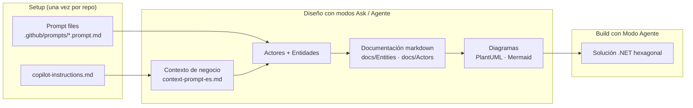
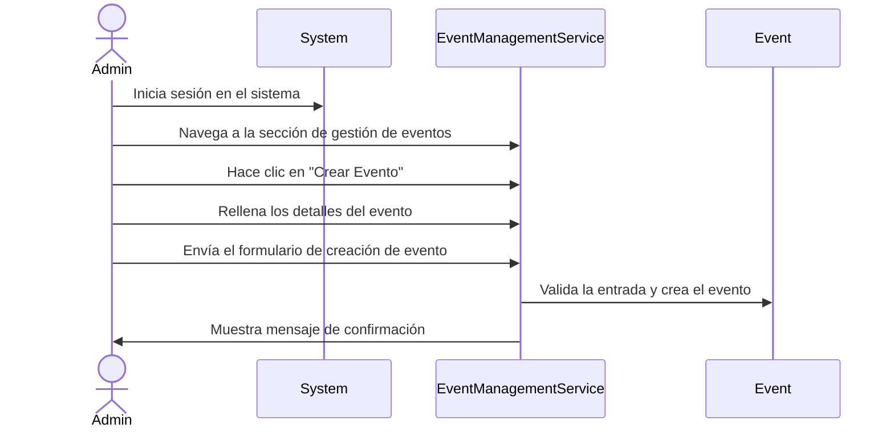
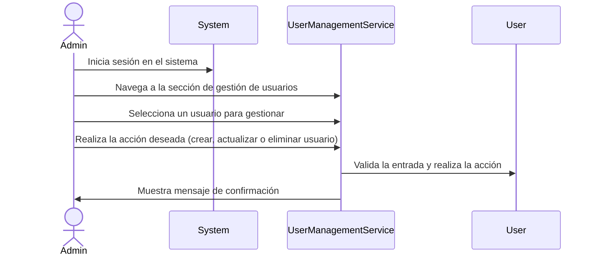
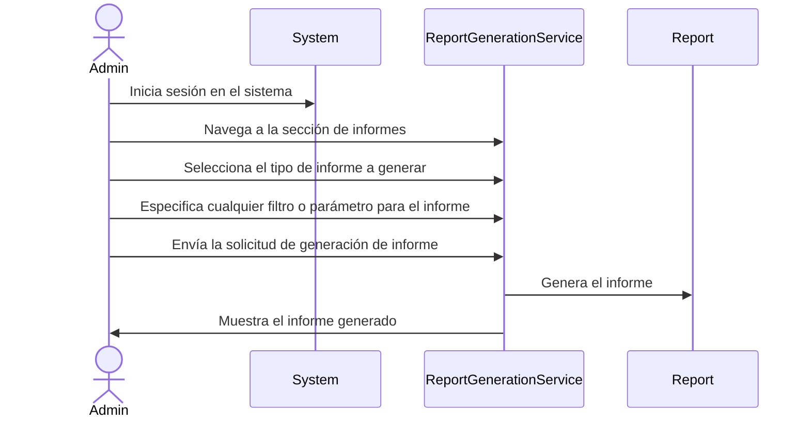
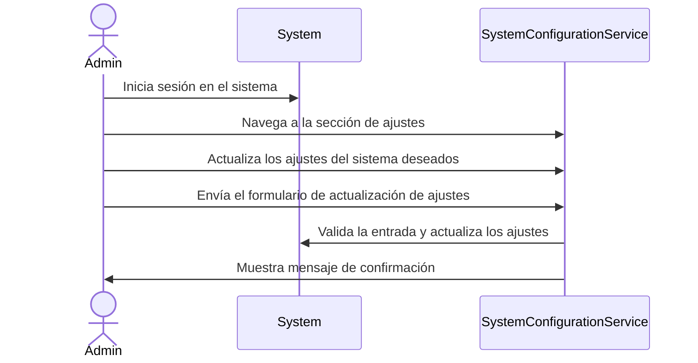
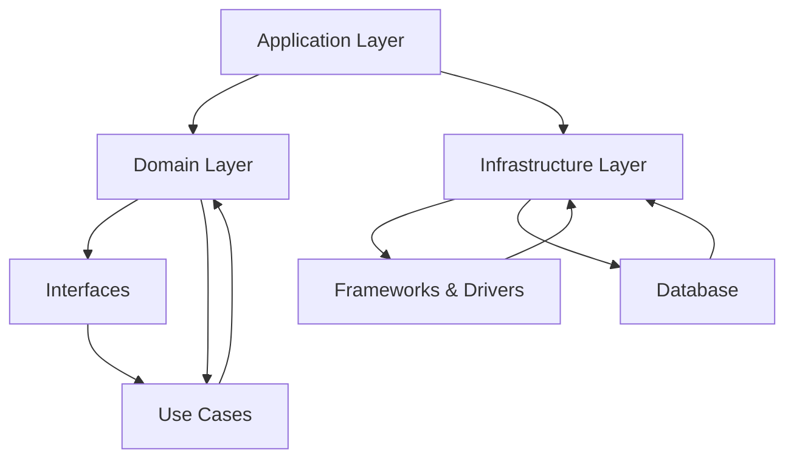
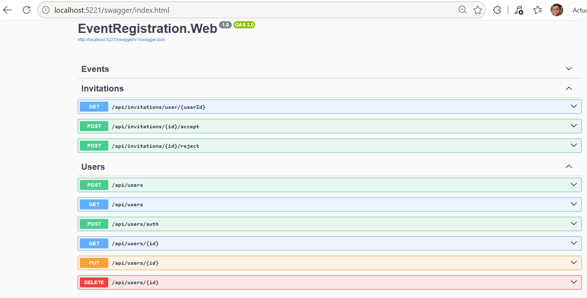

<!-- markdownlint-disable MD033 MD041 -->
<p align="center">
  
</p>

# GitHub Copilot — Workshop de Arquitectura de Software

> Laboratorio práctico para diseñar y andamiar un sistema de software desde
> cero utilizando las **últimas capacidades agénticas** de GitHub Copilot:
> **Modo Agente**, **Custom Instructions**, **Prompt Files**, **referencias
> de contexto** (`#codebase`, `#file`, `#folder`), **servidores MCP** y
> **subagentes**.

El workshop lleva una aplicación de registro de eventos desde el brief de
negocio inicial hasta una **solución .NET con arquitectura hexagonal**,
produciendo en el camino diagramas de casos de uso, diagramas de secuencia y
documentación estructurada — con Copilot ejecutando el trabajo multi-paso de
forma autónoma.

> [English version](./README.md)

---

## Tabla de contenido

- [Introducción](#introducción)
- [Objetivos de aprendizaje](#objetivos-de-aprendizaje)
- [Flujo del workshop](#flujo-del-workshop)
- [Requisitos](#requisitos)
- [Características agénticas utilizadas en este workshop](#características-agénticas-utilizadas-en-este-workshop)
- [Paso 1 · Definiendo el contexto](#paso-1--definiendo-el-contexto)
- [Paso 2 · Identificar actores y entidades con Ask + `#codebase`](#paso-2--identificar-actores-y-entidades-con-ask--codebase)
- [Paso 3 · Construir el workspace con Modo Agente](#paso-3--construir-el-workspace-con-modo-agente)
- [Paso 4 · Documentación de entidades mediante un Prompt File reutilizable](#paso-4--documentación-de-entidades-mediante-un-prompt-file-reutilizable)
- [Paso 5 · Documentación de los actores del sistema](#paso-5--documentación-de-los-actores-del-sistema)
- [Paso 6 · Casos de uso y diagramas PlantUML](#paso-6--casos-de-uso-y-diagramas-plantuml)
- [Paso 7 · Módulos, servicios y diagramas de secuencia con Mermaid](#paso-7--módulos-servicios-y-diagramas-de-secuencia-con-mermaid)
- [Paso 8 · Scaffold .NET hexagonal con Modo Agente](#paso-8--scaffold-net-hexagonal-con-modo-agente)
- [Opcional · Servidores MCP y subagentes](#opcional--servidores-mcp-y-subagentes)
- [Tarea sugerida](#tarea-sugerida)
- [Estructura del repositorio](#estructura-del-repositorio)

---

## Introducción

Este repositorio es un **workshop de demostración** de GitHub Copilot
aplicado a la arquitectura de software. Utilizando Copilot Chat construirás
una serie de documentos de diseño y artefactos de código para desarrollar un
sistema de software **desde cero**.

El objetivo no es enseñar UML o arquitectura hexagonal a fondo, sino mostrar
cómo las **capacidades agénticas** de Copilot — las que forman parte de los
modos Ask / Plan / **Agente** de Copilot Chat — aceleran todo el flujo de
arquitectura: diagramas de casos de uso, diagramas de secuencia,
documentación de entidades y un scaffold de proyecto funcional, todo guiado
por prompts en lenguaje natural que el Modo Agente de Copilot ejecuta de
forma autónoma.

El workshop está orientado a ingenieros de sistemas, arquitectos de software
y desarrolladores senior con experiencia previa en diseño de software.

---

## Objetivos de aprendizaje

Al finalizar el laboratorio, el participante será capaz de:

- **Persistir la intención del proyecto** en
  `.github/copilot-instructions.md` (o `AGENTS.md`) para que cada sesión de
  Copilot Chat en el repositorio arranque con el mismo contexto.
- **Escribir prompts reutilizables** como archivos `.prompt.md` dentro de
  `.github/prompts/` e invocarlos desde cualquier modo de chat.
- **Referenciar contexto con precisión** usando `#codebase`, `#file:<nombre>`,
  `#folder:<ruta>`, `#symbol`, `#selection` y `#problems`.
- **Impulsar trabajo multi-paso con Modo Agente**: dejar que Copilot itere
  sobre toda una carpeta, genere markdown coherente y ejecute comandos de
  terminal (`dotnet new`, `git`, render PlantUML) con aprobación por
  checkpoint.
- **Generar diagramas de casos de uso y secuencia** en PlantUML y Mermaid,
  manteniendo su contenido alineado con la documentación de entidades y
  actores.
- **Andamiar una solución .NET con arquitectura hexagonal** que respete los
  actores, entidades, servicios y casos de uso definidos previamente.
- **Extender Copilot** con servidores MCP y delegar la exploración a un
  **subagente** cuando el contexto crezca demasiado.

---

## Flujo del workshop

<p align="center">
  
</p>


```mermaid
flowchart LR
    subgraph Setup["Setup (una vez por repo)"]
        CI["copilot-instructions.md"]
        PF["Prompt files<br/>.github/prompts/*.prompt.md"]
    end

    subgraph Design["Diseño con modos Ask / Agente"]
        Ctx["Contexto de negocio<br/>context-prompt-es.md"]
        Ent["Actores + Entidades"]
        Docs["Documentación markdown<br/>docs/Entities · docs/Actors"]
        Diags["Diagramas<br/>PlantUML · Mermaid"]
    end

    subgraph Build["Build con Modo Agente"]
        Scaffold["Solución .NET hexagonal"]
    end

    CI --> Ctx
    PF --> Ent
    Ctx --> Ent
    Ent --> Docs
    Docs --> Diags
    Diags --> Scaffold
```

---

## Requisitos

- **Visual Studio Code** (versión estable más reciente).
- Extensiones **GitHub Copilot** y **GitHub Copilot Chat** con una
  suscripción activa que tenga el **Modo Agente** habilitado.
- [Extensión de diagramas PlantUML](https://marketplace.visualstudio.com/items?itemName=jebbs.plantuml) — necesaria para previsualizar archivos `.plantuml`.
- [Extensión de diagramas Mermaid](https://marketplace.visualstudio.com/items?itemName=bierner.markdown-mermaid) — necesaria para previsualizar Mermaid dentro de archivos `.md`.
- [.NET 8 SDK](https://dotnet.microsoft.com/download) (solo para el paso
  final de scaffold).
- Runtime de Java (necesario para que la extensión de PlantUML renderice).

Verifica tu instalación:

```powershell
code --version
dotnet --version
java -version
```

Abre en VS Code la carpeta que contiene este README y, luego, la vista
**Copilot Chat** (atajo por defecto en Windows: `Ctrl+Alt+I`).

---

## Características agénticas utilizadas en este workshop

El workshop asume que sabes **que** estas características existen. Esta
tabla es una referencia rápida; los pasos individuales explican cuándo y
por qué usar cada una.

| Característica | Qué es | Dónde vive |
| -------------- | ------ | ---------- |
| **Modo Ask** | Chat que responde preguntas y genera fragmentos en el hilo. | Chat view · selector de modo |
| **Modo Plan** | Chat que propone ediciones multi-archivo para que las revises antes de aplicar. | Chat view · selector de modo |
| **Modo Agente** | Modo autónomo que planifica, edita archivos y ejecuta herramientas hasta cumplir el objetivo, pidiendo aprobación para comandos de terminal. | Chat view · selector de modo |
| **Copilot Instructions** | Prompt de sistema de nivel repositorio, siempre activo. | `.github/copilot-instructions.md` o `AGENTS.md` |
| **Archivos de instrucciones** | Instrucciones focalizadas que se aplican a rutas específicas. | `.github/instructions/*.instructions.md` con frontmatter `applyTo` |
| **Prompt files** | Prompts reutilizables invocables desde cualquier modo. | `.github/prompts/*.prompt.md` |
| **Chat modes personalizados** | Persona + toolset + instrucciones preconfigurados. | `.github/chatmodes/*.chatmode.md` |
| **Referencias de contexto** | Adjuntan contexto preciso a un mensaje. | `#codebase`, `#file:<nombre>`, `#folder:<ruta>`, `#symbol`, `#selection`, `#problems`, `#terminalLastCommand`, `#fetch` |
| **Chat participants** | Expertos con namespace. | `@workspace`, `@vscode`, `@terminal`, `@github` |
| **Servidores MCP** | Herramientas Model Context Protocol conectadas a Copilot. | `.vscode/mcp.json` |
| **Subagentes** | Delegan una tarea focalizada a un agente dedicado. | Modo Agente → `runSubagent` |
| **Checkpoints** | Restauran el workspace a un estado previo a las ediciones del Agente. | Chat view · lista de checkpoints |

> 💡 **Tip**
>
> Copilot Chat ahora expone un **selector de modo** (Ask / Plan / Agente).
> Cada captura de este workshop asume **Modo Agente** salvo que se indique
> lo contrario.

<p align="center">
  
</p>

---

## Paso 1 · Definiendo el contexto

Para tareas de arquitectura Copilot necesita **dos capas de contexto**:

1. **Quién eres y qué esperas** (persona + reglas de flujo) — se captura
   una única vez en un archivo de Copilot Instructions, de modo que cada
   chat futuro arranca preconfigurado.
2. **Qué es el sistema** (reglas de negocio, módulos, restricciones) — se
   suministra por conversación mediante prompts o referencias `#file`.

### 1.1 · Persistir la persona en un archivo de Copilot Instructions

En lugar de pegar el mismo prompt de "quién soy" al principio de cada
chat, crea un archivo de instrucciones a nivel repositorio. Copilot Chat lo
carga automáticamente en los tres modos (Ask / Plan / Agente).

<p align="center">
  
</p>

Crea `.github/copilot-instructions.md` con contenido similar a este:

```markdown
# Workshop de Arquitectura de Software — Copilot Instructions

Estás pareando con **Pablo**, Ingeniero de Software que actúa como
**Arquitecto de Software** en su equipo.

Tu rol en este repositorio:

- Ayudar a diseñar y documentar arquitecturas de software usando
  **arquitectura hexagonal** (a.k.a. puertos y adaptadores).
- Producir documentación Markdown para entidades, actores, casos de uso,
  servicios y diagramas.
- Redactar diagramas UML utilizando **PlantUML** para casos de uso y
  **Mermaid** para diagramas de secuencia y de flujo.
- Cuando el lenguaje de implementación no esté definido, preferir un
  lenguaje **orientado a objetos** (por defecto: C# con .NET 8).

Convenciones:

- Cada entidad, actor y servicio recibe su propio archivo Markdown bajo
  `docs/`.
- Los archivos de casos de uso incluyen una tabla con flujo paso a paso,
  prerrequisitos y resultado esperado.
- No agregues características, comentarios ni docstrings que no se hayan
  pedido.
- Termina las respuestas con un breve resumen cuando estés en Modo Agente.
```

> 🤓 **Qué cambia frente al enfoque clásico**
>
> El workshop original tenía un *Prompt 1* que presentaba a Pablo y
> preguntaba "¿Eres capaz de eso?". Ese prompt sigue funcionando, pero vive
> solo en una sesión de chat. Un archivo `copilot-instructions.md` vuelve
> esa persona persistente en **cada** chat, cada modo y cada compañero de
> equipo.

Si todavía deseas correr el disparador conversacional original, sigue
siendo válido — solo que ahora es opcional:

<details>
<summary><strong>Prompt 1 (opcional, legacy)</strong> — disparador conversacional</summary>

```text
¡Hola! Mi nombre es Pablo, soy Ingeniero de Software y tengo el rol de
Arquitecto de Software en mi equipo. Quiero que me ayudes con algunas
tareas relacionadas con la arquitectura y el diseño de software. ¿Eres
capaz de hacer eso? Sé que puedes escribir código, así que estaba pensando
que podrías ayudarme a crear documentación de un proyecto usando archivos
markdown y también creando diagramas usando código con herramientas como
Mermaid o PlantUML. Además, quiero generar estructuras de código con una
arquitectura llamada "Arquitectura Hexagonal", no he definido qué lenguaje
de programación vamos a usar pero probablemente será un lenguaje orientado
a objetos. Los diagramas que tengo en mente son diagramas de casos de uso,
diagramas de secuencia, diagramas de clases y tal vez un diagrama de
relación de entidades. Probablemente necesitaré un par de diagramas UML
más, pero estoy bien con los actuales. ¿Podrías ayudarme con esto? ¿Puedes
ayudarme con estas tareas si te proporciono un contexto?
```

_Respuesta de Copilot:_

```text
Sí, puedo ayudarte con estas tareas. Por favor proporciona el contexto o
los requisitos específicos para la documentación, diagramas o estructuras
de código con los que necesitas ayuda.
```

</details>

> 💡 **Tip**
>
> Finalizar los prompts con una pregunta abierta mantiene al modelo
> receptivo a nuevas instrucciones, logrando una interacción humano-máquina
> más fluida — por eso el Prompt 2 (a continuación) dice explícitamente
> *"te voy a proporcionar varios prompts posteriores"*.

### 1.2 · El contexto del problema

El contexto de negocio del software / módulo / sistema a construir se
proporciona como un prompt rico. Mientras más restricciones, reglas de
negocio y módulos indiques, mejores serán las respuestas de Copilot.

**Prompt 2.**

- [Prompt en Español](./context-prompt-es.md)
- [Prompt en Inglés](./context-prompt.md)

En vez de pegar todo el archivo, adjúntalo como **referencia de archivo**
desde Copilot Chat:

```text
#file:context-prompt-es.md

No me des resultados aún. Primero procesa toda la información del archivo
anterior — esas son las reglas de negocio del sistema que vamos a
construir juntos. Te enviaré prompts posteriores con los diagramas y la
documentación que necesito generar.
```

_Respuesta de Copilot:_

```text
Entendido. He procesado la información que proporcionaste. Los requisitos
y reglas de negocio son claros, y entiendo los diferentes módulos que
deben implementarse en la aplicación web. Por favor, procede con tus
prompts subsecuentes, y te asistiré en consecuencia con la generación de
los diagramas y documentación necesarios.
```

---

## Paso 2 · Identificar actores y entidades con Ask + `#codebase`

Con la persona (Paso 1.1) y el problema (Paso 1.2) ya conectados, cambia
Copilot Chat a **Modo Ask** para explorar el dominio sin que Copilot edite
archivos todavía.

<p align="center">
  
</p>

> 🤓 **Aclaratoria de sistema**
>
> Siguiendo la definición formal de un sistema como *un conjunto de
> elementos interrelacionados e interdependientes que trabajan juntos para
> lograr un objetivo común*, una aplicación web es un sistema que entra en
> el paradigma de los sistemas informáticos. A partir de este punto nos
> referiremos a la aplicación como "sistema".

### 2.1 · Listar los actores

**Prompt 3.**

```text
#file:context-prompt-es.md

Dame una lista de los actores del sistema.
```

_Respuesta de Copilot:_

```md
**Usuario Registrado**
- Puede crear eventos.
- Puede ser invitado a eventos.
- Puede ver eventos a los que está invitado.
- Puede gestionar la información de su cuenta.
- Puede eliminar su cuenta (con restricciones).

**Usuario Organizador**
- Un tipo de usuario registrado que crea eventos.
- Puede modificar o eliminar sus propios eventos.
- Puede ver una lista de todos los asistentes a sus eventos.

**Usuario Asistente**
- Un tipo de usuario registrado que es invitado a eventos.
- Puede ver información básica sobre los eventos a los que está invitado.
- Puede aceptar o rechazar invitaciones a eventos.

**Usuario Administrador**
- Tiene control total sobre la aplicación.
- Puede ver todos los eventos dentro de la aplicación.
- Puede ver una lista de todos los usuarios en la plataforma.
- Puede agregar, eliminar y modificar usuarios.
- Puede eliminar y modificar cualquier evento.
```

### 2.2 · Listar todas las entidades

**Prompt 4.**

```text
#codebase

Dame una lista de todas las entidades del sistema incluyendo actores.
```

Usar `#codebase` aquí le indica a Copilot que considere cualquier cosa
indexada en el repo (actualmente los dos context prompts) además del
historial de chat.

_Respuesta de Copilot:_

```text
Aquí hay una lista de todas las entidades del sistema, incluyendo actores:

Actores:
- Usuario Registrado
- Usuario Organizador
- Usuario Asistente
- Usuario Administrador

Entidades:

- Usuario
Atributos: userId, username, email, fullName, age, countryOfResidence, phoneNumber, password, role (Registrado, Organizador, Asistente, Administrador)

- Evento
Atributos: eventId, title, description, date, organizerId, state (activo, finalizado), googleMeetLink

- Asistente
Atributos: attendeeId, eventId, userId, status (aceptado, rechazado)

- Invitación
Atributos: invitationId, eventId, userId, emailSent (boolean), response (aceptado, rechazado, pendiente)

Estas entidades y actores interactúan para cumplir con los requisitos y reglas de negocio del sistema.
```

### 2.3 · Refinar el modelo

Copilot produjo una lista válida, pero hay optimizaciones por aplicar:

- Un usuario registrado en realidad tiene solo dos roles: **usuario común**
  y **administrador**.
- "Organizador" no es un rol — es una regla de negocio sobre el creador
  del evento.
- No hace falta una entidad `Asistente`; una relación muchos-a-muchos
  usuario-evento la reemplaza.

Le informamos esta optimización a Copilot para que modifique las entidades
y sus atributos.

**Prompt 5.**

```text
Hiciste un buen análisis de los requisitos del sistema, pero hay algunos
cambios que deben hacerse para optimizar esta arquitectura.

1. Un usuario registrado solo puede tener en realidad dos roles, usuario
   común y usuario administrador. Solo los usuarios comunes pueden
   registrarse, los usuarios administradores están integrados en el
   sistema como mencionamos anteriormente en los requisitos.

2. Un usuario organizador no es un rol, en realidad es una regla de
   negocio que se puede cumplir agregando un atributo "creator_user" en la
   entidad evento.

3. Una entidad Asistente no existe porque un Usuario puede ser tanto un
   organizador como un asistente, por lo que todos los asistentes se
   pueden identificar mediante una relación entre la entidad usuarios y
   la entidad eventos, esta relación es una relación de muchos a muchos
   porque un usuario puede organizar múltiples eventos y también un
   usuario puede estar registrado en múltiples eventos.

Toma en cuenta estas declaraciones y cambia las entidades, actores y
atributos en consecuencia.
```

_Respuesta de Copilot:_

```text
Basado en las optimizaciones proporcionadas, aquí está la lista actualizada de actores y entidades:

Actores

Usuario Común

- Puede crear eventos.
- Puede ser invitado a eventos.
- Puede ver eventos a los que está invitado.
- Puede gestionar la información de su cuenta.
- Puede eliminar su cuenta (con restricciones).

Usuario Administrador

- Tiene control total sobre la aplicación.
- Puede ver todos los eventos dentro de la aplicación.
- Puede ver una lista de todos los usuarios en la plataforma.
- Puede agregar, eliminar y modificar usuarios.
- Puede eliminar y modificar cualquier evento.

Entidades

- Usuario:
Atributos: userId, username, email, fullName, age, countryOfResidence, phoneNumber, password, role (común, administrador)

- Evento
Atributos: eventId, title, description, date, creatorUserId, state (activo, finalizado), googleMeetLink

- UserEvent
Atributos: userEventId, userId, eventId, status (aceptado, rechazado)
Estos cambios reflejan las optimizaciones simplificando los roles y relaciones dentro del sistema.
```

---

## Paso 3 · Construir el workspace con Modo Agente

Con el dominio confirmado, cambia Copilot Chat a **Modo Agente**. El agente
autónomo reemplaza al legado `@workspace /new`: en vez de andamiar una sola
vez, puede crear carpetas, correr `git` e incluso pedirte aprobación para
llamadas a `dotnet new`.

<p align="center">
  
</p>

Estructura de carpetas objetivo (las subcarpetas de `Diagrams/` aparecen
en los Pasos 6 y 7 — se anticipan aquí como referencia):

```text
docs/
├── Entities/
├── UseCases/
├── Actors/
├── Services/
└── Diagrams/
    ├── use-cases/
    │   ├── admin/         # Diagramas PlantUML (Paso 6)
    │   └── user/
    └── sequence/          # Diagramas Mermaid (Paso 7)
```

**Prompt 6.**

```text
Crea una carpeta llamada `docs/` en la raíz del repositorio con las
siguientes subcarpetas:

- Entities/
- UseCases/
- Actors/
- Services/
- Diagrams/

Esta carpeta contendrá la documentación de arquitectura del sistema en el
que estamos trabajando.
```

> ⚠️ **Aprueba con cuidado**
>
> El Modo Agente lista cada operación de archivo antes de aplicarla. Usa la
> lista de checkpoints en la vista de chat para revisar los cambios y, si
> algo sale del carril, restaurar al checkpoint previo con un clic.

> 🧭 **Nota legacy**
>
> El workshop original usaba `@workspace /new` para crear esta carpeta. El
> Modo Agente es ahora el enfoque recomendado y más general porque preserva
> tus archivos existentes y te da un checkpoint para deshacer.

---

## Paso 4 · Documentación de entidades mediante un Prompt File reutilizable

Los próximos pasos ("generar un archivo Markdown por entidad", "por actor",
"por servicio"…) tienen exactamente la misma forma. Extrae esa forma a un
**prompt file** para reutilizarla tú y el resto del equipo.

<p align="center">
  
</p>

### 4.1 · Escribir el prompt file

Pídele al Modo Agente que lo cree, o escríbelo tú mismo:

`.github/prompts/generate-entity-docs.prompt.md`

````markdown
---
mode: agent
description: Genera un archivo Markdown de documentación por cada entidad del sistema.
tools: ['editFiles', 'search']
---

Objetivo: para cada entidad definida en el contexto actual del sistema,
crear un archivo Markdown bajo `docs/Entities/` llamado `<EntityName>.md`.

Cada archivo debe contener:

1. Una descripción detallada de la entidad explicando su rol.
2. Una tabla con todos los atributos, su tipo de dato, descripción y las
   reglas de negocio aplicables.
3. Una sección de "Relaciones" con los vínculos hacia otras entidades.

Restricciones:

- No crear archivos para entidades que ya existan.
- Usar la lista de entidades confirmada en el chat hasta ahora. Si dudas,
  referencia `#file:context-prompt-es.md` y el historial del chat.
- No inventar atributos que no estén mencionados en las reglas de negocio.
````

### 4.2 · Invocar el prompt file

En Copilot Chat, tipea `/` y elige `generate-entity-docs`, o referéncialo
inline como `#prompt:generate-entity-docs`. En Modo Agente, Copilot iterará
sobre la lista de entidades y producirá los archivos.

**Prompt 7.** (invocación)

```text
/generate-entity-docs
```

_Respuesta de Copilot — archivos generados:_

- `Event.md`

```md
# Evento

## Descripción
La entidad `Evento` representa un evento dentro del sistema. Incluye detalles como el título del evento, descripción, fecha, creador y estado. Los eventos pueden estar activos o finalizados y pueden incluir un enlace de Google Meet para reuniones virtuales.

## Atributos

| Atributo        | Tipo de Dato | Descripción                                                                 | Reglas de Negocio                                                                 |
|-----------------|--------------|-----------------------------------------------------------------------------|-----------------------------------------------------------------------------------|
| `eventId`       | `String`     | Identificador único para el evento.                                         | Debe ser único y no nulo.                                                         |
| `title`         | `String`     | Título del evento.                                                          | Debe ser no nulo y no vacío.                                                      |
| `description`   | `String`     | Descripción detallada del evento.                                           | Opcional.                                                                         |
| `date`          | `Date`       | Fecha y hora en que el evento está programado para ocurrir.                 | Debe ser una fecha válida en el futuro.                                           |
| `creatorUserId` | `String`     | Identificador del usuario que creó el evento.                               | Debe ser un ID de usuario válido.                                                 |
| `state`         | `String`     | Estado actual del evento (activo, finalizado).                              | Debe ser 'activo' o 'finalizado'.                                                 |
| `googleMeetLink`| `String`     | Enlace a Google Meet para el evento.                                        | Opcional. Debe ser una URL válida si se proporciona.                              |

## Relaciones
- Un `Evento` es creado por un `Usuario`.
- Un `Evento` puede tener múltiples entradas `UserEvent` asociadas, representando el estado de participación de los usuarios.
```

- `UserEvent.md`

```md
# UserEvent

## Descripción
La entidad `UserEvent` representa la relación entre un usuario y un evento. Incluye detalles como el estado de participación del usuario en el evento.

## Atributos

| Atributo        | Tipo de Dato | Descripción                                                                 | Reglas de Negocio                                                                 |
|-----------------|--------------|-----------------------------------------------------------------------------|-----------------------------------------------------------------------------------|
| `userEventId`   | `String`     | Identificador único para la relación usuario-evento.                        | Debe ser único y no nulo.                                                         |
| `userId`        | `String`     | Identificador del usuario que participa en el evento.                       | Debe ser un ID de usuario válido.                                                 |
| `eventId`       | `String`     | Identificador del evento en el que el usuario está participando.            | Debe ser un ID de evento válido.                                                  |
| `status`        | `String`     | Estado de participación del usuario (aceptado, rechazado).                  | Debe ser 'aceptado' o 'rechazado'.                                                |

## Relaciones
- Un `UserEvent` vincula un `Usuario` a un `Evento`.
- Un `Usuario` puede tener múltiples entradas `UserEvent`, representando la participación en múltiples eventos.
- Un `Evento` puede tener múltiples entradas `UserEvent`, representando la participación de múltiples usuarios.
```

Si falta la entidad `User` (Copilot puede saltarla porque también es un
actor), pídela explícitamente:

```text
Dame el documento markdown para la entidad User siguiendo la misma
estructura. Guárdalo bajo docs/Entities/.
```

- `User.md`

```md
# Usuario

## Descripción
La entidad `Usuario` representa a un usuario dentro del sistema. Incluye detalles como el identificador único del usuario, nombre, correo electrónico y rol. Los usuarios pueden crear eventos y participar en eventos.

## Atributos

| Atributo        | Tipo de Dato | Descripción                                                                 | Reglas de Negocio                                                                 |
|-----------------|--------------|-----------------------------------------------------------------------------|-----------------------------------------------------------------------------------|
| `userId`        | `String`     | Identificador único para el usuario.                                        | Debe ser único y no nulo.                                                         |
| `name`          | `String`     | Nombre completo del usuario.                                                | Debe ser no nulo y no vacío.                                                      |
| `email`         | `String`     | Dirección de correo electrónico del usuario.                                | Debe ser una dirección de correo electrónico válida y única.                      |
| `role`          | `String`     | Rol del usuario dentro del sistema (por ejemplo, admin, participante).      | Debe ser 'admin' o 'participante'.                                                |

## Relaciones
- Un `Usuario` puede crear múltiples entidades `Evento`.
- Un `Usuario` puede tener múltiples entradas `UserEvent`, representando la participación en múltiples eventos.
```

> ⚠️ **Importante**
>
> Todos estos archivos generados quedan bajo la carpeta `docs/Entities/`.
> Verifica el checkpoint en la vista de chat antes de commitear.

---

## Paso 5 · Documentación de los actores del sistema

Los actores representan entidades que interactúan y se rigen por las
reglas de negocio del dominio. Una entidad puede ser representada por
varios actores dependiendo del caso de uso y del flujo de trabajo.

### 5.1 · Confirmar la lista de actores

Como ya redujimos los actores en el Paso 2, una pregunta corta en Modo Ask
confirma que Copilot mantiene el contexto correcto:

**Prompt 8.**

```text
¿Cuáles son los actores del sistema?
```

_Respuesta de Copilot:_

```text
Usuario Común
- Puede crear eventos.
- Puede ser invitado a eventos.
- Puede ver eventos a los que está invitado.
- Puede gestionar la información de su cuenta.
- Puede eliminar su cuenta (con restricciones).

Usuario Administrador
- Tiene control total sobre la aplicación.
- Puede ver todos los eventos dentro de la aplicación.
- Puede ver una lista de todos los usuarios en la plataforma.
- Puede agregar, eliminar y modificar usuarios.
- Puede eliminar y modificar cualquier evento.
```

Por lo tanto vamos a definir un **prompt file** que hace exactamente esta
tarea de forma reutilizable.

### 5.2 · Generar la documentación de actores (patrón Prompt File)

Escribe `.github/prompts/generate-actor-docs.prompt.md`:

````markdown
---
mode: agent
description: Genera un archivo Markdown de documentación por cada actor del sistema.
tools: ['editFiles', 'search']
---

Objetivo: para cada actor confirmado en el contexto del chat, crear un
archivo Markdown bajo `docs/Actors/` llamado `<ActorName>.md`.

Cada archivo debe contener:

1. Una descripción detallada del actor.
2. Sus responsabilidades.
3. Sus restricciones.
4. Todas las reglas de negocio aplicables.
5. Todos sus casos de uso.

Restricciones:

- Usar exactamente los nombres de actor confirmados en el chat:
  **Usuario Común** y **Usuario Administrador** (salvo que el chat diga
  lo contrario).
- Si la lista de actores incluye algo más, deténte y pide confirmación.
````

**Prompt 9.**

```text
/generate-actor-docs
```

### 5.3 · Solución de problemas — se generaron actores distintos

Si Copilot inventa actores nuevos (por ejemplo **Participante** y
**Administrador** en vez de los que confirmamos), el actor
**Participante** carece de las capacidades "organizador" que definimos.
Restablece el contexto con el prompt clásico — sigue funcionando tal
cual:

<details>
<summary><strong>Fix prompt (aplicar solo si es necesario)</strong></summary>

```text
Previamente identificaste a los actores de este sistema como "Usuario
Común" y "Usuario Administrador". Para crear este sistema, necesitamos
mantener esos actores en lugar de los actores que creaste recientemente,
porque todas las reglas de negocio no se aplican completamente a los
nuevos, por lo que esto significa que "Usuario Común" y "Usuario
Administrador" deben mantenerse. También ten en cuenta que el Usuario
Común tiene las reglas de negocio de un Asistente y Organizador, como
describiste anteriormente.
```

</details>

_Respuesta de Copilot — archivos generados:_

- `AdminUser.md`

```md
# Usuario Administrador

## Descripción
El actor `Usuario Administrador` representa a un usuario con privilegios administrativos dentro del sistema. Los administradores tienen la capacidad de gestionar eventos, usuarios y otras configuraciones del sistema.

## Responsabilidades
- Crear, actualizar y eliminar eventos.
- Gestionar cuentas de usuario, incluyendo la creación, actualización y eliminación de usuarios.
- Monitorear la actividad del sistema y generar informes.
- Configurar ajustes y preferencias del sistema.

## Restricciones
- Los administradores deben tener un rol de administrador válido asignado.
- Las acciones de los administradores se registran para fines de auditoría.

## Reglas de Negocio
- Los administradores deben autenticarse utilizando una cuenta de administrador válida.
- Los administradores solo pueden realizar acciones dentro de su ámbito de permisos.
- Las acciones de los administradores deben cumplir con las políticas y regulaciones del sistema.

## Casos de Uso
- **Crear Evento**: El administrador crea un nuevo evento con detalles especificados.
- **Gestionar Usuarios**: El administrador agrega, actualiza o elimina cuentas de usuario.
- **Generar Informes**: El administrador genera informes sobre la actividad del sistema y la participación de los usuarios.
- **Configurar Ajustes**: El administrador actualiza los ajustes y preferencias del sistema.
```

- CommonUser.md

```md
# Usuario Común

## Descripción
El actor `Usuario Común` representa a un usuario regular dentro del sistema que puede participar en eventos. Este actor puede tener los roles de `Asistente` y `Organizador`.

## Responsabilidades
### Como Asistente
- Ver eventos disponibles.
- Unirse y participar en eventos.
- Proporcionar retroalimentación sobre los eventos.

### Como Organizador
- Crear y gestionar eventos.
- Invitar a usuarios a eventos.
- Monitorear la participación y retroalimentación de los eventos.

## Restricciones
- Los Usuarios Comunes deben tener una cuenta de usuario válida.
- Los Usuarios Comunes solo pueden unirse a eventos que estén activos y no estén llenos.
- Los Organizadores solo pueden gestionar eventos que hayan creado.

## Reglas de Negocio
### Como Asistente
- Los Asistentes deben autenticarse utilizando una cuenta de usuario válida.
- Los Asistentes solo pueden unirse a eventos para los que sean elegibles.
- Los Asistentes deben adherirse a las reglas y directrices del evento.

### Como Organizador
- Los Organizadores deben autenticarse utilizando una cuenta de usuario válida.
- Los Organizadores solo pueden gestionar sus propios eventos.
- Los Organizadores deben asegurarse de que los eventos cumplan con las políticas del sistema.

## Casos de Uso
### Como Asistente
- **Ver Eventos**: El Asistente ve una lista de eventos disponibles.
- **Unirse a Evento**: El Asistente se une a un evento que le interesa.
- **Salir de Evento**: El Asistente sale de un evento en el que ya no desea participar.
- **Proporcionar Retroalimentación**: El Asistente proporciona retroalimentación sobre un evento al que asistió.

### Como Organizador
- **Crear Evento**: El Organizador crea un nuevo evento con detalles especificados.
- **Gestionar Evento**: El Organizador actualiza o elimina un evento que creó.
- **Invitar Usuarios**: El Organizador invita a usuarios a unirse a su evento.
- **Monitorear Participación**: El Organizador monitorea la participación y retroalimentación de los usuarios en sus eventos.
```

---

## Paso 6 · Casos de uso y diagramas PlantUML

Mismo patrón: definir un prompt file que convierte *"la documentación de
actores + el contexto de negocio"* en tablas estructuradas de casos de
uso, y otro que traduce un caso de uso a un diagrama PlantUML.

<p align="center">
  
</p>

### 6.1 · Generar los documentos de casos de uso

Escribe `.github/prompts/generate-use-cases.prompt.md`:

````markdown
---
mode: agent
description: Genera la documentación de casos de uso por actor.
tools: ['editFiles', 'search']
---

Basándote en las reglas de negocio de esta aplicación y en la
documentación de actores en #folder:docs/Actors, crea los documentos de
Casos de Uso en Markdown, uno por actor, bajo `docs/UseCases/`.

Cada archivo debe contener, para cada caso de uso:
- Una tabla con la descripción paso a paso del flujo.
- Los prerrequisitos que deben completarse.
- El resultado esperado.
````

**Prompt 10.**

```text
/generate-use-cases
```

Resultado:

- `AdminUserUseCases.md`
- `CommonUserUseCases.md`

### 6.2 · Generar diagramas PlantUML de casos de uso

Escribe `.github/prompts/generate-use-case-diagram.prompt.md`:

````markdown
---
mode: agent
description: Genera un diagrama PlantUML de casos de uso a partir de un caso de uso.
tools: ['editFiles']
---

Dado un caso de uso específico referenciado por el usuario, crea un
archivo `.plantuml` bajo `docs/Diagrams/use-cases/<actor>/` llamado
`<use-case>.plantuml` que represente todos los pasos descritos en ese
caso de uso.

Restricciones:

- Usa `@startuml`/`@enduml`.
- Un diagrama = un caso de uso.
- Si la respuesta excede el límite de salida del modelo, divide el
  trabajo: genera el archivo solicitado y responde "¿continúo?" para que
  el usuario dispare el siguiente.
````

> ℹ️ **Límite de tamaño de respuesta**
>
> Copilot ocasionalmente devuelve "maximum response length reached". Cuando
> pase, genera un archivo a la vez con este prompt file, o pídele a
> Copilot *"produce solo el PlantUML del caso `<use case>` y detente"*.

**Prompt 11.** (caso único)

```text
/generate-use-case-diagram

Caso de uso: **Crear Evento** del actor **Admin**
(ver #file:docs/UseCases/AdminUserUseCases.md).

Guarda el diagrama como create.event.plantuml.
```

_Respuesta de Copilot — archivo de ejemplo `create.event.plantuml`:_

```PlantUML
@startuml
actor Admin as A

A -> (Create Event) : Inicia sesión en el sistema
(Create Event) --> (Event Management Section) : Navega a
(Event Management Section) --> (Create Event Form) : Hace clic en "Crear Evento"
(Create Event Form) --> A : Rellena los detalles del evento
A -> (Submit Event) : Envía el formulario de creación de evento
(Submit Event) --> (System) : Valida la entrada
(System) --> (Event List) : Crea el evento
(Event List) --> A : Muestra mensaje de confirmación

@enduml
```

### 6.3 · Batch de los diagramas restantes

En vez de iterar en Modo Ask, delega el batch al **Modo Agente**:

**Prompt 12.**

```text
Usando el prompt file de diagramas anterior, genera el archivo PlantUML
para cada caso de uso restante del actor Admin
(#file:docs/UseCases/AdminUserUseCases.md). Guárdalos bajo
`docs/Diagrams/use-cases/admin/`.
```

Archivos esperados bajo `docs/Diagrams/use-cases/admin/`:

- `create.event.plantuml`
- `manage.users.plantuml`
- `generate.reports.plantuml`
- `configure.settings.plantuml`

**Prompt 13.**

```text
Repite el batch para cada caso de uso del Usuario Común
(#file:docs/UseCases/CommonUserUseCases.md), guardando en
`docs/Diagrams/use-cases/user/`.
```

Archivos esperados bajo `docs/Diagrams/use-cases/user/`:

- `create.event.plantuml`
- `invite.users.plantuml`
- `join.event.plantuml`
- `leave.event.plantuml`
- `manage.event.plantuml`
- `monitor.participation.plantuml`
- `provide.feedback.plantuml`
- `view.events.plantuml`

---

## Paso 7 · Módulos, servicios y diagramas de secuencia con Mermaid

Los módulos o servicios son elementos del sistema que no representan una
entidad por sí sola, pero participan en los flujos de trabajo que conectan
actores con entidades.

<p align="center">
  
</p>

### 7.1 · Confirmar la lista de servicios

**Prompt 14.**

```text
#codebase

Por favor, proporcióname una lista con todos los módulos/servicios que
forman parte de este sistema.
```

_Respuesta de Copilot:_

```text
Basado en la estructura del espacio de trabajo y la documentación proporcionada, aquí hay una lista de todos los módulos/servicios que forman parte de este sistema:

Servicio de Gestión de Eventos

Responsable de crear, actualizar y eliminar eventos.
Gestiona los detalles del evento como título, descripción, fecha y estado.
Maneja la participación de los usuarios en los eventos.

Servicio de Gestión de Usuarios

Gestiona cuentas de usuario, incluyendo la creación, actualización y eliminación de usuarios.
Maneja la autenticación y autorización de usuarios.
Gestiona los roles de usuario (por ejemplo, Admin, Usuario Común).

Servicio de Generación de Informes

Genera informes sobre la actividad del sistema y la participación de los usuarios.
Proporciona varios filtros y parámetros para la personalización de informes.

Servicio de Configuración del Sistema

Gestiona los ajustes y preferencias del sistema.
Permite a los administradores configurar varios aspectos del sistema.

Servicio de Gestión de Retroalimentación

Recoge y gestiona la retroalimentación de los usuarios sobre los eventos.
Proporciona mecanismos para que los usuarios envíen retroalimentación.

Servicio de Gestión de Invitaciones

Maneja el envío de invitaciones a los usuarios para eventos.
Gestiona las respuestas de los usuarios a las invitaciones.
```

La respuesta de Copilot está acorde a todo lo desarrollado. Ahora pídele al
Modo Agente que la convierta en un archivo Markdown por servicio bajo
`docs/Services/`:

**Prompt 15.**

```text
Crea un archivo Markdown por cada módulo/servicio listado arriba, bajo
`docs/Services/`. Cada archivo debe contener:

- Una descripción detallada del servicio.
- Las entidades involucradas (enlazando a la documentación de entidades
  correspondiente).
- Todas las operaciones que puede realizar.

Ejemplo de nombramiento para el Servicio de Gestión de Invitaciones:
InvitationManagementService.md con operaciones como
SendInvitationToUser(), SendInvitationToUserWithAttachment(),
SendInvitationToExternalUser(), RemoveInvitation().
```

**Ejemplo: `EventManagementService.md`**

```md
# EventManagementService

## Descripción
El `EventManagementService` es responsable de crear, actualizar y eliminar eventos. Gestiona los detalles del evento como título, descripción, fecha y estado. También maneja la participación de los usuarios en los eventos.

## Entidades Involucradas
- [`Evento`](../Entities/Event.md)
- [`UserEvent`](../Entities/UserEvent.md)

## Operaciones
- **CreateEvent(eventDetails)**
  - Crea un nuevo evento con los detalles especificados.
- **UpdateEvent(eventId, updatedDetails)**
  - Actualiza los detalles de un evento existente.
- **DeleteEvent(eventId)**
  - Elimina un evento existente.
- **GetEvent(eventId)**
  - Recupera los detalles de un evento específico.
- **ListEvents()**
  - Lista todos los eventos disponibles.
- **AddUserToEvent(userId, eventId)**
  - Agrega un usuario a un evento.
- **RemoveUserFromEvent(userId, eventId)**
  - Elimina un usuario de un evento.
```

Otros archivos generados:

- `UserManagementService.md`
- `ReportGenerationService.md`
- `SystemConfigurationService.md`
- `FeedbackManagementService.md`
- `InvitationManagementService.md`

### 7.3 · Construir los diagramas de secuencia (Mermaid)

**Prompt 16.**

```text
#folder:docs

Crea todos los diagramas de secuencia basados en los casos de uso de cada
tipo de actor (ver #file:docs/UseCases/CommonUserUseCases.md y
#file:docs/UseCases/AdminUserUseCases.md). Considera también las
entidades, los servicios y los actores identificados y generados en
pasos anteriores. Crea todos los diagramas usando **Mermaid** y guárdalos
como archivos Markdown con bloques de código Mermaid bajo
`docs/Diagrams/sequence/`.
```

_Extracto de `AdminSequenceDiagrams.md`:_

````md
# Diagramas de Secuencia

## Casos de Uso del Administrador

### Crear Evento


```mermaid
sequenceDiagram
    actor Admin
    Admin ->> System: Inicia sesión en el sistema
    Admin ->> EventManagementService: Navega a la sección de gestión de eventos
    Admin ->> EventManagementService: Hace clic en "Crear Evento"
    Admin ->> EventManagementService: Rellena los detalles del evento
    Admin ->> EventManagementService: Envía el formulario de creación de evento
    EventManagementService ->> Event: Valida la entrada y crea el evento
    EventManagementService ->> Admin: Muestra mensaje de confirmación
```

### Gestionar Usuarios


```mermaid
sequenceDiagram
    actor Admin
    Admin ->> System: Inicia sesión en el sistema
    Admin ->> UserManagementService: Navega a la sección de gestión de usuarios
    Admin ->> UserManagementService: Selecciona un usuario para gestionar
    Admin ->> UserManagementService: Realiza la acción deseada (crear, actualizar o eliminar usuario)
    UserManagementService ->> User: Valida la entrada y realiza la acción
    UserManagementService ->> Admin: Muestra mensaje de confirmación
```

### Generar Informes


```mermaid
sequenceDiagram
    actor Admin
    Admin ->> System: Inicia sesión en el sistema
    Admin ->> ReportGenerationService: Navega a la sección de informes
    Admin ->> ReportGenerationService: Selecciona el tipo de informe a generar
    Admin ->> ReportGenerationService: Especifica cualquier filtro o parámetro para el informe
    Admin ->> ReportGenerationService: Envía la solicitud de generación de informe
    ReportGenerationService ->> Report: Genera el informe
    ReportGenerationService ->> Admin: Muestra el informe generado
```

### Configurar Ajustes


```mermaid
sequenceDiagram
    actor Admin
    Admin ->> System: Inicia sesión en el sistema
    Admin ->> SystemConfigurationService: Navega a la sección de ajustes
    Admin ->> SystemConfigurationService: Actualiza los ajustes del sistema deseados
    Admin ->> SystemConfigurationService: Envía el formulario de actualización de ajustes
    SystemConfigurationService ->> System: Valida la entrada y actualiza los ajustes
    SystemConfigurationService ->> Admin: Muestra mensaje de confirmación
```
````

Archivos generados:

- `AdminSequenceDiagrams.md`
- `CommonUserSequenceDiagrams.md`

---

## Paso 8 · Scaffold .NET hexagonal con Modo Agente

La arquitectura hexagonal (también llamada de puertos y adaptadores) separa
el núcleo de la aplicación — reglas de dominio y casos de uso — de las
preocupaciones externas como UI, bases de datos y servicios de terceros. El
núcleo está rodeado por **puertos** (interfaces) y **adaptadores**
(implementaciones concretas), lo que facilita testear y evolucionar el
núcleo de forma independiente.


```mermaid
graph TD
  A[Application Layer] --> B[Domain Layer]
  A --> C[Infrastructure Layer]
  B --> D[Interfaces]
  B --> E[Use Cases]
  C --> F[Frameworks & Drivers]
  C --> G[Database]
  D --> E
  E --> B
  F --> C
  G --> C
```

<p align="center">
  
</p>

Pide al **Modo Agente** que ande la solución. Como el Modo Agente puede
ejecutar comandos de terminal (previa aprobación), llamará directamente a
`dotnet new` en vez de solo escribir archivos a mano.

**Prompt 17.**

```text
Basado en todos los documentos ya creados en este workspace
(#folder:docs), andamia una nueva aplicación web .NET para esta aplicación
de registro de eventos usando .NET 8 y Clean / Hexagonal Architecture.

El proyecto debe:

- Vivir bajo un archivo de solución `DummyEventApp.sln` que contenga el
  proyecto Web .NET (y los proyectos adicionales de biblioteca de clases
  necesarios para un layout hexagonal: Domain, Application,
  Infrastructure).
- Modelar cada entidad, actor, servicio y caso de uso definido
  anteriormente.
- Incluir un `.gitignore` adaptado a .NET.
- No dejar ningún archivo generado en blanco — poblar el código necesario
  en cada archivo.
- No incluir un proyecto de tests.

Cablea los proyectos así:

- `Application` referencia a `Domain`.
- `Infrastructure` referencia a `Application`.
- `Web` referencia a `Application` **y** `Infrastructure`.

Como `Application` e `Infrastructure` son bibliotecas de clases que
exponen métodos de extensión sobre `IServiceCollection`
(`AddApplication()` / `AddInfrastructure()`), necesitan los siguientes
paquetes NuGet — agrégalos explícitamente y pinea la versión para que
coincida con el target framework:

- `Application`: `Microsoft.Extensions.DependencyInjection.Abstractions`.
- `Infrastructure`: `Microsoft.Extensions.DependencyInjection.Abstractions`
  y `Microsoft.Extensions.Logging.Abstractions` (necesario si algún
  adaptador loguea).

Usa comandos `dotnet new` desde la terminal integrada para crear los
proyectos. Pídeme aprobación antes de ejecutar cada llamada. Después de
cada comando, verifica el layout con las herramientas del workspace y
continúa hasta que la solución compile con `dotnet build`.
```

> ⚠️ **Revisando comandos de terminal**
>
> El Modo Agente mostrará una confirmación por cada comando. Léelo antes
> de aprobar. Si Copilot propone un comando destructivo (por ejemplo
> `rm -rf`), rechaza y reformula tu prompt.

> 💡 **Fijar versión de NuGet**
>
> Evita `dotnet add package … --no-restore` sin `--version` — escribe
> `Version="*"` (la más alta disponible) en el `.csproj`, lo que puede
> derivar con el tiempo y saltar de major version. Pinéa a versiones
> `8.0.*` (coincidiendo con `net8.0`) para reproducibilidad.

> 🧭 **Nota legacy**
>
> El workshop clásico usaba `@workspace /new` para este paso final. El
> Modo Agente es estrictamente más potente aquí: puede encadenar múltiples
> `dotnet new`, cablear proyectos entre sí y auto-verificar corriendo
> `dotnet build`.

---

## Opcional · Servidores MCP y subagentes

Copilot se puede extender con **servidores MCP** (Model Context Protocol)
y puede **delegar exploración a un subagente** cuando el workspace crece.

### Conectar un servidor MCP

Crea `.vscode/mcp.json` en la raíz para declarar servidores. Ejemplo
esqueleto — activa solo lo que uses:

```jsonc
{
  "servers": {
    "github": {
      "type": "stdio",
      "command": "npx",
      "args": ["-y", "@modelcontextprotocol/server-github"]
    },
    "plantuml": {
      "type": "stdio",
      "command": "npx",
      "args": ["-y", "mcp-plantuml"]
    }
  }
}
```

Cuando VS Code recargue la configuración MCP, las herramientas expuestas
por cada servidor quedan disponibles dentro del Modo Agente. Ganancias
típicas para este workshop:

- Un servidor MCP de **GitHub** deja que Copilot cree la rama / PR que
  publica la documentación generada.
- Un servidor MCP de **PlantUML** (o la extensión local) puede renderizar
  los diagramas del Paso 6 sin salir de VS Code.

### Delegar a un subagente

Cuando la ventana de contexto se llena (chats largos, muchos archivos),
lanza un subagente para mantener el hilo principal enfocado:

```text
Delegá a un subagente: "Explorá #folder:docs y produce una auditoría de
una página con casos de uso faltantes, entidades sin documentación y
servicios sin diagrama de secuencia asociado."
```

El subagente devuelve un único resumen que puedes pegar de nuevo al chat
principal como contexto — sin releer todo el árbol de `docs/` en Modo
Agente.

---

## Tarea sugerida

- Generar los **diagramas de clase** a partir de la documentación de
  entidades y servicios (`@startuml`/`@enduml` con bloques `class`). Un
  `.prompt.md` para este caso es un candidato natural para
  `.github/prompts/`.
- Escribir un archivo `.chatmode.md` llamado **`architect.chatmode.md`**
  que agrupe la persona del Paso 1.1 con los prompt files de los Pasos
  4–7, para que onboarding de un nuevo arquitecto al repo sea una única
  selección de modo.
- Convertir uno de los diagramas de secuencia en un controller /
  application service real en el scaffold .NET del Paso 8, manteniendo el
  código alineado con la documentación.

---

## Estructura del repositorio

```text
copilot-software-architecture-demo/
├── README.md              # Versión en inglés
├── README-ESP.md          # Este archivo (español)
├── context-prompt.md      # Contexto de negocio (inglés) — referenciado con #file
├── context-prompt-es.md   # Contexto de negocio (español) — referenciado con #file
└── images/                # Banners, workshop-flow y placeholders por paso
    ├── header-en.svg
    ├── header-es.svg
    ├── workshop-flow.svg
    ├── step-01-copilot-instructions.svg
    ├── step-02-agent-mode.svg
    ├── step-03-prompt-file.svg
    ├── step-04-context-refs.svg
    ├── step-05-agent-generating.svg
    ├── step-06-plantuml.svg
    ├── step-07-mermaid.svg
    ├── step-08-agent-scaffold.svg
    └── README.md          # Inventario de placeholders / capturas
```

Conforme corras el workshop, las carpetas `docs/`, `.github/prompts/` y
`DummyEventApp/` irán apareciendo — creadas por Copilot Modo Agente en los
Pasos 3, 4 y 8 respectivamente.

---

## Fin del práctico 🎉

Todo lo que generaste (docs de entidades, actores, tablas de casos de uso,
diagramas y el scaffold .NET) provino de prompts en lenguaje natural que el
Modo Agente de Copilot ejecutó de forma autónoma — sin `@workspace /new`.
La persona y la forma de cada tarea recurrente ahora viven como
`copilot-instructions.md` + prompt files que cualquier compañero puede
reutilizar. 🚀
