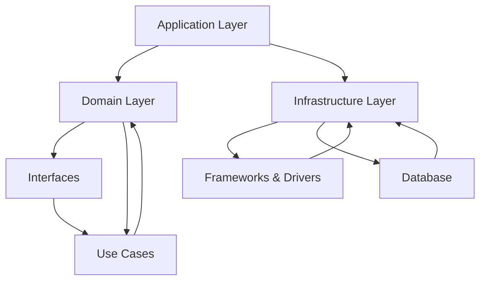

# GitHub Copilot Software Architecture Demo

This repository contains the demonstration project of the features and functionalities of GitHub Copilot applied to software architecture development. Using the GitHub Copilot Chat tool, a series of documents and guidelines are built to develop a software system from scratch.

The objective of this demonstration is to show how to use GitHub Copilot to generate use case diagrams, sequence diagrams, and class diagrams, as well as to build a base structure using hexagonal architecture. These tools and approaches allow for efficient visualization and design of the software system, facilitating communication and collaboration among development team members. Additionally, GitHub Copilot speeds up the coding process by providing suggestions and automatically completing code snippets, increasing productivity and reducing errors. This demonstration is aimed at systems engineers with experience in software architecture.

## Requirements

- Visual Studio Code.
- [PlantUML Diagram Extension](https://marketplace.visualstudio.com/items?itemName=jebbs.plantuml#:~:text=Features.%20Preview%20Diagram,%20Press%20Alt%20+%20D%20to%20start%20PlantUML)
- [Mermaid Diagram Extension](https://marketplace.visualstudio.com/items?itemName=bierner.markdown-mermaid)

## Step 1. Defining the context.

For architecture tasks, it is important to provide the context of what we need Copilot to do for us. It is recommended to construct prompts where we indicate the type of user using the tool, as well as a detailed explanation and the role Copilot will take to define and build the architecture of the application we will develop.

We will work on the following base prompts:

### User base context

A base context is defined to indicate to GitHub Copilot the type of user using it, their role, and a series of tasks that need to be completed. This way, GitHub Copilot adjusts the level of knowledge, the area of knowledge, and the types of responses that will be returned.

> 💡 **Tip**
>
> Ending prompts with a question is a good practice to keep the natural language model open to new prompts, establishing a more fluid and precise human-machine interaction.

**Prompt 1.**

`
Hi! My name is Pablo, I'm a Software Engineer and I have a role as a Software Architect in my team. I want you to help me with some tasks related to software architecture and software design. Are you capable of that? I know that you can write code, so I was thinking that you can help me create documentation for a project using markdown files and also create diagrams using code with tools like Mermaid or PlantUML. Also, I want to generate code structures with an architecture called "Hexagonal Architecture". I haven't defined which programming language we are going to use but it will probably be an object-oriented programming language. The diagrams that I have in mind are use case diagrams, sequence diagrams, class diagrams, and maybe an Entity Relationship diagram. I might need a couple of more UML diagrams but I'm okay with the current ones. Could you help me with this? Can you help me with these tasks if I provide you with a context?
`

_Copilot's Response_

`Yes, I can help you with these tasks. Please provide the context or specific requirements for the documentation, diagrams, or code structures you need assistance with.
`

Note that Copilot remains open and available to complete subsequent requests, which is what we want to achieve by providing the base context.

### Problem context

The context of the software/module/system/application that needs to be developed is defined, with the objective of providing Copilot with the necessary information to help us generate the corresponding documentation. At this point, it is very important to try to provide as much detail as possible, so the more features, business rules, and constraints we indicate, the more efficient the suggestions from the natural language model on which GitHub Copilot operates will be.

**Prompt 2.**

- [Prompt in Spanish](./context-prompt-es.md)
- [Prompt in English](./context-prompt.md)

By providing all the context of what the business has indicated, GitHub Copilot should respond with something like the following, indicating that it has complete context of what was provided.

_Copilot's Response:_

`
Understood. I have processed the information you provided. The requirements and business rules are clear, and I understand the different modules that need to be implemented in the web application. Please proceed with your subsequent prompts, and I will assist you accordingly with generating the necessary diagrams and documentation.
`

## Step 2. Identification of system actors and elements.

### Identification of system actors

At this point, we will identify the actors within the web application, understanding that actors are the different entities that interact with each other within a system and are governed by the business rules and constraints of the system.

> 🤓 System Clarification
>
> Following the formal definition of a system as a set of interrelated and interdependent elements that work together to achieve a common goal. Under this premise, a web application is a system that falls under the paradigm of information systems, so from this point on, we will refer to it as a "system" instead of an "application".

We will ask Copilot to identify the actors through a prompt and generate documentation about them.

**Prompt 3.**

`
Give me a list of the actors of the system.
`
_Copilot's Response:_

```md
**Registered User**
- Can create events.
- Can be invited to events.
- Can view events they are invited to.
- Can manage their account information.
- Can delete their account (with restrictions).

**Organizer User**
- A type of registered user who creates events.
- Can modify or delete their own events.
- Can see a list of all attendees for their events.

**Attendee User**
- A type of registered user who is invited to events.
- Can view basic information about events they are invited to.
- Can accept or decline event invitations.

**Administrator User**
- Has complete control over the application.
- Can see all events within the application.
- Can see a list of all users on the platform.
- Can add, delete, and modify users.
- Can delete and modify any event.


### Identification of system elements and objects

We ask Copilot to identify useful elements such as the entities that make up the system and interact with each other.

**Prompt 4.**

`
Give me a list of all the entities of the system including actors
`

__Copilot's Response__

```
Here is a list of all the entities of the system, including actors:

Actors:
- Registered User
- Organizer User
- Attendee User
- Administrator User

Entities:

- User
Attributes: userId, username, email, fullName, age, countryOfResidence, phoneNumber, password, role (Registered, Organizer, Attendee, Administrator)

- Event
Attributes: eventId, title, description, date, organizerId, state (active, finished), googleMeetLink

- Attendee
Attributes: attendeeId, eventId, userId, status (accepted, declined)

- Invitation
Attributes: invitationId, eventId, userId, emailSent (boolean), response (accepted, declined, pending)

These entities and actors interact to fulfill the requirements and business rules of the system.
```

If you look closely, Copilot provides a valid list of entities that are part of the web application being planned. However, there are some adjustments we can make, such as:

- A registered user can actually have two roles: as a user or an administrator user.
- The restriction of organizer user or attendee user exists only due to the relationship between the user and the event.
- An organizer user can be identified as the creator of that event with an attribute called creator_user in the event entity.
- Attendee users can be identified through a many-to-many relationship between the user and event entities, understanding that an event can have many registered users and a user can be registered in multiple events.

We inform Copilot of this optimization so that it can modify the entities and their attributes.

**Prompt 5.**
```
You did a good analysis on the system requirements, but there are some changes that need to be done 
in order to optimize this architecture.

1. A registered user can only have in reality two roles, common user and admin user. 
Only common users can be registered, admin users are built into the system as we mentioned earlier in the requirements.

2. An organizer user isn't a role, in reality, it is a business rule that can be accomplished 
by adding a "creator_user" attribute into the event entity.

3. An Attendee entity doesn't exist because a User can be both an organizer or an attendee, 
so all the attendees can be identified by a relationship between the users entity and the events entity, 
this relationship is a many-to-many relationship because a user can organize multiple events 
and also a user can be registered in multiple events.

Take into account these statements and change the entities, actors, and attributes accordingly.
```

Given the changes, Copilot should respond with something similar to the following:

```
Based on the provided optimizations, here is the updated list of actors and entities:

Actors

Common User

- Can create events.
- Can be invited to events.
- Can view events they are invited to.
- Can manage their account information.
- Can delete their account (with restrictions).

Admin User

- Has complete control over the application.
- Can see all events within the application.
- Can see a list of all users on the platform.
- Can add, delete, and modify users.
- Can delete and modify any event.

Entities

- User:
Attributes: userId, username, email, fullName, age, countryOfResidence, phoneNumber, password, role (common, admin)

- Event
Attributes: eventId, title, description, date, creatorUserId, state (active, finished), googleMeetLink

- UserEvent
Attributes: userEventId, userId, eventId, status (accepted, declined)

These changes reflect the optimizations by simplifying the roles and relationships within the system.
```
## Step 3. Building the workspace environment with the workspace agent

With all the context defined and both the actors and entities of the system identified, we ask GitHub Copilot to use the @workspace /new agent to create a folder structure that follows the form below.

```
docs/
    |
    ---- Entities/
    |
    ---- Use Cases/
    |
    ---- Actors/
    |
    ---- Services/
    |
    ---- Diagrams/
```

**Prompt 6.**

`
@workspace /new Create a new project named docs with the following folders Entities, UseCases, Actors, Services and Diagrams. This project will contain the architecture documentation of the application that we are working on.
`

## Step 4. Building the documentation of the entities.

We ask GitHub Copilot to generate markdown documents with the information of each of the system's entities.


**Prompt 7.**

`
@workspace I want you to create a markdown documentation file for each one of the entities of the system. These files must contain the following information: A detailed description of the entity explaining what it does. A table describing all the attributes of this entity and their data type. The business rules applyed to them and the relationship with other entities described. This files must be a markdown file.
`

In this case, the following documents are generated:

_Copilot's Response_

- Event.md

```md
# Event

## Description
The `Event` entity represents an event within the system. It includes details such as the event's title, description, date, creator, and state. Events can be active or finished and may include a Google Meet link for virtual meetings.

## Attributes

| Attribute       | Data Type | Description                                                                 | Business Rules                                                                 |
|-----------------|-----------|-----------------------------------------------------------------------------|-------------------------------------------------------------------------------|
| `eventId`       | `String`  | Unique identifier for the event.                                            | Must be unique and non-null.                                                  |
| `title`         | `String`  | Title of the event.                                                         | Must be non-null and non-empty.                                               |
| `description`   | `String`  | Detailed description of the event.                                          | Optional.                                                                     |
| `date`          | `Date`    | Date and time when the event is scheduled to occur.                         | Must be a valid date in the future.                                           |
| `creatorUserId` | `String`  | Identifier of the user who created the event.                               | Must be a valid user ID.                                                      |
| `state`         | `String`  | Current state of the event (active, finished).                              | Must be either 'active' or 'finished'.                                        |
| `googleMeetLink`| `String`  | Link to the Google Meet for the event.                                       | Optional. Must be a valid URL if provided.                                    |

## Relationships
- An `Event` is created by a `User`.
- An `Event` can have multiple `UserEvent` entries associated with it, representing users' participation status.
```

- UserEvent.md

```md
# UserEvent

## Description
The `UserEvent` entity represents the relationship between a user and an event. It includes details such as the user's participation status in the event.

## Attributes

| Attribute       | Data Type | Description                                                                 | Business Rules                                                                 |
|-----------------|-----------|-----------------------------------------------------------------------------|-------------------------------------------------------------------------------|
| `userEventId`   | `String`  | Unique identifier for the user-event relationship.                          | Must be unique and non-null.                                                  |
| `userId`        | `String`  | Identifier of the user participating in the event.                          | Must be a valid user ID.                                                      |
| `eventId`       | `String`  | Identifier of the event the user is participating in.                       | Must be a valid event ID.                                                     |
| `status`        | `String`  | Participation status of the user (accepted, declined).                      | Must be either 'accepted' or 'declined'.                                      |

## Relationships
- A `UserEvent` links a `User` to an `Event`.
- A `User` can have multiple `UserEvent` entries, representing participation in multiple events.
- An `Event` can have multiple `UserEvent` entries, representing multiple users' participation.
```

Nos percatamos que falta la entidad **User**, por lo tanto se la solicitamos.

```
@workspace Give me the markdown document for User entity
```

- User.md

```md
# User

## Description
The `User` entity represents a user within the system. It includes details such as the user's unique identifier, name, email, and role. Users can create events and participate in events.

## Attributes

| Attribute       | Data Type | Description                                                                 | Business Rules                                                                 |
|-----------------|-----------|-----------------------------------------------------------------------------|-------------------------------------------------------------------------------|
| `userId`        | `String`  | Unique identifier for the user.                                             | Must be unique and non-null.                                                  |
| `name`          | `String`  | Full name of the user.                                                      | Must be non-null and non-empty.                                               |
| `email`         | `String`  | Email address of the user.                                                  | Must be a valid email address and unique.                                     |
| `role`          | `String`  | Role of the user within the system (e.g., admin, participant).              | Must be either 'admin' or 'participant'.                                      |

## Relationships
- A `User` can create multiple `Event` entities.
- A `User` can have multiple `UserEvent` entries, representing participation in multiple events.
```

> ⚠️ Important
>
> All these generated files are saved in the `Entities` folder of the project.

## Step 5. Building the documentation of the system actors.

Actors represent entities that interact and are governed by the business rules described by the business. An entity can be represented by multiple actors depending on the use case and workflow.

Understanding this, we ask GitHub Copilot to generate the documentation of the actors participating in the system. These will be saved in the `docs/Actors` directory.

We ask Copilot about the actors of the system, remembering that we previously asked it to identify them but not to document them.

**Prompt 8.**

`
What are the actors of the system.
`

_Copilot's Response:_

```
Common User
- Can create events.
- Can be invited to events.
- Can view events they are invited to.
- Can manage their account information.
- Can delete their account (with restrictions).

Admin User
- Has complete control over the application.
- Can see all events within the application.
- Can see a list of all users on the platform.
- Can add, delete, and modify users.
- Can delete and modify any event.
```

Therefore, we will ask GitHub Copilot through a prompt to generate documentation in markdown files for the actors considering various aspects.

**Prompt 9.**

```
@workspace based on the actors of the system create the documentation file 
for each one of them. Containing the following information:

1. A Detailed description of the actor. 
2. The responsibilities of the actor.
3. The restrictions of the actor.
4. All the business rules applied to him.
5. All the use cases of the actor.
```

### Troubleshooting: In case different actors are generated

In this case, GitHub Copilot has generated different actors than those we have been handling. Specifically, it has generated the following actors: **Participant** and **Admin**.

However, this does not fully adapt to the previously indicated business rules, as the **Participant** actor lacks the capabilities to create events like an **Organizer** user. Therefore, we will ask GitHub Copilot to emphasize the previously identified actors **Common User** and **Admin User** through a prompt.

**Fix prompt (Only Apply if necessary)**

`
@workspace Previously you identified the actors of this system as "Common User" and "Admin User". In order to create this system, we need to keep those actors instead of the actors you created recently, because all the business rules don't apply completely to the newer ones. This means that "Common User" and "Admin User" must be kept. Also, take note that Common User has the business rules of both an Attendant and Organizer, as you described previously.
`

- AdminUser.md

```md
# Admin User

## Description
The `Admin User` actor represents a user with administrative privileges within the system. Admins have the ability to manage events, users, and other system settings.

## Responsibilities
- Create, update, and delete events.
- Manage user accounts, including creating, updating, and deleting users.
- Monitor system activity and generate reports.
- Configure system settings and preferences.

## Restrictions
- Admins must have a valid admin role assigned.
- Admin actions are logged for auditing purposes.

## Business Rules
- Admins must authenticate using a valid admin account.
- Admins can only perform actions within their scope of permissions.
- Admin actions must comply with system policies and regulations.

## Use Cases
- **Create Event**: Admin creates a new event with specified details.
- **Manage Users**: Admin adds, updates, or removes user accounts.
- **Generate Reports**: Admin generates reports on system activity and user participation.
- **Configure Settings**: Admin updates system settings and preferences.
```

- CommonUser.md

```md
# Common User

## Description
The `Common User` actor represents a regular user within the system who can participate in events. This actor can have the roles of `Attendant` and `Organizer`.

## Responsibilities
### As an Attendant
- View available events.
- Join and participate in events.
- Provide feedback on events.

### As an Organizer
- Create and manage events.
- Invite users to events.
- Monitor event participation and feedback.

## Restrictions
- Common Users must have a valid user account.
- Common Users can only join events that are active and not full.
- Organizers can only manage events they have created.

## Business Rules
### As an Attendant
- Attendants must authenticate using a valid user account.
- Attendants can only join events they are eligible for.
- Attendants must adhere to event rules and guidelines.

### As an Organizer
- Organizers must authenticate using a valid user account.
- Organizers can only manage their own events.
- Organizers must ensure events comply with system policies.

## Use Cases
### As an Attendant
- **View Events**: Attendant views a list of available events.
- **Join Event**: Attendant joins an event they are interested in.
- **Leave Event**: Attendant leaves an event they no longer wish to participate in.
- **Provide Feedback**: Attendant provides feedback on an event they attended.

### As an Organizer
- **Create Event**: Organizer creates a new event with specified details.
- **Manage Event**: Organizer updates or deletes an event they created.
- **Invite Users**: Organizer invites users to join their event.
- **Monitor Participation**: Organizer monitors user participation and feedback for their events.
```

## Step 6 Building the use cases and their diagrams.

**Prompt 10.**

`
@workspace Based on the business rules of this application/system, and also taking in count the documentation of the actors of the system #file:AdminUser.md and #file:CommonUser.md Create the Use Cases documents in a markdown file for each actor of the system. The use cases file must contain a table for each use case and inside the table will be a step by step description of the use case, also the use case shoud specify the prerequisites to be completed and the expected outcome.
`

##

By executing the previous prompt, we obtain the use case files for the system actors, resulting in two files named as follows:

- AdminUserUseCases.md
erU- CommonUserUseCases.md

### Use Case Diagrams Generated with PlantUML using GitHub Copilot

After obtaining the use case files, we proceed to construct a prompt that allows the generation of use case diagrams using the PlantUML tool. This tool is a library that enables the construction of various types of diagrams focusing on the UML language. In this case, we will ask it to generate all the use case diagrams for the system actors.


> GitHub Copilot can sometimes generate responses with a quite prolonged character count, causing an error message to appear indicating that the maximum response limit has been reached. This can be resolved by rephrasing the prompt to limit the response size or by processing the response through multiple prompts.

Taking this into account, we will first generate the use case diagram for event creation for the **Administrator** Actor. Subsequently, we will generate the other use cases for this actor and then repeat the process for the **User** actor.

**Prompt 11.**

`
@workspace You did a great job with those documents, now i need to create the use case diagrams for each one of the use cases for all of the Actors of the system. But let's start with only one first. Let's take the Create Event Use Case of the Admin Actor #file:AdminUserUseCases.md. Using PlantUML tool create file called create.event.case.plantuml that represents all the steps described in the table for this particular case.
`

With this prompt, the PlantUML code for the event creation use case of the **Admin** actor is generated.

_Copilot's Response:_

- create.event.plantuml (Example File)
```PlantUML
@startuml
actor Admin as A

A -> (Create Event) : Logs into the system
(Create Event) --> (Event Management Section) : Navigates to
(Event Management Section) --> (Create Event Form) : Clicks on "Create Event"
(Create Event Form) --> A : Fills in event details
A -> (Submit Event) : Submits the event creation form
(Submit Event) --> (System) : Validates input
(System) --> (Event List) : Creates the event
(Event List) --> A : Displays confirmation message

@enduml
```

Le indicamos a copilot que repita lo mismo con el resto de casos de uso del actor **Admin**:

**Prompt 12.**

`
@workspace Do the same with all the other use cases of the Admin Actor #file:AdminUserUseCases.md
`

Esto generara un listado de archivos que se deben guardar en el directorio de: `docs/diagrams/use-cases/admin/`

- create.event.plantuml
- manage.users.plantuml
- generate.reports.plantuml
- configure.settings.plantuml

Obtenidos los diagramas de caso de uso del actor administrador, procedemos a pedirle que realice lo mismo con el actor **User**, estos deben ser guardados en el directorio `docs/diagrams/use-cases/user`

**Prompt 13.**

`
@workspace Repeat the process but now with all the User use cases. #file:CommonUserUseCases.md 
`

This will generate the following files:
- create.event.plantuml
- invite.users.plantuml
- join.event.plantuml
- leave.event.plantuml
- manage.event.plantuml
- monitor.participation.plantuml
- provide.feedback.plantuml
- view.events.plantuml

## Step 7. Identifying system modules. Building sequence diagrams.

A very important point in the construction of any software is the identification of system modules or services. These can be defined as those elements of the system that by themselves do not represent any entity but interact in one way or another in the process. In other words, these elements are part of the processes that interact with the actors.

### Consulting Copilot about the system services/modules.

We consult with Copilot about the system modules to verify that it has the correct contextual information. If not, we will make adjustments.

**Prompt 14.**

`
@workspace Please, provide me a list with all the modules/services that are part of this system.
`

_Copilot's Response_
```
Based on the provided workspace structure and documentation, here is a list of all the modules/services that are part of this system:
```

Event Management Service

Responsible for creating, updating, and deleting events.
Manages event details such as title, description, date, and state.
Handles user participation in events.

User Management Service

Manages user accounts, including creating, updating, and deleting users.
Handles user authentication and authorization.
Manages user roles (e.g., Admin, Common User).

Report Generation Service

Generates reports on system activity and user participation.
Provides various filters and parameters for report customization.

System Configuration Service

Manages system settings and preferences.
Allows admins to configure various aspects of the system.

Feedback Management Service

Collects and manages user feedback on events.
Provides mechanisms for users to submit feedback.

Invitation Management Service

Handles sending invitations to users for events.
Manages user responses to invitations.
```

GitHub Copilot's response is consistent with everything that has been developed so far. Therefore, we will proceed to instruct it to generate all the markdown documentation files for these services using the @workspace agent within the `docs/services` directory.

**Prompt 15.**

`
@workspace Elaborate all the markdown docs for each module/service of the system specifying a detailed description of the service, the entities involed, all the operations that can perform. As example the Invitation Management Service can be named as InvitationManagementService and can perform operations like:
`
`SendInvitationToUser(), SendInvitationToUserWithAttachment(), SendInvitationToExternalUser(), RemoveInvitation()`

Copilot generara varios archivos markdown que guardaremos dentro del directorio `docs/services`.

**Ejemplo: EventManagementService.md**

```md
# EventManagementService

## Description
The `EventManagementService` is responsible for creating, updating, and deleting events. It manages event details such as title, description, date, and state. It also handles user participation in events.

## Entities Involved
- [`Event`](../Entities/Event.md)
- [`UserEvent`](../Entities/UserEvent.md)

## Operations
- **CreateEvent(eventDetails)**
  - Creates a new event with the specified details.
- **UpdateEvent(eventId, updatedDetails)**
  - Updates the details of an existing event.
- **DeleteEvent(eventId)**
  - Deletes an existing event.
- **GetEvent(eventId)**
  - Retrieves the details of a specific event.
- **ListEvents()**
  - Lists all available events.
- **AddUserToEvent(userId, eventId)**
  - Adds a user to an event.
- **RemoveUserFromEvent(userId, eventId)**
  - Removes a user from an event.
```

El resto de archivos generados son:

- UserManagementService.md
- ReportGenerationService.md
- SystemConfigurationService.md
- FeedbackManagementService.md
- InvitationManagementService.md

### Building Sequence Diagrams

Once the documentation related to the modules/services that are part of the system is obtained, we can use GitHub Copilot to generate the sequence diagrams considering the use cases, actors, entities, and services. For this, we will use the **Mermaid** tool, which allows building diagrams within markdown files.

**Prompt 16**

`
@workspace Create all the sequence diagrams based on the use cases of each type of actor. #file:CommonUserUseCases.md #file:AdminUserUseCases.md. Take into account also the entities, the services, and the actors of the system identified and generated in previous steps. Create all the diagrams using Mermaid.
`

This will generate two files containing the sequence diagrams for the actions and existing use cases for each actor in the system.

Ejemplo:

```md
# Sequence Diagrams

## Admin Use Cases

### Create Event

sequenceDiagram
    actor Admin
    Admin ->> System: Logs into the system
    Admin ->> EventManagementService: Navigates to the event management section
    Admin ->> EventManagementService: Clicks on "Create Event"
    Admin ->> EventManagementService: Fills in event details
    Admin ->> EventManagementService: Submits the event creation form
    EventManagementService ->> Event: Validates input and creates the event
    EventManagementService ->> Admin: Displays confirmation message

### Manage Users

sequenceDiagram
    actor Admin
    Admin ->> System: Logs into the system
    Admin ->> UserManagementService: Navigates to the user management section
    Admin ->> UserManagementService: Selects a user to manage
    Admin ->> UserManagementService: Performs the desired action (create, update, or delete user)
    UserManagementService ->> User: Validates input and performs the action
    UserManagementService ->> Admin: Displays confirmation message

### Generate Reports

sequenceDiagram
    actor Admin
    Admin ->> System: Logs into the system
    Admin ->> ReportGenerationService: Navigates to the reports section
    Admin ->> ReportGenerationService: Selects the type of report to generate
    Admin ->> ReportGenerationService: Specifies any filters or parameters for the report
    Admin ->> ReportGenerationService: Submits the report generation request
    ReportGenerationService ->> Report: Generates the report
    ReportGenerationService ->> Admin: Displays the generated report

### Configure Settings

sequenceDiagram
    actor Admin
    Admin ->> System: Logs into the system
    Admin ->> SystemConfigurationService: Navigates to the settings section
    Admin ->> SystemConfigurationService: Updates the desired system settings
    Admin ->> SystemConfigurationService: Submits the settings update form
    SystemConfigurationService ->> System: Validates input and updates the settings
    SystemConfigurationService ->> Admin: Displays confirmation message
```

Files generated:

- AdminSequenceDiagrams.md
- CommonUserSequenceDiagrams.md

## Step 8. Generation of the proposed base project following the guidelines of hexagonal architecture.

Hexagonal architecture, also known as ports and adapters architecture, is a design approach that aims to separate the core concerns of the application from external concerns, such as the user interface, databases, and external services. In this architecture, the core of the application is located at the center and is surrounded by ports, which are interfaces that define interactions with the outside world, and adapters, which implement those interfaces and handle communication with external components. This allows the core of the application to remain independent of implementation details, making it easier to test and maintain.



Using GitHub Copilot and with the existing context, we will generate a project structure for the application that has been designed from the beginning of this exercise. Through Copilot, we will generate a .NET Web App project that employs Clean Architecture, also known as hexagonal architecture. This will provide us with a base structure from which to start.

**Prompt 17**
`
@workspace /new Based on all the documents created on this workspace, create a new .NET Web App for this event registration application using .NET 8 and Clean Architecture. This project must considerate all the entities, actors, services and use cases defined previously. The project must be under a solution file called DummyEventApp containing inside it the .NET Web app project. Also create a .gitignore file for this project. Do not left any file in blank generate al the necessesary code on each file. Do not generate a test project.
`

This will build a .NET 8 Web App application, which will contain a base structure similar to what is defined in this exercise, so that it can be modified and used as a template to develop this exercise.

## End of the practice. 😜


# Homework to do.!! 📕

Como parte de practica para practicar despues, se sugiere generar los diagramas de clase partiendo de la base de la documentacion construida para generar las entidades y los servicios, es posible crear los diagramas de clase correspondientes al sistema.