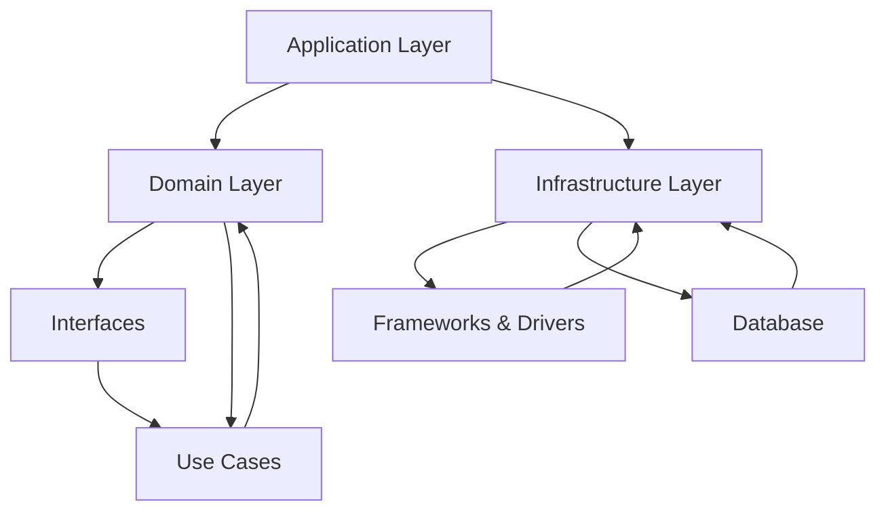

# copilot-software-architecture-demo

Este repositorio contiene el proyecto de demostración de las características y funcionalidades de GitHub Copilot aplicadas al desarrollo de arquitectura de software. Utilizando la herramienta GitHub Copilot Chat, se construyen una serie de documentos y lineamientos que permiten desarrollar un sistema de software desde cero.

El objetivo de este práctico de demostración es mostrar cómo utilizar GitHub Copilot para generar diagramas de caso de uso, de secuencia y de clases, así como construir una estructura base empleando la arquitectura hexagonal. Estas herramientas y enfoques permiten visualizar y diseñar eficientemente el sistema de software, facilitando la comunicación y colaboración entre los miembros del equipo de desarrollo. Además, GitHub Copilot agiliza el proceso de escritura de código al proporcionar sugerencias y completar automáticamente fragmentos de código, lo que aumenta la productividad y reduce los errores. Este práctico está orientado a ingenieros de sistemas con experiencia en arquitectura de software.

## Contenido


## Paso 1. Definiendo el contexto. 

Para las tareas de arquitectura, es importante proporcionar el contexto de lo que necesitamos que copilot haga por nosotros, para ello es recomendable que se construyan prompts en donde indiquemos el tipo de usuario que hace uso de la herramienta, asi como una explicación detallada y el rol que tomara copilot para definir y contruir la arquitectura de la aplicacion que realizaremos.

Trabajaremos sobre los siguientes prompts base:

### Contexto base del usuario

Se define un contexto base, que le indique a GitHub Copilot el tipo de usuario que lo utiliza, su rol y una serie de tareas que se necesitan completar. De forma que GitHub Copilot ajuste el nivel de conocimiento, el area del conocimiento y los tipos de respuesta que seran devueltos.

> 💡 **Tip**
>
> Finalizar los prompts con una pregunta, es una buena practica para que el modelo de lenguaje natural permanezca abierto a nuevos prompts, de forma que se establece una interaccion humano-maquina mas fluida y precisa.

**Prompt 1.**

`
Hi.! My name is Pablo, i'm a Software Engineer and I have a role as a Software Architect in my team. I want you to help me with some tasks related with software architecture and software design. Are you capable of that?. I know that you can write code, so i was thinking that you can help me to create documentation of a project using markdown files and also creating diagramas using code with tools like Mermaid or PlantUML. Also i want to generate code structures with an architecture called "Hexagonal Architecture", i haven't defined which programming language we are gonna use but probabily will be a oriented programing language. The diagrams that i have in mind are use case diagrams, sequence diagrams, class diagrams and maybe a Entity Relationship diagram. Probably i'm gonna need a couple of UML diagrams more but i'm ok with the current ones. Could you help me with this? Can you help me with these tasks if I provide you a context?
`

_Respuesta de Copilot_

`
Yes, I can help you with these tasks. Please provide the context or specific requirements for the documentation, diagrams, or code structures you need assistance with.
`

Notese, que copilot queda abierto y disponible para completar solicitudes posteriores, esto es lo que se quiere lograr al proporcionar el contexto base.

### Contexto base de la problematica a resolver

Se define el contexto del software/modulo/sistema/aplicación que se requiera desarrollar, con el objetivo de proporcionar a Copilot la información necesaria para que nos ayude a generar la documentación correspondiente. En este punto es muy importante, tratar de proporcionar el mayor detalle posible, por lo que mientras mas caracteristicas, reglas de negocio y restricciones indiquemos, mas eficiente seran las sugerencias que nos responda el modelo de lenguaje natural sobre el que funciona GitHub Copilot.

**Prompt 2.**

- [Prompt en Español](./context-prompt-es.md)
- [Prompt en Ingles](./context-prompt.md)

Al proporcionar todo el contexto de lo que el negocio nos ha indicado, Github Copilot nos debe responder algo como lo siguiente, indicando que tiene completo contexto de lo proporcionado.

_Respuesta de GitHub Copilot:_

`
Understood. I have processed the information you provided. The requirements and business rules are clear, and I understand the different modules that need to be implemented in the web application. Please proceed with your subsequent prompts, and I will assist you accordingly with generating the necessary diagrams and documentation.
`

## Paso 2. Identificacion de los actores y elementos del sistema.

### Identificacion de los actores del sistema

En este punto identificaremos los actores dentro de la aplicacion web, entendiendo que los actores son las diferentes entidades que interactuan entre si dentro de un sistema y que se rigen por las reglas de negocio y restricciones del mismo.

> 🤓 Aclaratoria de sistema
>
> Siguiendo la definicion formal de un sistema, como todo conjunto de elementos interrelacionados e interdependientes que funcionan en conjunto para lograr un objetivo comun. Bajo esta premisa, una aplicacion web es un sistema que entra bajo el paradigma de sistemas informaticos, por lo que nos referiremos a partir de este punto como "sistema" en lugar de "aplicacion"

Le pediremos a copilot que identifique a los actores mediante un prompt y que genere documentacion sobre los mismos.

**Prompt 3.**

`
Give me a list of the actors of the system.
`
_Respuesta de Copilot:_

```md
**Registered User**
- Can create events.
- Can be invited to events.
- Can view events they are invited to.
- Can manage their account information.
- Can delete their account (with restrictions).

**Organizer User**
- A type of registered user who creates events.
- Can modify or delete their own events.
- Can see a list of all attendees for their events.

**Attendee User**
- A type of registered user who is invited to events.
- Can view basic information about events they are invited to.
- Can accept or decline event invitations.

**Administrator User**
- Has complete control over the application.
- Can see all events within the application.
- Can see a list of all users on the platform.
- Can add, delete, and modify users.
- Can delete and modify any event.
```

### Identificacion de elementos y objetos del sistema.

Le pedimos a copilot que identifique elementos utiles como las entidades que conforman el sistema e interactuan entre si.

**Prompt 4.**

`
Give me a list of all the entities of the system including actors
`

__Respuesta de Copilot__

```
Here is a list of all the entities of the system, including actors:

Actors:
- Registered User
- Organizer User
- Attendee User
- Administrator User

Entities:

- User
Attributes: userId, username, email, fullName, age, countryOfResidence, phoneNumber, password, role (Registered, Organizer, Attendee, Administrator)

- Event
Attributes: eventId, title, description, date, organizerId, state (active, finished), googleMeetLink

- Attendee
Attributes: attendeeId, eventId, userId, status (accepted, declined)

- Invitation
Attributes: invitationId, eventId, userId, emailSent (boolean), response (accepted, declined, pending)

These entities and actors interact to fulfill the requirements and business rules of the system.
```

Si se observa bien Copilot arroja una lista de entidades validas que conforman parte de la aplicacion web que se planea desarrollar, sin embargo hay algunos ajustes que podemos realizar como por ejemplo:

- Un usuario registrado puede tener realmente dos roles, como usuario o un usuario administrador.
- La restriccion de usuario organizador o usuario atendiente existe solamente por la relacion entre el usuario y el evento.
- Un usuario organizador se puede identificar por ser el creador de ese evento con un atributo llamado creator_user en la entidad evento.
- Los usuarios atendientes se pueden identificar mediante una relacion entre las entidades de usuario y evento siendo esta una relacion de muchos a muchos, entendiendo que un evento puede tener muchos usuarios registrados y un usuario puede estar registrado en multiples eventos.

Esta optimizacion se la hacemos saber a Copilot para que modifique las entidades y sus atributos.

**Prompt 5.**
```
You did a good analysis on the system requirements, but there are some changes that need to be done 
in order to optimize this architecture.

1. A registered user can only have in reality two roles, common user and admin user. 
Only common users can be registed, admin users are built in the system as we mentioned earlier in the requirements.

2. A organizer user isn't a role, in reality is a business rule that can be acomplished 
by adding a "creator_user" attribute into event entity.

3. A Attendee entity doesn't exist because a User can be both a organizer or a attendee, 
so all the attendees can be identified by a relationship between the users entity and the events entity, 
this relationship is a many to many relationship because a user can organize multiple events 
and also a user can be registered en multiple events.

Take in count this statements and change the entities, actors and attributes accordingly
```

Proporcionados los cambios, copilot debe responder algo similar a lo siguiente:

```
Based on the provided optimizations, here is the updated list of actors and entities:

Actors

Common User

- Can create events.
- Can be invited to events.
- Can view events they are invited to.
- Can manage their account information.
- Can delete their account (with restrictions).

Admin User

- Has complete control over the application.
- Can see all events within the application.
- Can see a list of all users on the platform.
- Can add, delete, and modify users.
- Can delete and modify any event.

Entities

- User:
Attributes: userId, username, email, fullName, age, countryOfResidence, phoneNumber, password, role (common, admin)

- Event
Attributes: eventId, title, description, date, creatorUserId, state (active, finished), googleMeetLink

- UserEvent
Attributes: userEventId, userId, eventId, status (accepted, declined)
These changes reflect the optimizations by simplifying the roles and relationships within the system
```

## Paso 3. Construccion del entorno de trabajo con el agente workspace.

Ya teniendo todo el contexto definido y tanto los actores como entidades del sistema identificadas. Le pedimos a GitHub Copilot que mediante el uso del agente @workspace /new una estructura de carpetas que siga la siguiente forma.

```
docs/
    |
    ---- Entities/
    |
    ---- Use Cases/
    |
    ---- Actors/
    |
    ---- Services/
    |
    ---- Diagrams/
```

**Prompt 6.**

`
@workspace /new Create a new project named docs with the following folders Entities, UseCases, Actors, Services and Diagrams. This project will contain the architecture documentation of the application that we are working on.
`

## Paso 4. Construccion de la documentacion de las entidades.

Le pedimos a Github Copilot que genere documentos markdown con la informacion de cada una de las entidades del sistema.

**Prompt 7.**

`
@workspace I want you to create a markdown documentation file for each one of the entities of the system. These files must contain the following information: A detailed description of the entity explaining what it does. A table describing all the attributes of this entity and their data type. The business rules applyed to them and the relationship with other entities described. This files must be a markdown file.
`

En este caso genero los siguientes documentos:

_Respuesta de Copilot_

- Event.md

```md
# Event

## Description
The `Event` entity represents an event within the system. It includes details such as the event's title, description, date, creator, and state. Events can be active or finished and may include a Google Meet link for virtual meetings.

## Attributes

| Attribute       | Data Type | Description                                                                 | Business Rules                                                                 |
|-----------------|-----------|-----------------------------------------------------------------------------|-------------------------------------------------------------------------------|
| `eventId`       | `String`  | Unique identifier for the event.                                            | Must be unique and non-null.                                                  |
| `title`         | `String`  | Title of the event.                                                         | Must be non-null and non-empty.                                               |
| `description`   | `String`  | Detailed description of the event.                                          | Optional.                                                                     |
| `date`          | `Date`    | Date and time when the event is scheduled to occur.                         | Must be a valid date in the future.                                           |
| `creatorUserId` | `String`  | Identifier of the user who created the event.                               | Must be a valid user ID.                                                      |
| `state`         | `String`  | Current state of the event (active, finished).                              | Must be either 'active' or 'finished'.                                        |
| `googleMeetLink`| `String`  | Link to the Google Meet for the event.                                       | Optional. Must be a valid URL if provided.                                    |

## Relationships
- An `Event` is created by a `User`.
- An `Event` can have multiple `UserEvent` entries associated with it, representing users' participation status.
```

- UserEvent.md

```md
# UserEvent

## Description
The `UserEvent` entity represents the relationship between a user and an event. It includes details such as the user's participation status in the event.

## Attributes

| Attribute       | Data Type | Description                                                                 | Business Rules                                                                 |
|-----------------|-----------|-----------------------------------------------------------------------------|-------------------------------------------------------------------------------|
| `userEventId`   | `String`  | Unique identifier for the user-event relationship.                          | Must be unique and non-null.                                                  |
| `userId`        | `String`  | Identifier of the user participating in the event.                          | Must be a valid user ID.                                                      |
| `eventId`       | `String`  | Identifier of the event the user is participating in.                       | Must be a valid event ID.                                                     |
| `status`        | `String`  | Participation status of the user (accepted, declined).                      | Must be either 'accepted' or 'declined'.                                      |

## Relationships
- A `UserEvent` links a `User` to an `Event`.
- A `User` can have multiple `UserEvent` entries, representing participation in multiple events.
- An `Event` can have multiple `UserEvent` entries, representing multiple users' participation.
```

Nos percatamos que falta la entidad **User**, por lo tanto se la solicitamos.

```
@workspace Give me the markdown document for User entity
```

- User.md

```md
# User

## Description
The `User` entity represents a user within the system. It includes details such as the user's unique identifier, name, email, and role. Users can create events and participate in events.

## Attributes

| Attribute       | Data Type | Description                                                                 | Business Rules                                                                 |
|-----------------|-----------|-----------------------------------------------------------------------------|-------------------------------------------------------------------------------|
| `userId`        | `String`  | Unique identifier for the user.                                             | Must be unique and non-null.                                                  |
| `name`          | `String`  | Full name of the user.                                                      | Must be non-null and non-empty.                                               |
| `email`         | `String`  | Email address of the user.                                                  | Must be a valid email address and unique.                                     |
| `role`          | `String`  | Role of the user within the system (e.g., admin, participant).              | Must be either 'admin' or 'participant'.                                      |

## Relationships
- A `User` can create multiple `Event` entities.
- A `User` can have multiple `UserEvent` entries, representing participation in multiple events.
```

> ⚠️ Importante
>
> Todos estos archivos generados, los guardamos en la carpeta `Entities` del proyecto

## Paso 5. Construccion de la documentacion de los actores del sistema.

Los actores representan entidades que interacturan y se rigen por las reglas de negocio descritas por el negocio. Una entidad puede ser representada por multiples actores dependiendo del caso de uso y dependiendo del flujo de trabajo.

Entendiendo esto, le pedimos a GitHub Copilot, que genere la documentacion de los actores que participan dentro del sistema. Los cuales seran guardados dentro del directorio `docs/Actors`

Le consultamos a copilot los actores del sistema, recordemos que anteriormente le habiamos solicitado identificarlos mas no documentarlos.

**Prompt 8.**

`
What are the actors of the system.
`

_La respuesta de copilot:_

```
Common User
- Can create events.
- Can be invited to events.
- Can view events they are invited to.
- Can manage their account information.
- Can delete their account (with restrictions).

Admin User
- Has complete control over the application.
- Can see all events within the application.
- Can see a list of all users on the platform.
- Can add, delete, and modify users.
- Can delete and modify any event.
```

Por lo tanto le pediremos a GitHub Copilot mediante un prompt que genere una documentacion en archivos markdown de los actores considerando varios aspectos

**Prompt 9.**

```
@workspace based on the actors of the system create the documentation file 
for each one of them. Containing the following information:

1. A Detailed description of the actor. 
2. The responsibilities of the actor.
3. The restrictions of the actor.
4. All the business rules applied to him.
5. All the use cases of the actor.
```

### Troubleshooting: En caso que genere actores diferentes

Para este caso GitHub Copilot nos ha generado actores diferentes a los que hemos venido manejando. Nos ha generado en concreto los siguientes actores: **Participant** y **Admin**

Sin embargo esto no se adapta a las reglas de negocio completas previamente indicadas, ya que el actor **Participant** carece de las capacidades de crear eventos de un usuario **Organizer**. Por ende le pediremos a GitHub Copilot que haga enfasis en los actores previamente identificados **Common User** y **Admin User**, mediante un prompt.

**Fix prompt (Only Apply if necessary)**

`
@workspace Previuously you identified the actors of this system as "Common User" and "Admin User". In order to create this system, we need to keep those actors instead the actors you created recently, because all the business rules doesn't apply completely to the newer ones, so this means that "Common User" and "Admin User" must be keeped. Also take note that Common User have the business rules of a Attendant and Organizer, as you described prevously. 
`

- AdminUser.md

```md
# Admin User

## Description
The `Admin User` actor represents a user with administrative privileges within the system. Admins have the ability to manage events, users, and other system settings.

## Responsibilities
- Create, update, and delete events.
- Manage user accounts, including creating, updating, and deleting users.
- Monitor system activity and generate reports.
- Configure system settings and preferences.

## Restrictions
- Admins must have a valid admin role assigned.
- Admin actions are logged for auditing purposes.

## Business Rules
- Admins must authenticate using a valid admin account.
- Admins can only perform actions within their scope of permissions.
- Admin actions must comply with system policies and regulations.

## Use Cases
- **Create Event**: Admin creates a new event with specified details.
- **Manage Users**: Admin adds, updates, or removes user accounts.
- **Generate Reports**: Admin generates reports on system activity and user participation.
- **Configure Settings**: Admin updates system settings and preferences.
```

- CommonUser.md

```md
# Common User

## Description
The `Common User` actor represents a regular user within the system who can participate in events. This actor can have the roles of `Attendant` and `Organizer`.

## Responsibilities
### As an Attendant
- View available events.
- Join and participate in events.
- Provide feedback on events.

### As an Organizer
- Create and manage events.
- Invite users to events.
- Monitor event participation and feedback.

## Restrictions
- Common Users must have a valid user account.
- Common Users can only join events that are active and not full.
- Organizers can only manage events they have created.

## Business Rules
### As an Attendant
- Attendants must authenticate using a valid user account.
- Attendants can only join events they are eligible for.
- Attendants must adhere to event rules and guidelines.

### As an Organizer
- Organizers must authenticate using a valid user account.
- Organizers can only manage their own events.
- Organizers must ensure events comply with system policies.

## Use Cases
### As an Attendant
- **View Events**: Attendant views a list of available events.
- **Join Event**: Attendant joins an event they are interested in.
- **Leave Event**: Attendant leaves an event they no longer wish to participate in.
- **Provide Feedback**: Attendant provides feedback on an event they attended.

### As an Organizer
- **Create Event**: Organizer creates a new event with specified details.
- **Manage Event**: Organizer updates or deletes an event they created.
- **Invite Users**: Organizer invites users to join their event.
- **Monitor Participation**: Organizer monitors user participation and feedback for their events.
```

## Paso 6 Construyendo los casos de uso y sus diagramas.

**Prompt 10.**

`
@workspace Based on the business rules of this application/system, and also taking in count the documentation of the actors of the system #file:AdminUser.md and #file:CommonUser.md Create the Use Cases documents in a markdown file for each actor of the system. The use cases file must contain a table for each use case and inside the table will be a step by step description of the use case, also the use case shoud specify the prerequisites to be completed and the expected outcome.
`

### Archivos de caso de uso generados

Al ejecutar el prompt anterior obtenemos los archivos de casos de uso para Actores del sistema obteniendo dos archivos llamados de la siguiente forma:

- AdminUserUseCases.md
- CommonUserUseCases.md

### Diagramas de caso de uso generados mediante PlantUML con GitHub Copilot.

Obtenidos los archivos de los casos de uso, procedemos a construir un prompt que permita la generacion de los diagramas de caso de uso mediante la herramienta de PlantUML, esta herramienta es una libreria que permite construir diagramas de diferentes tipos enfocandose en el lenguaje UML. Para este caso le pediremos que genere todos los diagramas de caso de uso de los actores del sistema.

> ℹ️ Limite de tamaño de respuesta de Copilot.
>
> GitHub Copilot en ocasiones puede generar respuestas con una cantidad de caracteres bastante pronlongada, ocasionando que en ciertos momentos, se genere un mensaje de error indicando que se ha alcanzado el limite maximo de respuesta. Esto se soluciona parafraseando el prompt de forma que se limite el tamaño de la respuesta, o que se procese la respuesta mediante multiples prompts.

Teniendo en cuenta lo anterior generaremos primero el diagrama de caso de uso para la creacion de eventos del Actor **Administrador**, posteriormente se generaran los demas casos de uso para dicho actor y luego repetimos el proceso para el actor **User**.

**Prompt 11.**

`
@workspace You did a great job with those documents, now i need to create the use case diagrams for each one of the use cases for all of the Actors of the system. But let's start with only one first. Let's take the Create Event Use Case of the Admin Actor #file:AdminUserUseCases.md. Using PlantUML tool create file called create.event.case.plantuml that represents all the steps described in the table for this particular case.
`

Con este prompt se genera el codigo de PlantUML para el caso de uso de creacion de evento del actor **Admin**

_Respuesta de Copilot:_

- create.event.plantuml (Archivo de Ejemplo)
```PlantUML
@startuml
actor Admin as A

A -> (Create Event) : Logs into the system
(Create Event) --> (Event Management Section) : Navigates to
(Event Management Section) --> (Create Event Form) : Clicks on "Create Event"
(Create Event Form) --> A : Fills in event details
A -> (Submit Event) : Submits the event creation form
(Submit Event) --> (System) : Validates input
(System) --> (Event List) : Creates the event
(Event List) --> A : Displays confirmation message

@enduml
```

Le indicamos a copilot que repita lo mismo con el resto de casos de uso del actor **Admin**:

**Prompt 12.**

`
@workspace Do the same with all the other use cases of the Admin Actor #file:AdminUserUseCases.md
`

Esto generara un listado de archivos que se deben guardar en el directorio de: `docs/diagrams/use-cases/admin/`

- create.event.plantuml
- manage.users.plantuml
- generate.reports.plantuml
- configure.settings.plantuml

Obtenidos los diagramas de caso de uso del actor administrador, procedemos a pedirle que realice lo mismo con el actor **User**, estos deben ser guardados en el directorio `docs/diagrams/use-cases/user`

**Prompt 13.**

`
@workspace Repeat the process but now with all the User use cases. #file:CommonUserUseCases.md 
`

This will generate the following files:
- create.event.plantuml
- invite.users.plantuml
- join.event.plantuml
- leave.event.plantuml
- manage.event.plantuml
- monitor.participation.plantuml
- provide.feedback.plantuml
- view.events.plantuml

## Paso 7. Identificando modulos del sistema. Construccion de diagramas de secuencia.

Un punto muy importante en la construccion de todo software, es la identificacion de modulos o servicios del sistema. Esto se puede definir como aquellos elementos del sistema que por si solos no representan ninguna entidad, pero interactuan de una forma u otra en el proceso, es decir estos elementos forman parte de los procesos que interactuan con los actores.

### Consultando a copilot los servicios/modulos del sistema.

Se consulta con copilot los modulos del sistema, para verificar que contextualmente disponga de la informacion correcta, en caso contrario realizaremos ajustes.

**Prompt 14.**

`
@workspace Please, provide me a list with all the modules/services that are part of this system.
`

_Respuesta de Copilot_
```
Based on the provided workspace structure and documentation, here is a list of all the modules/services that are part of this system:

Event Management Service

Responsible for creating, updating, and deleting events.
Manages event details such as title, description, date, and state.
Handles user participation in events.

User Management Service

Manages user accounts, including creating, updating, and deleting users.
Handles user authentication and authorization.
Manages user roles (e.g., Admin, Common User).

Report Generation Service

Generates reports on system activity and user participation.
Provides various filters and parameters for report customization.

System Configuration Service

Manages system settings and preferences.
Allows admins to configure various aspects of the system.

Feedback Management Service

Collects and manages user feedback on events.
Provides mechanisms for users to submit feedback.

Invitation Management Service

Handles sending invitations to users for events.
Manages user responses to invitations.
```

La respuesta de GitHub Copiot, esta acorde a todo lo que se ha desarrollado hasta el momento. Por lo que procederemos a indicarle que genere todos los archivos de documentacion markdown para estos servicios utilizando el agente @workspace dentro del directorio `docs/services`

**Prompt 15.**

`
@workspace Elaborate all the markdown docs for each module/service of the system specifying a detailed description of the service, the entities involed, all the operations that can perform. As example the Invitation Management Service can be named as InvitationManagementService and can perform operations like:
`
`SendInvitationToUser(), SendInvitationToUserWithAttachment(), SendInvitationToExternalUser(), RemoveInvitation()`

Copilot generara varios archivos markdown que guardaremos dentro del directorio `docs/services`.

**Ejemplo: EventManagementService.md**

```md
# EventManagementService

## Description
The `EventManagementService` is responsible for creating, updating, and deleting events. It manages event details such as title, description, date, and state. It also handles user participation in events.

## Entities Involved
- [`Event`](../Entities/Event.md)
- [`UserEvent`](../Entities/UserEvent.md)

## Operations
- **CreateEvent(eventDetails)**
  - Creates a new event with the specified details.
- **UpdateEvent(eventId, updatedDetails)**
  - Updates the details of an existing event.
- **DeleteEvent(eventId)**
  - Deletes an existing event.
- **GetEvent(eventId)**
  - Retrieves the details of a specific event.
- **ListEvents()**
  - Lists all available events.
- **AddUserToEvent(userId, eventId)**
  - Adds a user to an event.
- **RemoveUserFromEvent(userId, eventId)**
  - Removes a user from an event.
```

El resto de archivos generados son:

- UserManagementService.md
- ReportGenerationService.md
- SystemConfigurationService.md
- FeedbackManagementService.md
- InvitationManagementService.md

### Construyendo diagramas de secuencia.

Una vez obtenidos la documentacion relacionada a los modulos/servicios que forman parte del sistema, podemos utilizar GitHub Copilot para generar los diagramas de secuencia teniendo en cuenta los casos de uso, actores, entidades y servicios. Para esto utilizaremos la herramienta de **Mermaid**, que permite construir diagramas dentro de archivos markdown.

**Prompt 16**

`
@workspace Create all the sequence diagrams based on the use cases of each type of actor. #file:CommonUserUseCases.md #file:AdminUserUseCases.md. Take in count also the entities, the services and the actors of the system identified and generated in previous steps. Create all the diagrams using Mermaid.
`

Esto generará dos archivos que contienen los diagramas de secuencia para las acciones y casos de uso existentes por cada actor del sistema

Ejemplo:

```md
# Sequence Diagrams

## Admin Use Cases

### Create Event

sequenceDiagram
    actor Admin
    Admin ->> System: Logs into the system
    Admin ->> EventManagementService: Navigates to the event management section
    Admin ->> EventManagementService: Clicks on "Create Event"
    Admin ->> EventManagementService: Fills in event details
    Admin ->> EventManagementService: Submits the event creation form
    EventManagementService ->> Event: Validates input and creates the event
    EventManagementService ->> Admin: Displays confirmation message

### Manage Users

sequenceDiagram
    actor Admin
    Admin ->> System: Logs into the system
    Admin ->> UserManagementService: Navigates to the user management section
    Admin ->> UserManagementService: Selects a user to manage
    Admin ->> UserManagementService: Performs the desired action (create, update, or delete user)
    UserManagementService ->> User: Validates input and performs the action
    UserManagementService ->> Admin: Displays confirmation message

### Generate Reports

sequenceDiagram
    actor Admin
    Admin ->> System: Logs into the system
    Admin ->> ReportGenerationService: Navigates to the reports section
    Admin ->> ReportGenerationService: Selects the type of report to generate
    Admin ->> ReportGenerationService: Specifies any filters or parameters for the report
    Admin ->> ReportGenerationService: Submits the report generation request
    ReportGenerationService ->> Report: Generates the report
    ReportGenerationService ->> Admin: Displays the generated report

### Configure Settings

sequenceDiagram
    actor Admin
    Admin ->> System: Logs into the system
    Admin ->> SystemConfigurationService: Navigates to the settings section
    Admin ->> SystemConfigurationService: Updates the desired system settings
    Admin ->> SystemConfigurationService: Submits the settings update form
    SystemConfigurationService ->> System: Validates input and updates the settings
    SystemConfigurationService ->> Admin: Displays confirmation message
```

Archivos Generados:

- AdminSequenceDiagrams.md
- CommonUserSequenceDiagrams.md

## Paso 8. Generacion del proyecto base propuesto siguiendo los lineamientos de arquitectura hexagonal.

La arquitectura hexagonal, también conocida como arquitectura de puertos y adaptadores, es un enfoque de diseño que busca separar las preocupaciones del núcleo de la aplicación de las preocupaciones externas, como la interfaz de usuario, las bases de datos y los servicios externos. En esta arquitectura, el núcleo de la aplicación se encuentra en el centro y está rodeado por puertos, que son interfaces que definen las interacciones con el exterior, y adaptadores, que implementan esas interfaces y se encargan de la comunicación con los componentes externos. Esto permite que el núcleo de la aplicación sea independiente de los detalles de implementación y sea más fácil de probar y mantener.



Empleando GitHub Copilot y con el contexto existente generaremos una estructura de proyecto para el aplicativo que se ha venido diseñando desde el comienzo de este practico. Mediante Copilot, generaremos un proyecto del tipo .NET Web App que emplee Clean Architecture o arquitectura hexagonal como tambien se le conoce. Y nos proporcione una estructura base sobre la cual partir.

**Prompt 17**
`
@workspace /new Based on all the documents created on this workspace, create a new .NET Web App for this event registration application using .NET 8 and Clean Architecture. This project must considerate all the entities, actors, services and use cases defined previously. The project must be under a solution file called DummyEventApp containing inside it the .NET Web app project. Also create a .gitignore file for this project. Do not left any file in blank generate al the necessesary code on each file. Do not generate a test project.
`

Esto construira una aplicacion .NET 8 del tipo Web App, la cual contendra una estructura base similar a lo definido en este practico, de forma que puede modificarse y emplearse como plantilla para desarrollar este practico.

## Fin del practico. 😜


# Homework to do.!! 📕

Como parte de practica para practicar despues, se sugiere generar los diagramas de clase partiendo de la base de la documentacion construida para generar las entidades y los servicios, es posible crear los diagramas de clase correspondientes al sistema.

