<!-- markdownlint-disable MD033 MD041 -->
<p align="center">
  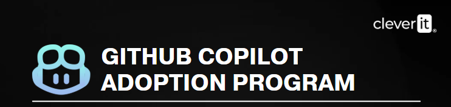
</p>

# GitHub Copilot — Software Architecture Workshop

> Hands-on lab for designing and scaffolding a software system from scratch
> using the **newest agentic features** of GitHub Copilot: **Agent Mode**,
> **Custom Instructions**, **Prompt Files**, **context references**
> (`#codebase`, `#file`, `#folder`), **MCP servers**, and **subagents**.

The workshop takes an event-registration application from an initial business
brief all the way to a **hexagonal architecture .NET solution**, producing use
case diagrams, sequence diagrams, and structured documentation along the
way — with Copilot doing the multi-step work autonomously.

> [Versión en español](./README-ESP.md)

---

## Table of contents

- [Introduction](#introduction)
- [Learning objectives](#learning-objectives)
- [Workshop flow](#workshop-flow)
- [Prerequisites](#prerequisites)
- [Agentic Copilot features used in this workshop](#agentic-copilot-features-used-in-this-workshop)
- [Step 1 · Defining the context](#step-1--defining-the-context)
- [Step 2 · Identify actors and entities with Ask mode + `#codebase`](#step-2--identify-actors-and-entities-with-ask-mode--codebase)
- [Step 3 · Build the workspace with Agent Mode](#step-3--build-the-workspace-with-agent-mode)
- [Step 4 · Documentation of entities via a reusable Prompt File](#step-4--documentation-of-entities-via-a-reusable-prompt-file)
- [Step 5 · Documentation of system actors](#step-5--documentation-of-system-actors)
- [Step 6 · Use cases and PlantUML diagrams](#step-6--use-cases-and-plantuml-diagrams)
- [Step 7 · Modules, services and Mermaid sequence diagrams](#step-7--modules-services-and-mermaid-sequence-diagrams)
- [Step 8 · Hexagonal .NET scaffold with Agent Mode](#step-8--hexagonal-net-scaffold-with-agent-mode)
- [Optional · MCP servers and subagents](#optional--mcp-servers-and-subagents)
- [Homework](#homework)
- [Repository structure](#repository-structure)

---

## Introduction

This repository is a **demonstration workshop** of GitHub Copilot applied to
software architecture. Using Copilot Chat you will build a series of design
documents and code artifacts to develop a software system **from scratch**.

The goal is not to teach UML or hexagonal architecture in depth, but to show
how the **agentic capabilities** of Copilot — the ones released as part of
Copilot Chat's Ask / Edit / **Agent** modes — accelerate the entire
architecture workflow: use case diagrams, sequence diagrams, entity
documentation, and a runnable project scaffold, all driven by natural language
prompts that Copilot Agent Mode can execute autonomously.

The workshop is targeted at systems engineers, software architects and senior
developers already familiar with software design.

---

## Learning objectives

By the end of the lab, participants will be able to:

- **Persist project intent** in `.github/copilot-instructions.md` (or
  `AGENTS.md`) so every Copilot Chat session in the repo starts with the
  same context.
- **Author reusable prompts** as `.prompt.md` files under
  `.github/prompts/` and invoke them from any chat mode.
- **Reference context precisely** using `#codebase`, `#file:<name>`,
  `#folder:<path>`, `#symbol`, `#selection` and `#problems`.
- **Drive multi-step work with Agent Mode**: let Copilot iterate over an
  entire folder, generate coherent markdown, and run terminal commands
  (`dotnet new`, `git`, PlantUML rendering) with checkpoint approval.
- **Generate use case and sequence diagrams** in PlantUML and Mermaid,
  keeping their content aligned with the entity/actor documentation.
- **Scaffold a hexagonal-architecture .NET solution** that respects the
  actors, entities, services and use cases defined earlier.
- **Extend Copilot** with MCP servers and delegate exploration to a
  **subagent** when the context grows large.

---

## Workshop flow

<p align="center">
  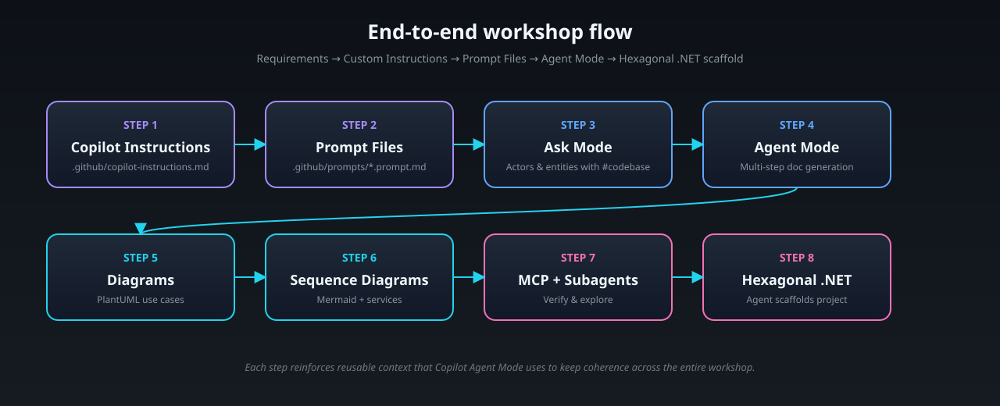
</p>

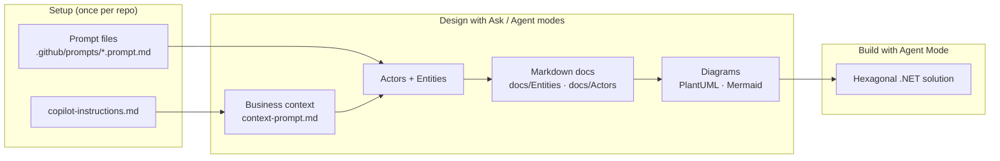
```mermaid
flowchart LR
    subgraph Setup["Setup (once per repo)"]
        CI["copilot-instructions.md"]
        PF["Prompt files<br/>.github/prompts/*.prompt.md"]
    end

    subgraph Design["Design with Ask / Agent modes"]
        Ctx["Business context<br/>context-prompt.md"]
        Ent["Actors + Entities"]
        Docs["Markdown docs<br/>docs/Entities · docs/Actors"]
        Diags["Diagrams<br/>PlantUML · Mermaid"]
    end

    subgraph Build["Build with Agent Mode"]
        Scaffold["Hexagonal .NET solution"]
    end

    CI --> Ctx
    PF --> Ent
    Ctx --> Ent
    Ent --> Docs
    Docs --> Diags
    Diags --> Scaffold
```

---

## Prerequisites

- **Visual Studio Code** (latest stable release).
- **GitHub Copilot** and **GitHub Copilot Chat** extensions with an active
  subscription that has **Agent Mode** enabled.
- [PlantUML Diagram Extension](https://marketplace.visualstudio.com/items?itemName=jebbs.plantuml) — required to preview `.plantuml` files.
- [Mermaid Diagram Extension](https://marketplace.visualstudio.com/items?itemName=bierner.markdown-mermaid) — required to preview Mermaid inside `.md` files.
- [.NET 8 SDK](https://dotnet.microsoft.com/download) (only for the final scaffold step).
- Java runtime (needed by the PlantUML extension to render diagrams).

Verify your setup:

```powershell
code --version
dotnet --version
java -version
```

Open the folder that contains this README in VS Code, then open the
**Copilot Chat** view (default shortcut on Windows: `Ctrl+Alt+I`).

---

## Agentic Copilot features used in this workshop

The workshop assumes you know **that** these features exist. This table is a
quick reference — the individual steps explain when and why to use them.

| Feature | What it is | Where it lives |
| ------- | ---------- | -------------- |
| **Ask mode** | Chat that answers questions and generates snippets in the message thread. | Chat view · mode picker |
| **Edit mode** | Chat that proposes multi-file edits you review before applying. | Chat view · mode picker |
| **Agent Mode** | Autonomous mode that plans, edits files and runs tools until the goal is met, asking you to approve terminal commands. | Chat view · mode picker |
| **Copilot Instructions** | Repo-wide, always-on system prompt. | `.github/copilot-instructions.md` or `AGENTS.md` |
| **Instructions files** | Scoped instructions that apply to matching paths. | `.github/instructions/*.instructions.md` with `applyTo` frontmatter |
| **Prompt files** | Reusable prompts callable from any mode. | `.github/prompts/*.prompt.md` |
| **Custom chat modes** | Preset persona + toolset + instructions. | `.github/chatmodes/*.chatmode.md` |
| **Context references** | Attach precise context to a message. | `#codebase`, `#file:<name>`, `#folder:<path>`, `#symbol`, `#selection`, `#problems`, `#terminalLastCommand`, `#fetch` |
| **Chat participants** | Namespaced experts. | `@workspace`, `@vscode`, `@terminal`, `@github` |
| **MCP servers** | Model Context Protocol tools plugged into Copilot. | `.vscode/mcp.json` |
| **Subagents** | Delegate a focused task to a dedicated agent. | Agent Mode → `runSubagent` |
| **Checkpoints** | Restore the workspace to a state before Agent Mode edits. | Chat view · checkpoint list |

> 💡 **Tip**
>
> Copilot Chat now exposes a **mode picker** (Ask / Edit / Agent). Every
> screenshot in this workshop assumes **Agent Mode** unless stated otherwise.

<p align="center">
  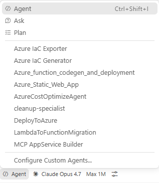
</p>

---

## Step 1 · Defining the context

For architecture tasks Copilot needs **two layers of context**:

1. **Who you are and what you expect** (persona + workflow rules) — this is
   best captured **once**, in a Copilot Instructions file, so every future
   chat starts pre-configured.
2. **What the system is** (business rules, modules, restrictions) — better
   supplied per-conversation via prompts or `#file` references.

### 1.1 · Persist your persona in a Copilot Instructions file

Instead of pasting the same "who am I" prompt at the start of every chat,
create a repo-level instructions file. Copilot Chat automatically loads it in
all three modes (Ask / Edit / Agent).

<p align="center">
  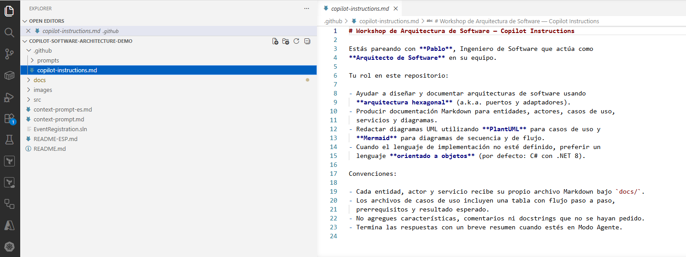
</p>

Create `.github/copilot-instructions.md` with content along these lines:

```markdown
# Software Architecture Workshop — Copilot Instructions

You are pair-programming with **Pablo**, a Software Engineer acting as
**Software Architect** on his team.

Your role in this repository:

- Help design and document software architectures using **hexagonal
  architecture** (aka ports and adapters).
- Produce Markdown documentation for entities, actors, use cases, services
  and diagrams.
- Author UML diagrams using **PlantUML** for use cases and **Mermaid** for
  sequence and flow diagrams.
- When the target implementation language is unspecified, prefer an
  **object-oriented** language (default: C# with .NET 8).

Conventions:

- Every entity, actor and service gets its own Markdown file under `docs/`.
- Use case files include a table with step-by-step flow, prerequisites and
  expected outcome.
- Do not add features, comments or docstrings that were not requested.
- End answers with a short recap when running in Agent Mode.
```

> 🤓 **What changed vs. the classic approach**
>
> The original workshop had a *Prompt 1* that introduced Pablo and asked
> Copilot "Are you capable of that?". That prompt still works, but it lives
> only in a single chat session. A `copilot-instructions.md` file makes the
> same persona persistent across **every** chat, every mode, every teammate.

If you still want to run the original conversational opener, this remains
valid — just note it is now optional:

<details>
<summary><strong>Prompt 1 (optional, legacy)</strong> — conversational persona opener</summary>

```text
Hi! My name is Pablo, I'm a Software Engineer and I have a role as a
Software Architect in my team. I want you to help me with some tasks related
to software architecture and software design. Are you capable of that? I
know that you can write code, so I was thinking that you can help me create
documentation for a project using markdown files and also create diagrams
using code with tools like Mermaid or PlantUML. Also, I want to generate
code structures with an architecture called "Hexagonal Architecture". I
haven't defined which programming language we are going to use but it will
probably be an object-oriented programming language. The diagrams that I
have in mind are use case diagrams and sequence diagrams. I might need a
couple of more UML diagrams but I'm okay with the current ones. Could you
help me with this? Can you help me with these tasks if I provide you with a
context?
```

_Copilot's Response:_

```text
Yes, I can help you with these tasks. Please provide the context or
specific requirements for the documentation, diagrams, or code structures
you need assistance with.
```

</details>

> 💡 **Tip**
>
> Ending prompts with an open-ended question keeps the model receptive to
> subsequent instructions, resulting in a smoother human-machine
> interaction — this is why Prompt 2 (below) explicitly says *"I will send
> you subsequent prompts"*.

### 1.2 · The problem context

The business context of the software / module / system to be built is
supplied as a rich prompt. The more constraints, business rules and modules
you spell out, the better Copilot's responses will be.

**Prompt 2.**

- [Prompt in English](./context-prompt.md)
- [Prompt in Spanish](./context-prompt-es.md)

Instead of pasting the whole thing, attach it as a **file reference** from
Copilot Chat:

```text
#file:context-prompt.md

Do not give me results yet. First, process all the information in the file
above — those are the business rules for the system we are going to build
together. I will send you subsequent prompts with the diagrams and
documentation I need generated.
```

_Copilot's Response:_

```text
Understood. I have processed the information you provided. The requirements
and business rules are clear, and I understand the different modules that
need to be implemented in the web application. Please proceed with your
subsequent prompts, and I will assist you accordingly with generating the
necessary diagrams and documentation.
```

---

## Step 2 · Identify actors and entities with Ask mode + `#codebase`

Now that the persona (Step 1.1) and the problem (Step 1.2) are wired up,
switch Copilot Chat to **Ask mode** to explore the domain without letting
Copilot edit any file yet.

<p align="center">
  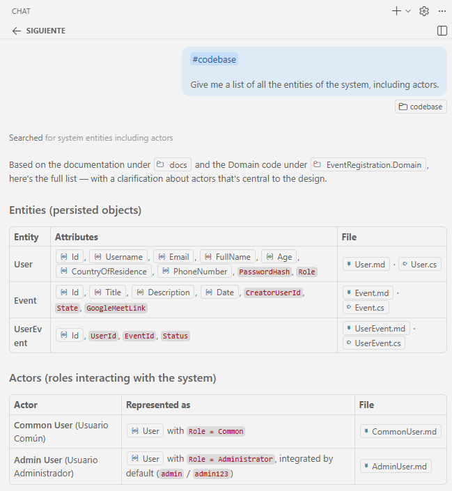
</p>

> 🤓 **System clarification**
>
> Following the formal definition of a system as *a set of interrelated and
> interdependent elements working together toward a common goal*, a web
> application is a system that falls under the paradigm of information
> systems. From here on we refer to it as a "system" instead of an
> "application".

### 2.1 · List the actors

**Prompt 3.**

```text
#file:context-prompt.md

Give me a list of the actors of the system.
```

_Copilot's Response:_

```md
**Registered User**
- Can create events.
- Can be invited to events.
- Can view events they are invited to.
- Can manage their account information.
- Can delete their account (with restrictions).

**Organizer User**
- A type of registered user who creates events.
- Can modify or delete their own events.
- Can see a list of all attendees for their events.

**Attendee User**
- A type of registered user who is invited to events.
- Can view basic information about events they are invited to.
- Can accept or decline event invitations.

**Administrator User**
- Has complete control over the application.
- Can see all events within the application.
- Can see a list of all users on the platform.
- Can add, delete, and modify users.
- Can delete and modify any event.
```

### 2.2 · List all entities

**Prompt 4.**

```text
#codebase

Give me a list of all the entities of the system, including actors.
```

Using `#codebase` here tells Copilot to consider anything already indexed in
the repo (currently only the two context prompts) in addition to the chat
history.

_Copilot's Response:_

```text
Here is a list of all the entities of the system, including actors:

Actors:
- Registered User
- Organizer User
- Attendee User
- Administrator User

Entities:

- User
Attributes: userId, username, email, fullName, age, countryOfResidence, phoneNumber, password, role (Registered, Organizer, Attendee, Administrator)

- Event
Attributes: eventId, title, description, date, organizerId, state (active, finished), googleMeetLink

- Attendee
Attributes: attendeeId, eventId, userId, status (accepted, declined)

- Invitation
Attributes: invitationId, eventId, userId, emailSent (boolean), response (accepted, declined, pending)

These entities and actors interact to fulfill the requirements and business rules of the system.
```

### 2.3 · Refine the model

Copilot has produced a valid list, but there are optimizations to apply:

- A registered user really has only two roles: **common user** and **admin**.
- "Organizer" is not a role — it is a business rule about the event creator.
- No dedicated `Attendee` entity is needed; a user–event many-to-many
  relationship covers it.

We inform Copilot of this optimization so that it can modify the entities and their attributes.

**Prompt 5.**

```text
You did a good analysis on the system requirements, but there are some
changes that need to be done in order to optimize this architecture.

1. A registered user can only have in reality two roles, common user and
   admin user. Only common users can be registered — admin users are built
   into the system as we mentioned earlier in the requirements.

2. An organizer user isn't a role, in reality it is a business rule that can
   be accomplished by adding a "creator_user" attribute into the event
   entity.

3. An Attendee entity doesn't exist because a User can be both an organizer
   or an attendee, so all the attendees can be identified by a relationship
   between the users entity and the events entity, this relationship is a
   many-to-many relationship because a user can organize multiple events and
   also a user can be registered in multiple events.

Take into account these statements and change the entities, actors, and
attributes accordingly.
```

_Copilot's Response:_

```text
Based on the provided optimizations, here is the updated list of actors and
entities:

Actors

Common User

- Can create events.
- Can be invited to events.
- Can view events they are invited to.
- Can manage their account information.
- Can delete their account (with restrictions).

Admin User

- Has complete control over the application.
- Can see all events within the application.
- Can see a list of all users on the platform.
- Can add, delete, and modify users.
- Can delete and modify any event.

Entities

- User:
Attributes: userId, username, email, fullName, age, countryOfResidence, phoneNumber, password, role (common, admin)

- Event
Attributes: eventId, title, description, date, creatorUserId, state (active, finished), googleMeetLink

- UserEvent
Attributes: userEventId, userId, eventId, status (accepted, declined)

These changes reflect the optimizations by simplifying the roles and
relationships within the system.
```

---

## Step 3 · Build the workspace with Agent Mode

With the domain confirmed, switch Copilot Chat to **Agent Mode**. The
autonomous agent replaces the legacy `@workspace /new` command: instead of
scaffolding once, it can create folders, run `git`, and even ask you to
approve `dotnet new` calls.

<p align="center">
  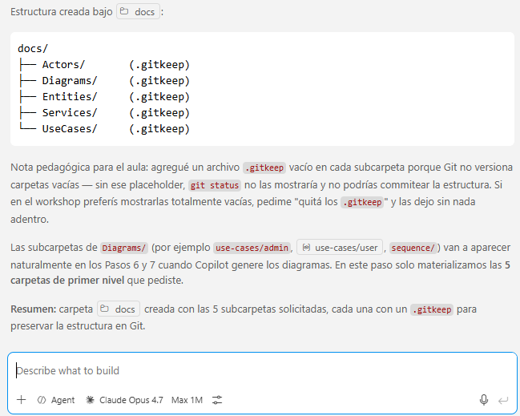
</p>

Target folder structure (the `Diagrams/` subfolders are introduced by
Steps 6 and 7 — mentioned here for reference):

```text
docs/
├── Entities/
├── UseCases/
├── Actors/
├── Services/
└── Diagrams/
    ├── use-cases/
    │   ├── admin/         # PlantUML diagrams (Step 6)
    │   └── user/
    └── sequence/          # Mermaid diagrams (Step 7)
```

**Prompt 6.**

```text
Create a new folder called `docs/` at the repository root with the following
subfolders:

- Entities/
- UseCases/
- Actors/
- Services/
- Diagrams/

This folder will contain the architecture documentation of the system we
are working on.
```

> ⚠️ **Approve carefully**
>
> Agent Mode will list every file operation before applying it. Use the
> checkpoint list in the chat view to review changes and, if anything goes
> off-track, restore to the previous checkpoint in one click.

> 🧭 **Legacy note**
>
> The original workshop used `@workspace /new` to scaffold this folder.
> Agent Mode is now the recommended, more general approach because it
> preserves your existing files and gives you a checkpoint for undo.

---

## Step 4 · Documentation of entities via a reusable Prompt File

The next several steps ("generate a Markdown file per entity", "per actor",
"per service"…) have exactly the same shape. Extract the shape into a
**prompt file** so you (and the rest of the team) can reuse it.

<p align="center">
  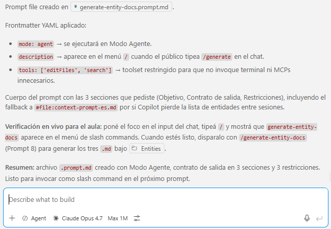
</p>

### 4.1 · Author the prompt file

Ask Agent Mode to create it, or write it yourself:

`.github/prompts/generate-entity-docs.prompt.md`

````markdown
---
mode: agent
description: Generate a Markdown documentation file for each entity of the system.
tools: ['editFiles', 'search']
---

Goal: for every entity defined in the current system context, create one
Markdown file under `docs/Entities/` named `<EntityName>.md`.

Each file must contain:

1. A detailed description of the entity, explaining its role.
2. A table describing all attributes, their data type, description and the
   business rules that apply to them.
3. A "Relationships" section listing the connections with other entities.

Constraints:

- Do not create files for entities that already exist.
- Use the entity list confirmed in the chat so far. If in doubt, reference
  `#file:context-prompt.md` and the chat history.
- Do not fabricate attributes not mentioned in the business rules.
````

### 4.2 · Invoke the prompt file

In Copilot Chat, type `/` and pick `generate-entity-docs`, or reference it
inline as `#prompt:generate-entity-docs`. In Agent Mode, Copilot will iterate
over the entity list and produce the files.

**Prompt 7.** (invocation)

```text
/generate-entity-docs
```

_Copilot's Response — generated files:_

- `Event.md`

```md
# Event

## Description
The `Event` entity represents an event within the system. It includes details such as the event's title, description, date, creator, and state. Events can be active or finished and may include a Google Meet link for virtual meetings.

## Attributes

| Attribute       | Data Type | Description                                                                 | Business Rules                                                                 |
|-----------------|-----------|-----------------------------------------------------------------------------|-------------------------------------------------------------------------------|
| `eventId`       | `String`  | Unique identifier for the event.                                            | Must be unique and non-null.                                                  |
| `title`         | `String`  | Title of the event.                                                         | Must be non-null and non-empty.                                               |
| `description`   | `String`  | Detailed description of the event.                                          | Optional.                                                                     |
| `date`          | `Date`    | Date and time when the event is scheduled to occur.                         | Must be a valid date in the future.                                           |
| `creatorUserId` | `String`  | Identifier of the user who created the event.                               | Must be a valid user ID.                                                      |
| `state`         | `String`  | Current state of the event (active, finished).                              | Must be either 'active' or 'finished'.                                        |
| `googleMeetLink`| `String`  | Link to the Google Meet for the event.                                       | Optional. Must be a valid URL if provided.                                    |

## Relationships
- An `Event` is created by a `User`.
- An `Event` can have multiple `UserEvent` entries associated with it, representing users' participation status.
```

- `UserEvent.md`

```md
# UserEvent

## Description
The `UserEvent` entity represents the relationship between a user and an event. It includes details such as the user's participation status in the event.

## Attributes

| Attribute       | Data Type | Description                                                                 | Business Rules                                                                 |
|-----------------|-----------|-----------------------------------------------------------------------------|-------------------------------------------------------------------------------|
| `userEventId`   | `String`  | Unique identifier for the user-event relationship.                          | Must be unique and non-null.                                                  |
| `userId`        | `String`  | Identifier of the user participating in the event.                          | Must be a valid user ID.                                                      |
| `eventId`       | `String`  | Identifier of the event the user is participating in.                       | Must be a valid event ID.                                                     |
| `status`        | `String`  | Participation status of the user (accepted, declined).                      | Must be either 'accepted' or 'declined'.                                      |

## Relationships
- A `UserEvent` links a `User` to an `Event`.
- A `User` can have multiple `UserEvent` entries, representing participation in multiple events.
- An `Event` can have multiple `UserEvent` entries, representing multiple users' participation.
```

If the `User` entity is missing (Copilot may skip it because it is also an
actor), ask for it explicitly:

```text
Give me the markdown document for the User entity following the same
structure. Save it under docs/Entities/.
```

- `User.md`

```md
# User

## Description
The `User` entity represents a user within the system. It includes details such as the user's unique identifier, name, email, and role. Users can create events and participate in events.

## Attributes

| Attribute       | Data Type | Description                                                                 | Business Rules                                                                 |
|-----------------|-----------|-----------------------------------------------------------------------------|-------------------------------------------------------------------------------|
| `userId`        | `String`  | Unique identifier for the user.                                             | Must be unique and non-null.                                                  |
| `name`          | `String`  | Full name of the user.                                                      | Must be non-null and non-empty.                                               |
| `email`         | `String`  | Email address of the user.                                                  | Must be a valid email address and unique.                                     |
| `role`          | `String`  | Role of the user within the system (e.g., admin, participant).              | Must be either 'admin' or 'participant'.                                      |

## Relationships
- A `User` can create multiple `Event` entities.
- A `User` can have multiple `UserEvent` entries, representing participation in multiple events.
```

> ⚠️ **Important**
>
> All these generated files are saved in the `docs/Entities/` folder. Verify
> the checkpoint in the chat view before committing.

---

## Step 5 · Documentation of system actors

Actors represent entities that interact and are governed by the business
rules of the domain. An entity can be represented by multiple actors
depending on the use case and the workflow.

### 5.1 · Confirm the actor list

Since we already narrowed the actors in Step 2, a short Ask-mode question
confirms Copilot still holds the right context:

**Prompt 8.**

```text
What are the actors of the system?
```

_Copilot's Response:_

```text
Common User
- Can create events.
- Can be invited to events.
- Can view events they are invited to.
- Can manage their account information.
- Can delete their account (with restrictions).

Admin User
- Has complete control over the application.
- Can see all events within the application.
- Can see a list of all users on the platform.
- Can add, delete, and modify users.
- Can delete and modify any event.
```

### 5.2 · Generate the actor docs (Prompt File pattern)

Author `.github/prompts/generate-actor-docs.prompt.md`:

````markdown
---
mode: agent
description: Generate a Markdown documentation file for each actor of the system.
tools: ['editFiles', 'search']
---

Goal: for every actor confirmed in the chat context, create one Markdown
file under `docs/Actors/` named `<ActorName>.md`.

Each file must contain:

1. A detailed description of the actor.
2. Their responsibilities.
3. Their restrictions.
4. All business rules that apply to them.
5. All their use cases.

Constraints:

- Use exactly the actor names confirmed in the chat: **Common User** and
  **Admin User** (unless the chat says otherwise).
- If the actor list includes anything else, stop and ask for confirmation.
````

**Prompt 9.**

```text
/generate-actor-docs
```

### 5.3 · Troubleshooting — different actors generated

If Copilot invents new actors (for example **Participant** and **Admin**
instead of the ones we confirmed), the **Participant** actor lacks the
"organizer" capabilities we defined earlier. Reset the context with the
classic fix prompt — it still works verbatim:

<details>
<summary><strong>Fix prompt (apply only if needed)</strong></summary>

```text
Previously you identified the actors of this system as "Common User" and
"Admin User". In order to create this system, we need to keep those actors
instead of the actors you created recently, because all the business rules
don't apply completely to the newer ones. This means that "Common User" and
"Admin User" must be kept. Also, take note that Common User has the
business rules of both an Attendant and Organizer, as you described
previously.
```

</details>

_Copilot's Response — generated files:_

- `AdminUser.md`

```md
# Admin User

## Description
The `Admin User` actor represents a user with administrative privileges within the system. Admins have the ability to manage events, users, and other system settings.

## Responsibilities
- Create, update, and delete events.
- Manage user accounts, including creating, updating, and deleting users.
- Monitor system activity and generate reports.
- Configure system settings and preferences.

## Restrictions
- Admins must have a valid admin role assigned.
- Admin actions are logged for auditing purposes.

## Business Rules
- Admins must authenticate using a valid admin account.
- Admins can only perform actions within their scope of permissions.
- Admin actions must comply with system policies and regulations.

## Use Cases
- **Create Event**: Admin creates a new event with specified details.
- **Manage Users**: Admin adds, updates, or removes user accounts.
- **Generate Reports**: Admin generates reports on system activity and user participation.
- **Configure Settings**: Admin updates system settings and preferences.
```

- CommonUser.md

```md
# Common User

## Description
The `Common User` actor represents a regular user within the system who can participate in events. This actor can have the roles of `Attendant` and `Organizer`.

## Responsibilities
### As an Attendant
- View available events.
- Join and participate in events.
- Provide feedback on events.

### As an Organizer
- Create and manage events.
- Invite users to events.
- Monitor event participation and feedback.

## Restrictions
- Common Users must have a valid user account.
- Common Users can only join events that are active and not full.
- Organizers can only manage events they have created.

## Business Rules
### As an Attendant
- Attendants must authenticate using a valid user account.
- Attendants can only join events they are eligible for.
- Attendants must adhere to event rules and guidelines.

### As an Organizer
- Organizers must authenticate using a valid user account.
- Organizers can only manage their own events.
- Organizers must ensure events comply with system policies.

## Use Cases
### As an Attendant
- **View Events**: Attendant views a list of available events.
- **Join Event**: Attendant joins an event they are interested in.
- **Leave Event**: Attendant leaves an event they no longer wish to participate in.
- **Provide Feedback**: Attendant provides feedback on an event they attended.

### As an Organizer
- **Create Event**: Organizer creates a new event with specified details.
- **Manage Event**: Organizer updates or deletes an event they created.
- **Invite Users**: Organizer invites users to join their event.
- **Monitor Participation**: Organizer monitors user participation and feedback for their events.
```

---

## Step 6 · Use cases and PlantUML diagrams

Same pattern: define one prompt file that turns *"the actor docs + the
business context"* into structured use case tables, and another that
converts a use case into a PlantUML diagram.

<p align="center">
  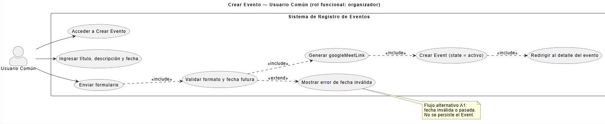
</p>

### 6.1 · Generate use case documents

Author `.github/prompts/generate-use-cases.prompt.md`:

````markdown
---
mode: agent
description: Generate use case documentation per actor.
tools: ['editFiles', 'search']
---

Based on the business rules of this application and the actor documentation
in #folder:docs/Actors, create the Use Cases documents in Markdown, one per
actor, under `docs/UseCases/`.

Each file must contain, for every use case:
- A table with a step-by-step description of the flow.
- The prerequisites that must be completed.
- The expected outcome.
````

**Prompt 10.**

```text
/generate-use-cases
```

Result:

- `AdminUserUseCases.md`
- `CommonUserUseCases.md`

### 6.2 · Generate PlantUML use case diagrams

Author `.github/prompts/generate-use-case-diagram.prompt.md`:

````markdown
---
mode: agent
description: Generate a PlantUML use case diagram from a use case description.
tools: ['editFiles']
---

Given a specific use case referenced by the user, create a `.plantuml` file
under `docs/Diagrams/use-cases/<actor>/` named `<use-case>.plantuml` that
represents all the steps described in that use case.

Constraints:

- Use `@startuml`/`@enduml`.
- One diagram = one use case.
- If the response would exceed the model's output cap, split it: generate
  the requested file and reply "continue?" so the user can trigger the next
  one.
````

> ℹ️ **Response size limits**
>
> Copilot occasionally returns "maximum response length reached". When that
> happens, generate one file at a time using this prompt file, or ask
> Copilot to *"produce only the PlantUML for `<use case>` and stop"*.

**Prompt 11.** (single-case)

```text
/generate-use-case-diagram

Use case: **Create Event** for the **Admin** actor
(see #file:docs/UseCases/AdminUserUseCases.md).

Save the diagram as create.event.plantuml.
```

_Copilot's Response — example file `create.event.plantuml`:_

```PlantUML
@startuml
actor Admin as A

A -> (Create Event) : Logs into the system
(Create Event) --> (Event Management Section) : Navigates to
(Event Management Section) --> (Create Event Form) : Clicks on "Create Event"
(Create Event Form) --> A : Fills in event details
A -> (Submit Event) : Submits the event creation form
(Submit Event) --> (System) : Validates input
(System) --> (Event List) : Creates the event
(Event List) --> A : Displays confirmation message

@enduml
```

### 6.3 · Batch the remaining diagrams

Rather than looping in Ask mode, delegate the batch to **Agent Mode**:

**Prompt 12.**

```text
Using the diagram prompt file above, generate the PlantUML file for every
remaining use case of the Admin actor
(#file:docs/UseCases/AdminUserUseCases.md). Save them under
`docs/Diagrams/use-cases/admin/`.
```

Expected files under `docs/Diagrams/use-cases/admin/`:

- `create.event.plantuml`
- `manage.users.plantuml`
- `generate.reports.plantuml`
- `configure.settings.plantuml`

**Prompt 13.**

```text
Repeat the batch for every use case of the Common User
(#file:docs/UseCases/CommonUserUseCases.md), saving into
`docs/Diagrams/use-cases/user/`.
```

Expected files under `docs/Diagrams/use-cases/user/`:

- `create.event.plantuml`
- `invite.users.plantuml`
- `join.event.plantuml`
- `leave.event.plantuml`
- `manage.event.plantuml`
- `monitor.participation.plantuml`
- `provide.feedback.plantuml`
- `view.events.plantuml`

---

## Step 7 · Modules, services and Mermaid sequence diagrams

Modules or services are the elements of the system that do not represent
any single entity but participate in the workflows that connect actors and
entities.

<p align="center">
  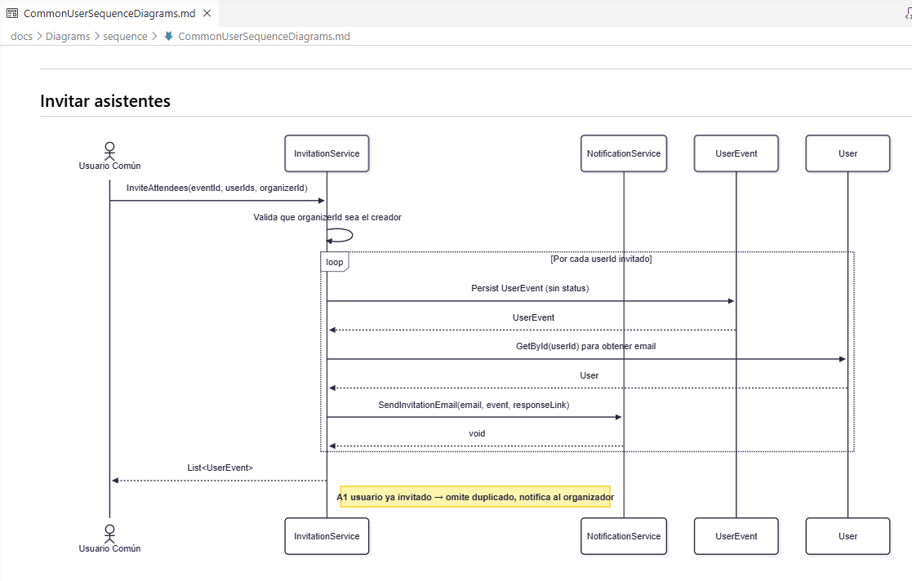
</p>

### 7.1 · Confirm the service list

**Prompt 14.**

```text
#codebase

Please, provide me a list with all the modules/services that are part of
this system.
```

_Copilot's Response:_

```text
Based on the provided workspace structure and documentation, here is a list
of all the modules/services that are part of this system:

Event Management Service

Responsible for creating, updating, and deleting events.
Manages event details such as title, description, date, and state.
Handles user participation in events.

User Management Service

Manages user accounts, including creating, updating, and deleting users.
Handles user authentication and authorization.
Manages user roles (e.g., Admin, Common User).

Report Generation Service

Generates reports on system activity and user participation.
Provides various filters and parameters for report customization.

System Configuration Service

Manages system settings and preferences.
Allows admins to configure various aspects of the system.

Feedback Management Service

Collects and manages user feedback on events.
Provides mechanisms for users to submit feedback.

Invitation Management Service

Handles sending invitations to users for events.
Manages user responses to invitations.
```

### 7.2 · Generate the service docs

Copilot's response is consistent with the domain so far. Ask Agent Mode to
turn it into one Markdown file per service under `docs/Services/`:

**Prompt 15.**

```text
Create one Markdown file per module/service listed above under
`docs/Services/`. Each file must contain:

- A detailed description of the service.
- The entities it involves (link to the corresponding entity docs).
- All the operations it can perform.

Example naming for the Invitation Management Service:
InvitationManagementService.md, with operations like
SendInvitationToUser(), SendInvitationToUserWithAttachment(),
SendInvitationToExternalUser(), RemoveInvitation().
```

**Example: `EventManagementService.md`**

```md
# EventManagementService

## Description
The `EventManagementService` is responsible for creating, updating, and deleting events. It manages event details such as title, description, date, and state. It also handles user participation in events.

## Entities Involved
- [`Event`](../Entities/Event.md)
- [`UserEvent`](../Entities/UserEvent.md)

## Operations
- **CreateEvent(eventDetails)**
  - Creates a new event with the specified details.
- **UpdateEvent(eventId, updatedDetails)**
  - Updates the details of an existing event.
- **DeleteEvent(eventId)**
  - Deletes an existing event.
- **GetEvent(eventId)**
  - Retrieves the details of a specific event.
- **ListEvents()**
  - Lists all available events.
- **AddUserToEvent(userId, eventId)**
  - Adds a user to an event.
- **RemoveUserFromEvent(userId, eventId)**
  - Removes a user from an event.
```

Other generated files:

- `UserManagementService.md`
- `ReportGenerationService.md`
- `SystemConfigurationService.md`
- `FeedbackManagementService.md`
- `InvitationManagementService.md`

### 7.3 · Build the sequence diagrams (Mermaid)

**Prompt 16.**

```text
#folder:docs

Create all the sequence diagrams based on the use cases of each type of
actor (see #file:docs/UseCases/CommonUserUseCases.md and
#file:docs/UseCases/AdminUserUseCases.md). Consider also the entities, the
services and the actors identified and generated in previous steps. Create
all the diagrams using **Mermaid** and save them as Markdown files with
Mermaid code blocks under `docs/Diagrams/sequence/`.
```

_Excerpt from the generated `AdminSequenceDiagrams.md`:_

````md
# Sequence Diagrams

## Admin Use Cases

### Create Event

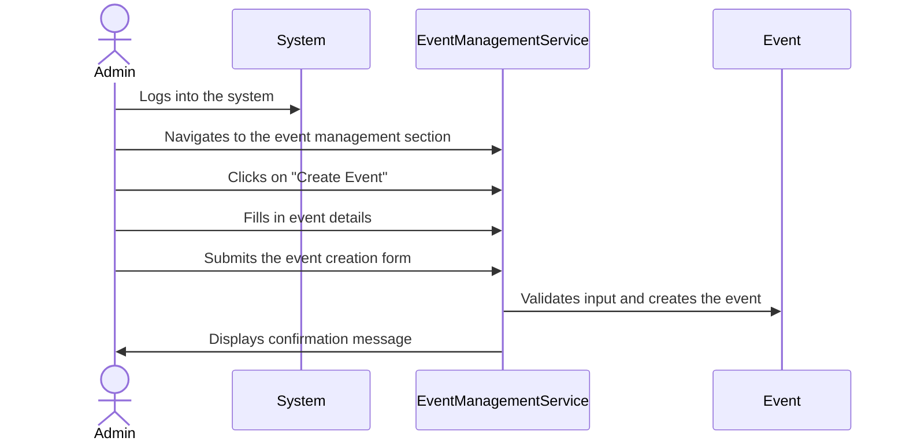
```mermaid
sequenceDiagram
    actor Admin
    Admin ->> System: Logs into the system
    Admin ->> EventManagementService: Navigates to the event management section
    Admin ->> EventManagementService: Clicks on "Create Event"
    Admin ->> EventManagementService: Fills in event details
    Admin ->> EventManagementService: Submits the event creation form
    EventManagementService ->> Event: Validates input and creates the event
    EventManagementService ->> Admin: Displays confirmation message
```

### Manage Users

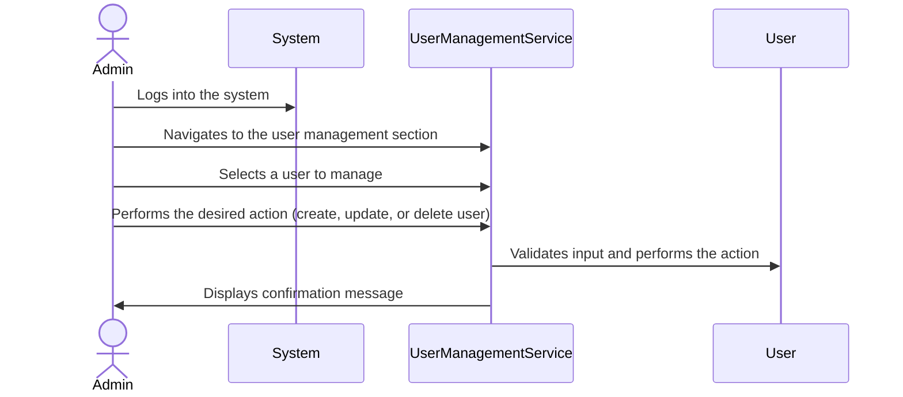
```mermaid
sequenceDiagram
    actor Admin
    Admin ->> System: Logs into the system
    Admin ->> UserManagementService: Navigates to the user management section
    Admin ->> UserManagementService: Selects a user to manage
    Admin ->> UserManagementService: Performs the desired action (create, update, or delete user)
    UserManagementService ->> User: Validates input and performs the action
    UserManagementService ->> Admin: Displays confirmation message
```

### Generate Reports

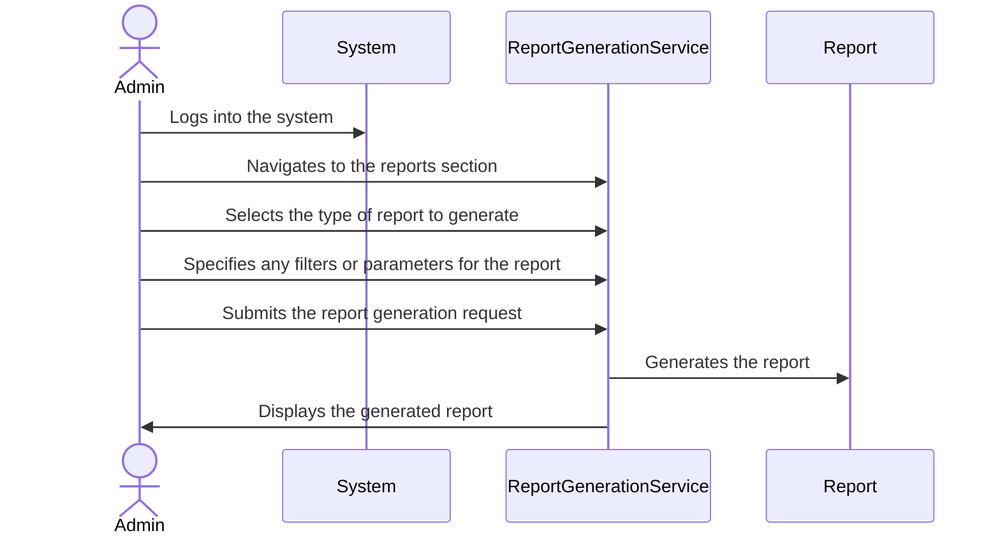
```mermaid
sequenceDiagram
    actor Admin
    Admin ->> System: Logs into the system
    Admin ->> ReportGenerationService: Navigates to the reports section
    Admin ->> ReportGenerationService: Selects the type of report to generate
    Admin ->> ReportGenerationService: Specifies any filters or parameters for the report
    Admin ->> ReportGenerationService: Submits the report generation request
    ReportGenerationService ->> Report: Generates the report
    ReportGenerationService ->> Admin: Displays the generated report
```

### Configure Settings

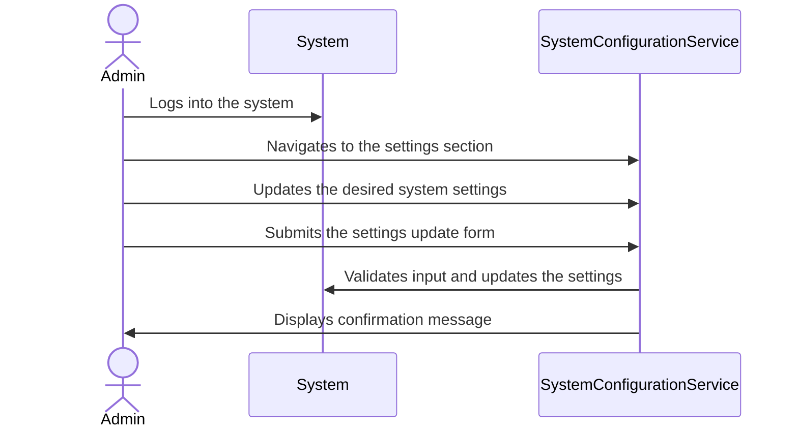
```mermaid
sequenceDiagram
    actor Admin
    Admin ->> System: Logs into the system
    Admin ->> SystemConfigurationService: Navigates to the settings section
    Admin ->> SystemConfigurationService: Updates the desired system settings
    Admin ->> SystemConfigurationService: Submits the settings update form
    SystemConfigurationService ->> System: Validates input and updates the settings
    SystemConfigurationService ->> Admin: Displays confirmation message
```
````

Generated files:

- `AdminSequenceDiagrams.md`
- `CommonUserSequenceDiagrams.md`

---

## Step 8 · Hexagonal .NET scaffold with Agent Mode

Hexagonal architecture (a.k.a. ports and adapters) separates the core of the
application — domain rules and use cases — from external concerns such as
UI, databases and third-party services. The core is surrounded by **ports**
(interfaces) and **adapters** (concrete implementations), which makes the
core easy to test and evolve independently.

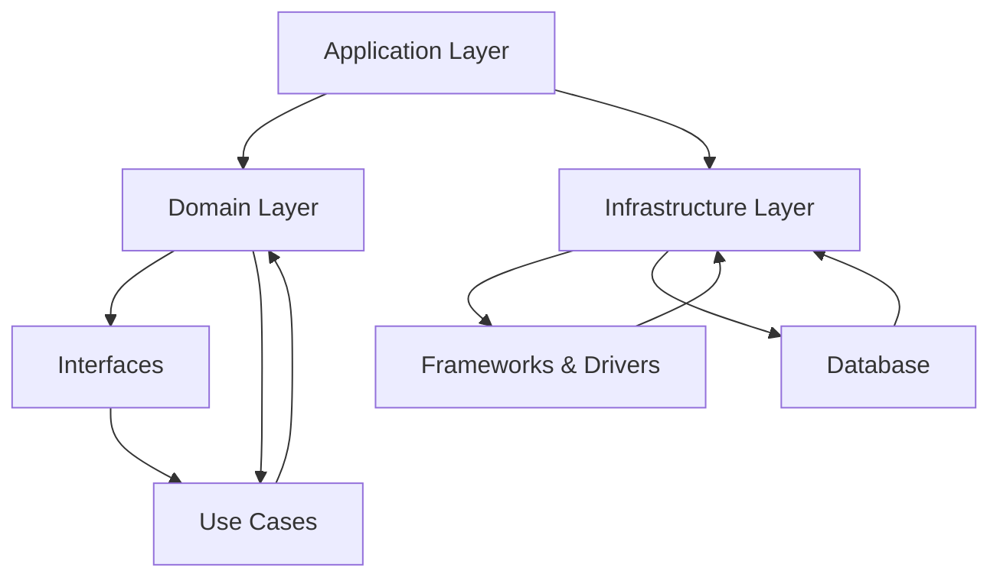
```mermaid
graph TD
  A[Application Layer] --> B[Domain Layer]
  A --> C[Infrastructure Layer]
  B --> D[Interfaces]
  B --> E[Use Cases]
  C --> F[Frameworks & Drivers]
  C --> G[Database]
  D --> E
  E --> B
  F --> C
  G --> C
```

<p align="center">
  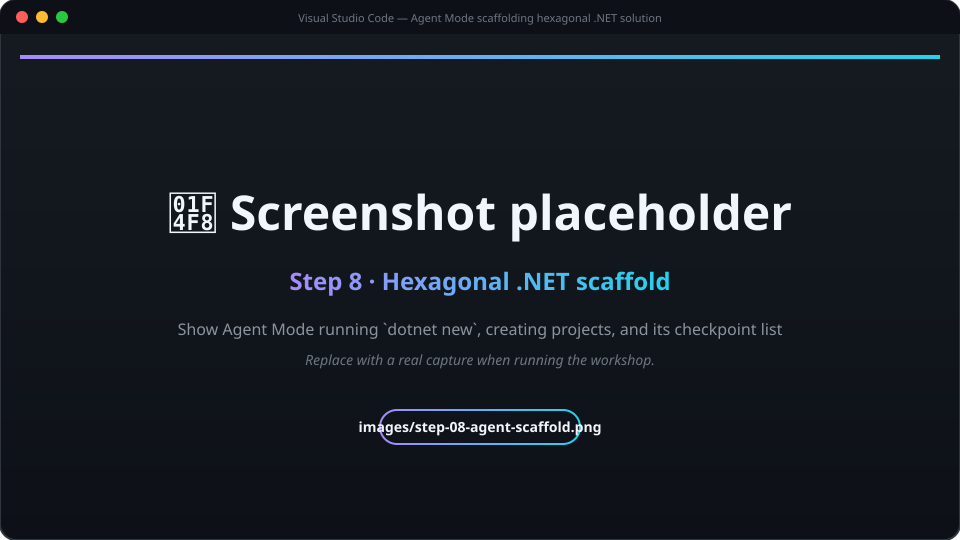
</p>

Ask **Agent Mode** to scaffold the solution. Because Agent Mode can run
terminal commands (after asking your permission), it will call `dotnet new`
directly instead of just writing files by hand.

**Prompt 17.**

```text
Based on all the documents already created in this workspace
(#folder:docs), scaffold a new .NET Web App for this event-registration
application using .NET 8 and Clean / Hexagonal Architecture.

The project must:

- Live under a solution file named `DummyEventApp.sln` that contains the
  .NET Web App project (and the additional class-library projects needed
  for a hexagonal layout: Domain, Application, Infrastructure).
- Model every entity, actor, service and use case defined previously.
- Include a `.gitignore` tailored for .NET.
- Not leave any generated file empty — populate the necessary code in each
  file.
- Not include a test project.

Wire the projects like this:

- `Application` references `Domain`.
- `Infrastructure` references `Application`.
- `Web` references `Application` **and** `Infrastructure`.

Because `Application` and `Infrastructure` are class libraries that expose
`IServiceCollection` extension methods (`AddApplication()` /
`AddInfrastructure()`) they need the following NuGet packages — add them
explicitly and pin the version to match the target framework:

- `Application`: `Microsoft.Extensions.DependencyInjection.Abstractions`.
- `Infrastructure`: `Microsoft.Extensions.DependencyInjection.Abstractions`
  and `Microsoft.Extensions.Logging.Abstractions` (needed if any adapter
  logs).

Use `dotnet new` commands from the integrated terminal to create the
projects. Ask me to approve each terminal call before running it. After
each command, verify the file layout with the workspace tools and continue
until the solution builds with `dotnet build`.
```

> ⚠️ **Reviewing terminal commands**
>
> Agent Mode will pop up a confirmation for every terminal call. Read each
> command before approving. If Copilot proposes a destructive command (for
> example `rm -rf`), reject it and rephrase your prompt.

> 💡 **NuGet pinning**
>
> Avoid `dotnet add package … --no-restore` without a `--version` — it
> writes `Version="*"` (highest available) into the `.csproj`, which can
> drift with time and cross-major-version releases. Pin to `8.0.*`
> versions (matching `net8.0`) for reproducibility.

> 🧭 **Legacy note**
>
> The classic workshop used `@workspace /new` for this final step. Agent
> Mode is strictly more powerful here: it can chain multiple `dotnet new`
> calls, wire projects together, and self-verify by running `dotnet build`.

---

## Optional · MCP servers and subagents

Copilot can be extended with **MCP servers** (Model Context Protocol) and
can **delegate exploration to a subagent** when the workspace grows.

### Attach an MCP server

Create `.vscode/mcp.json` at the repo root to declare servers. Example
skeleton — enable only what you use:

```jsonc
{
  "servers": {
    "github": {
      "type": "stdio",
      "command": "npx",
      "args": ["-y", "@modelcontextprotocol/server-github"]
    },
    "plantuml": {
      "type": "stdio",
      "command": "npx",
      "args": ["-y", "mcp-plantuml"]
    }
  }
}
```

After VS Code reloads the MCP configuration, the tools exposed by each
server become available inside Agent Mode. Typical wins for this workshop:

- A **GitHub** MCP server lets Copilot create the branch / PR that publishes
  the generated documentation.
- A **PlantUML** MCP server (or the local extension) can render the diagrams
  from Step 6 without leaving VS Code.

### Delegate to a subagent

When the context window fills up (long chats, many files), spawn a subagent
to keep the main conversation focused:

```text
Delegate to a subagent: "Explore #folder:docs and produce a one-page audit
of missing use cases, entities without documentation, and services that
have no matching sequence diagram."
```

The subagent returns a single summary that you can paste back into the main
chat as context — no more re-reading the whole `docs/` tree in Agent Mode.

---

## Homework

- Generate the **class diagrams** from the entity and service documentation
  (PlantUML `@startuml`/`@enduml` with `class` blocks). A `.prompt.md` for
  this is a natural addition to `.github/prompts/`.
- Author a `.chatmode.md` file called **`architect.chatmode.md`** that
  bundles the persona from Step 1.1 with the prompt files from Steps 4–7,
  so onboarding a new architect to the repo is a single mode selection.
- Convert one of the sequence diagrams into an actual controller /
  application service in the .NET scaffold from Step 8, keeping the code
  aligned with the documentation.

---

## Repository structure

```text
copilot-software-architecture-demo/
├── README.md              # This file (English)
├── README-ESP.md          # Spanish version
├── context-prompt.md      # Business context (English) — referenced by #file
├── context-prompt-es.md   # Business context (Spanish) — referenced by #file
└── images/                # Header banners, workshop-flow, step placeholders
    ├── header-en.svg
    ├── header-es.svg
    ├── workshop-flow.svg
    ├── step-01-copilot-instructions.svg
    ├── step-02-agent-mode.svg
    ├── step-03-prompt-file.svg
    ├── step-04-context-refs.svg
    ├── step-05-agent-generating.svg
    ├── step-06-plantuml.svg
    ├── step-07-mermaid.svg
    ├── step-08-agent-scaffold.svg
    └── README.md          # Placeholder / capture inventory
```

As you run the workshop, the `docs/`, `.github/prompts/` and
`DummyEventApp/` folders will appear — created by Copilot Agent Mode in
Steps 3, 4 and 8 respectively.

---

## End of the practice 🎉

Everything you have generated (entity docs, actor docs, use case tables,
diagrams and the .NET scaffold) came from natural-language prompts that
Copilot Agent Mode executed autonomously — no `@workspace /new` required.
The persona and shape of every recurring task now lives as
`copilot-instructions.md` + prompt files that any teammate can reuse. 🚀
