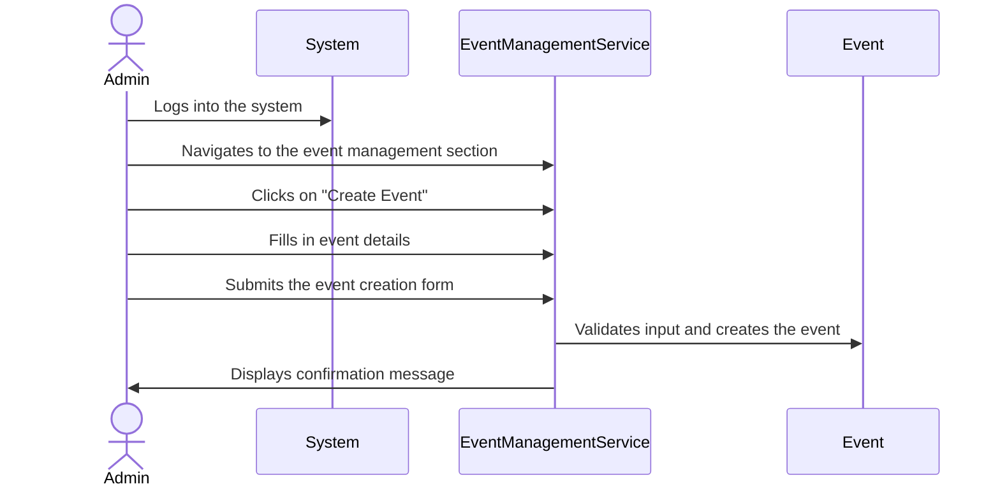
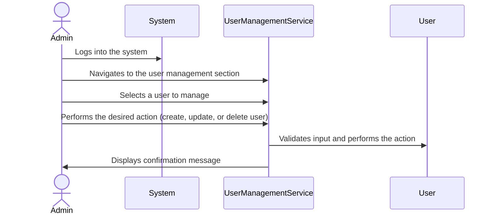
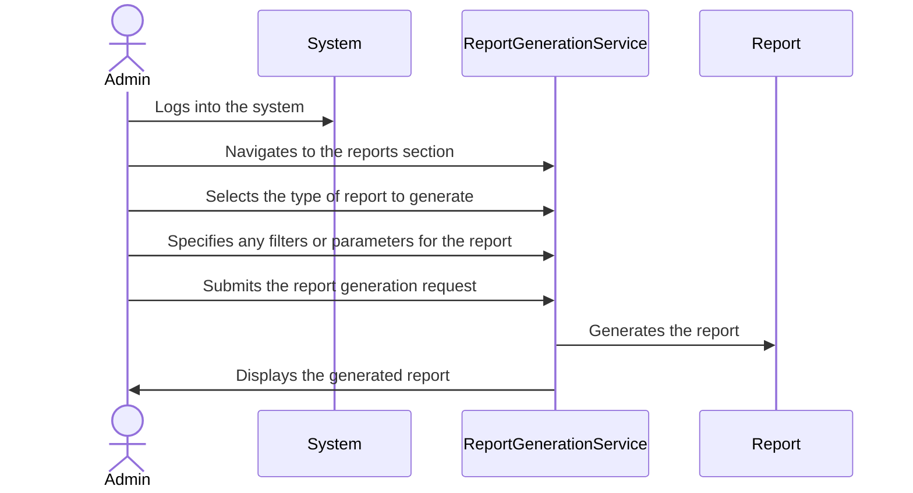
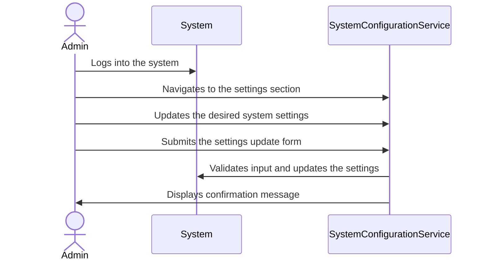

# Sequence Diagrams

## Admin Use Cases

### Create Event

```mermaid
sequenceDiagram
    actor Admin
    Admin ->> System: Logs into the system
    Admin ->> EventManagementService: Navigates to the event management section
    Admin ->> EventManagementService: Clicks on "Create Event"
    Admin ->> EventManagementService: Fills in event details
    Admin ->> EventManagementService: Submits the event creation form
    EventManagementService ->> Event: Validates input and creates the event
    EventManagementService ->> Admin: Displays confirmation message
```

### Manage Users

```mermaid
sequenceDiagram
    actor Admin
    Admin ->> System: Logs into the system
    Admin ->> UserManagementService: Navigates to the user management section
    Admin ->> UserManagementService: Selects a user to manage
    Admin ->> UserManagementService: Performs the desired action (create, update, or delete user)
    UserManagementService ->> User: Validates input and performs the action
    UserManagementService ->> Admin: Displays confirmation message
```

### Generate Reports

```mermaid
sequenceDiagram
    actor Admin
    Admin ->> System: Logs into the system
    Admin ->> ReportGenerationService: Navigates to the reports section
    Admin ->> ReportGenerationService: Selects the type of report to generate
    Admin ->> ReportGenerationService: Specifies any filters or parameters for the report
    Admin ->> ReportGenerationService: Submits the report generation request
    ReportGenerationService ->> Report: Generates the report
    ReportGenerationService ->> Admin: Displays the generated report
```

### Configure Settings

```mermaid
sequenceDiagram
    actor Admin
    Admin ->> System: Logs into the system
    Admin ->> SystemConfigurationService: Navigates to the settings section
    Admin ->> SystemConfigurationService: Updates the desired system settings
    Admin ->> SystemConfigurationService: Submits the settings update form
    SystemConfigurationService ->> System: Validates input and updates the settings
    SystemConfigurationService ->> Admin: Displays confirmation message
```