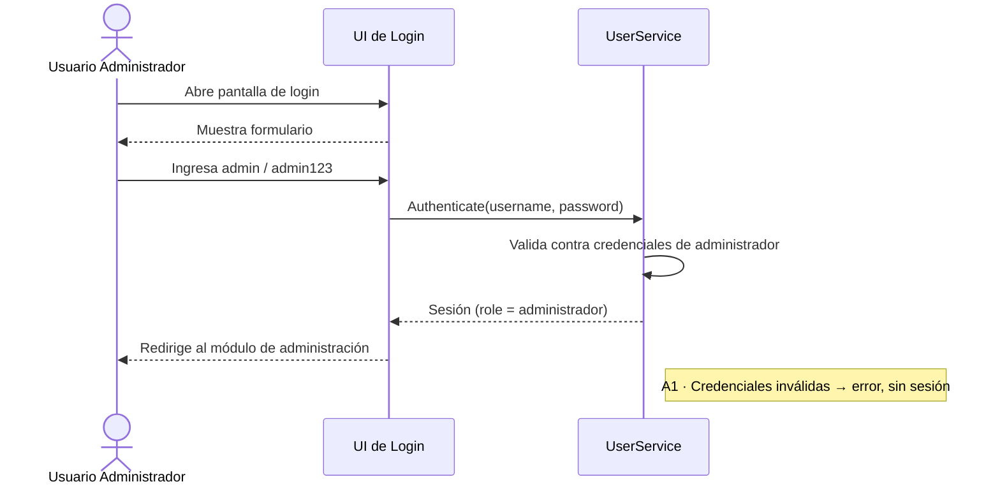
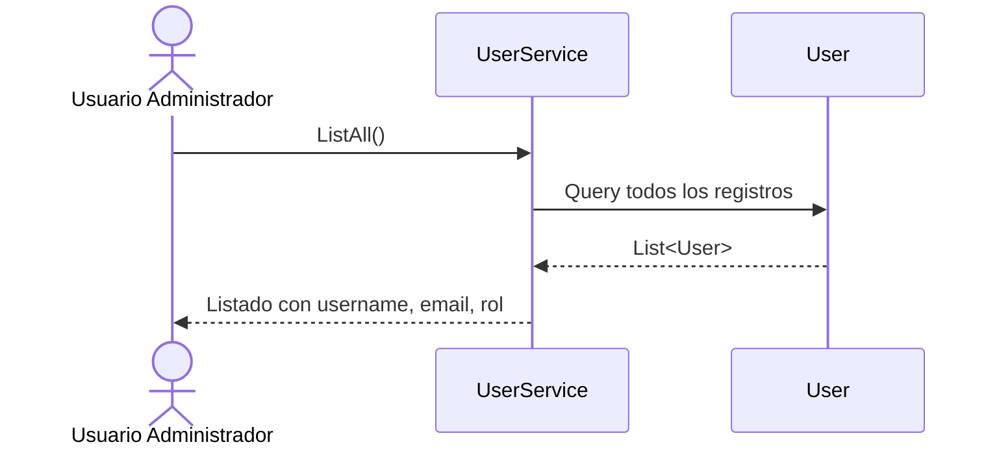
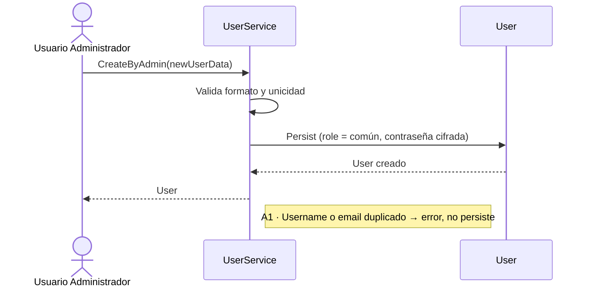
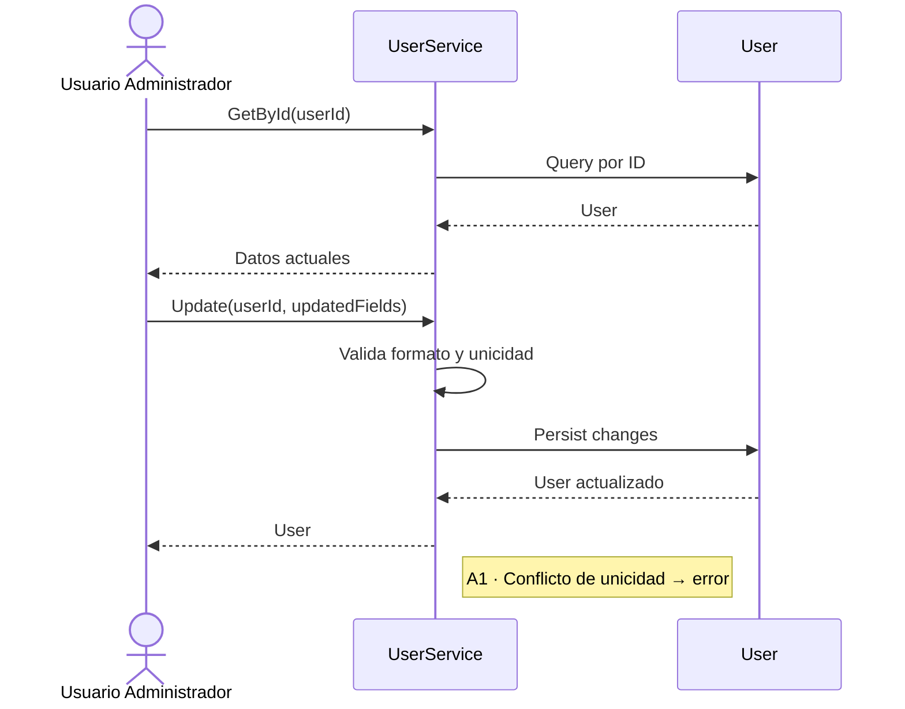
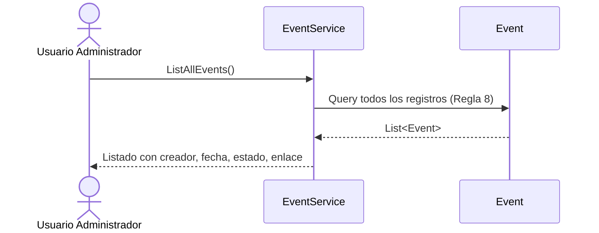
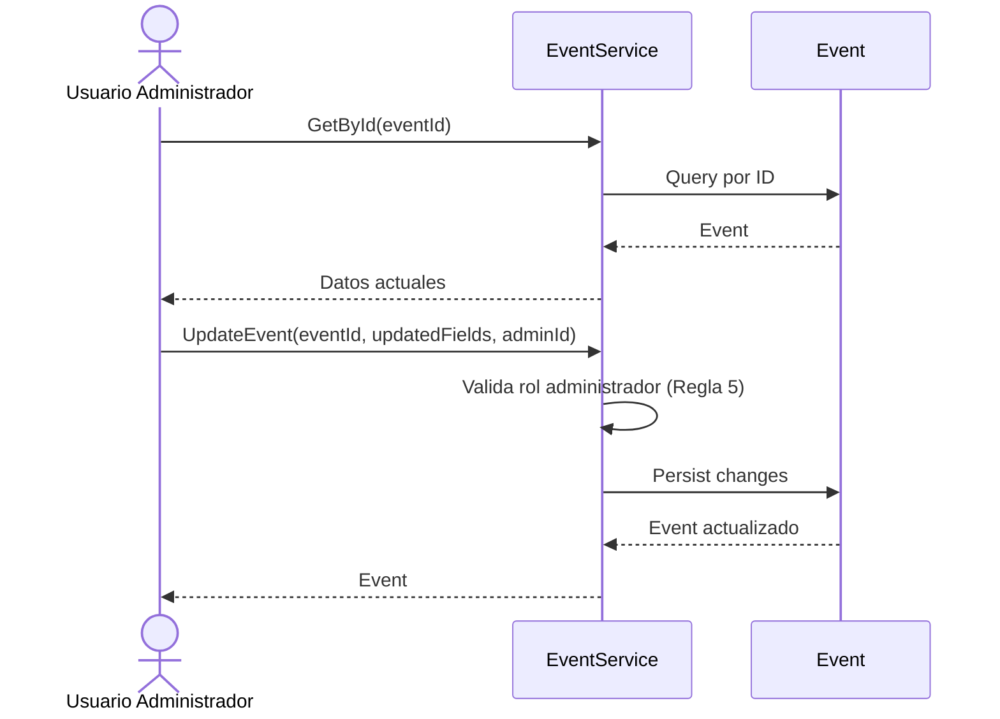
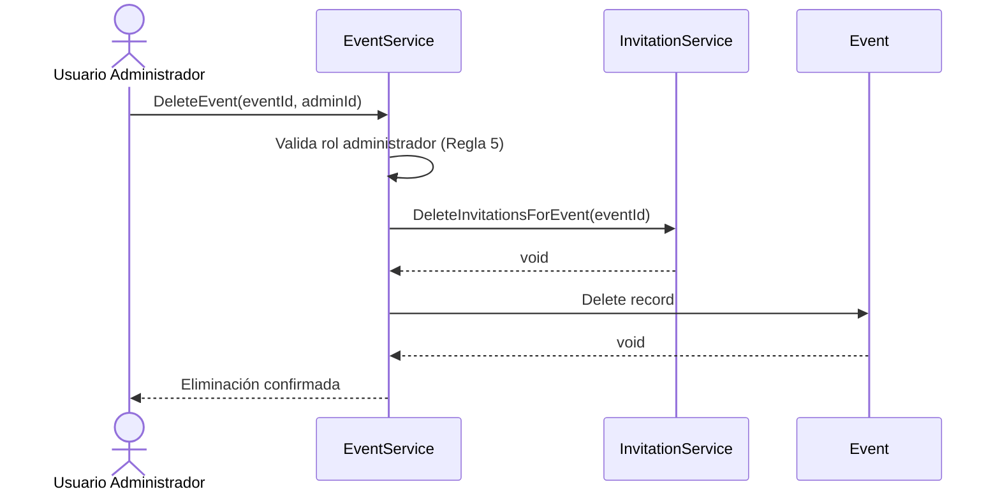

# Diagramas de Secuencia — Usuario Administrador

Cada diagrama refleja el flujo paso a paso documentado en
[../../UseCases/AdminUserUseCases.md](../../UseCases/AdminUserUseCases.md),
usando los servicios definidos en [../../Services/](../../Services/) y las
entidades bajo [../../Entities/](../../Entities/).

---

## Iniciar sesión como administrador



---

## Ver listado de todos los usuarios



---

## Agregar usuario



---

## Modificar usuario



---

## Eliminar usuario

```mermaid
sequenceDiagram
    actor Admin as Usuario Administrador
    participant US as UserService
    participant ES as EventService
    participant IS as InvitationService
    participant U as User

    Admin ->> US: Delete(userId)
    US ->> ES: HasActiveEventsAsOrganizer(userId)
    ES -->> US: bool
    Note right of US: A1 · Si hay eventos activos → advertencia; admin puede forzar cascada
    US ->> IS: DeleteInvitationsForUser(userId)
    IS -->> US: void
    US ->> U: Delete record
    U -->> US: void
    US -->> Admin: Eliminación confirmada
```

---

## Ver listado de todos los eventos



---

## Modificar cualquier evento



---

## Eliminar cualquier evento


