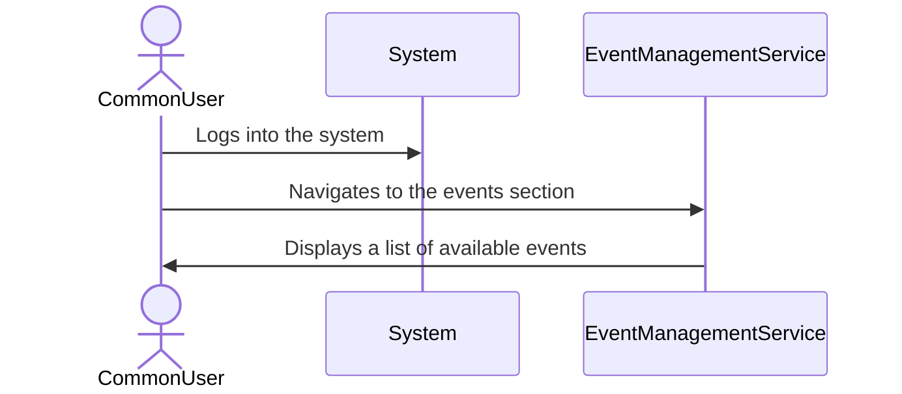
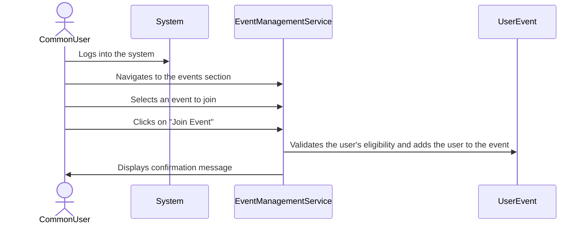
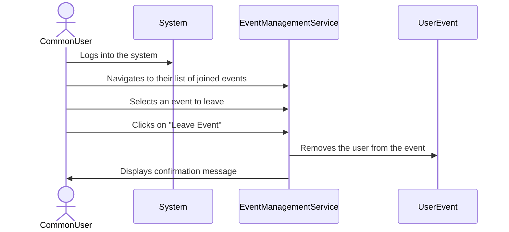
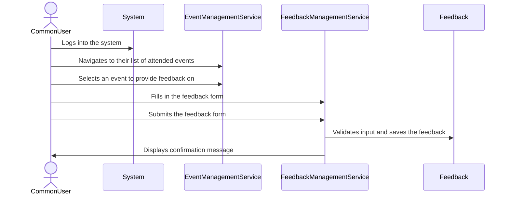
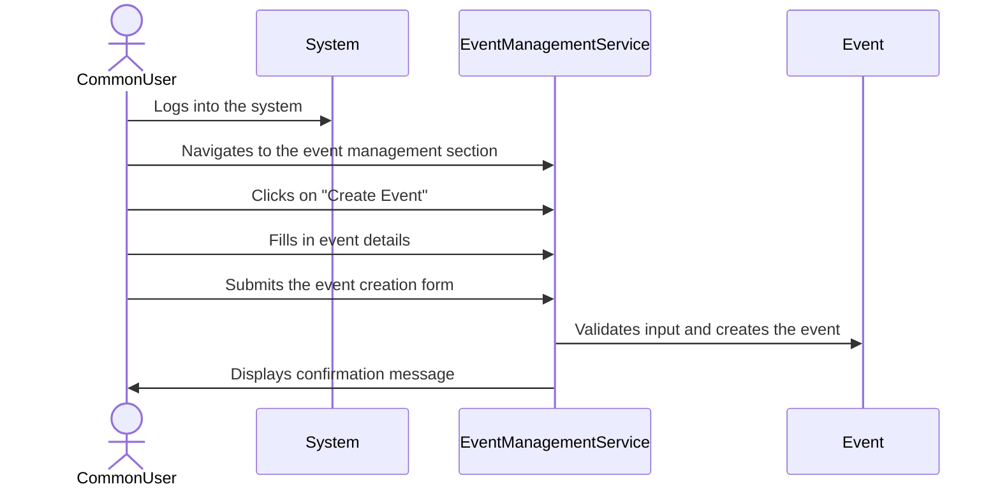
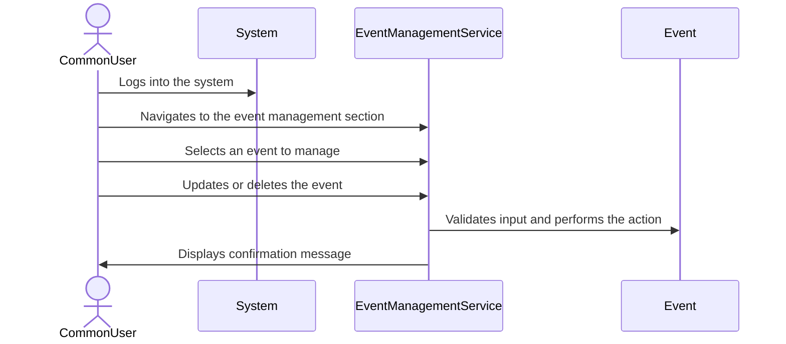
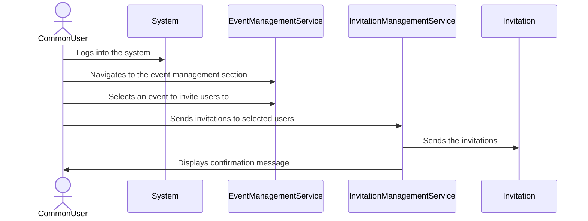
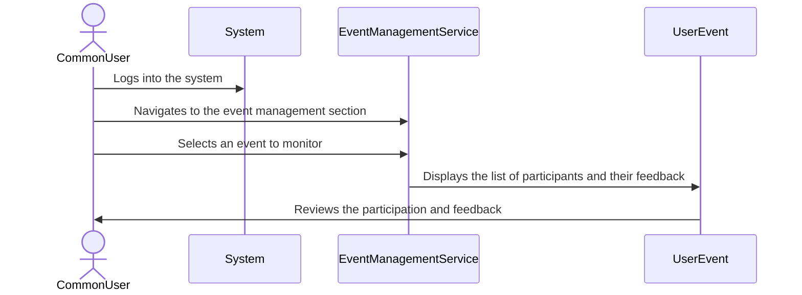

# Use Case Diagrams

## Common User Use Cases

### View Events

### Join Event

### Leave Event

### Provide Feedback

### Create Event

### Manage Event

### Invite Users

### Monitor Participation

