# Diagramas de Secuencia — Usuario Común

Cada diagrama refleja el flujo paso a paso documentado en
[../../UseCases/CommonUserUseCases.md](../../UseCases/CommonUserUseCases.md),
usando los servicios definidos en [../../Services/](../../Services/) y las
entidades bajo [../../Entities/](../../Entities/).

---

## Registrarse en la aplicación

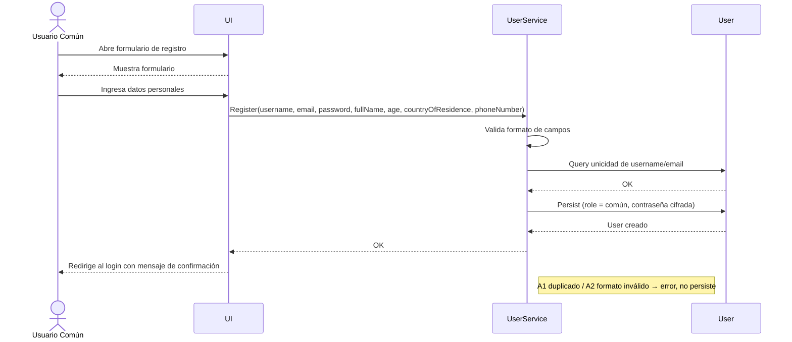
```mermaid
sequenceDiagram
    actor UC as Usuario Común
    participant UI
    participant US as UserService
    participant U as User

    UC ->> UI: Abre formulario de registro
    UI -->> UC: Muestra formulario
    UC ->> UI: Ingresa datos personales
    UI ->> US: Register(username, email, password, fullName, age, countryOfResidence, phoneNumber)
    US ->> US: Valida formato de campos
    US ->> U: Query unicidad de username/email
    U -->> US: OK
    US ->> U: Persist (role = común, contraseña cifrada)
    U -->> US: User creado
    US -->> UI: OK
    UI -->> UC: Redirige al login con mensaje de confirmación
    Note right of US: A1 duplicado / A2 formato inválido → error, no persiste
```

---

## Iniciar sesión

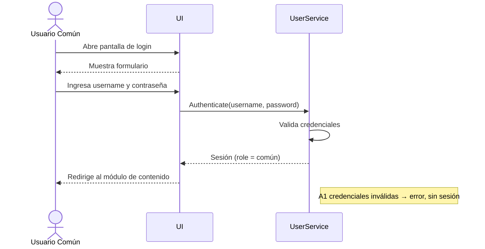
```mermaid
sequenceDiagram
    actor UC as Usuario Común
    participant UI
    participant US as UserService

    UC ->> UI: Abre pantalla de login
    UI -->> UC: Muestra formulario
    UC ->> UI: Ingresa username y contraseña
    UI ->> US: Authenticate(username, password)
    US ->> US: Valida credenciales
    US -->> UI: Sesión (role = común)
    UI -->> UC: Redirige al módulo de contenido
    Note right of US: A1 credenciales inválidas → error, sin sesión
```

---

## Gestionar cuenta

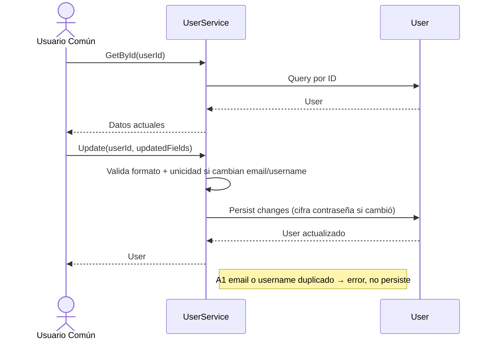
```mermaid
sequenceDiagram
    actor UC as Usuario Común
    participant US as UserService
    participant U as User

    UC ->> US: GetById(userId)
    US ->> U: Query por ID
    U -->> US: User
    US -->> UC: Datos actuales
    UC ->> US: Update(userId, updatedFields)
    US ->> US: Valida formato + unicidad si cambian email/username
    US ->> U: Persist changes (cifra contraseña si cambió)
    U -->> US: User actualizado
    US -->> UC: User
    Note right of US: A1 email o username duplicado → error, no persiste
```

---

## Eliminar cuenta

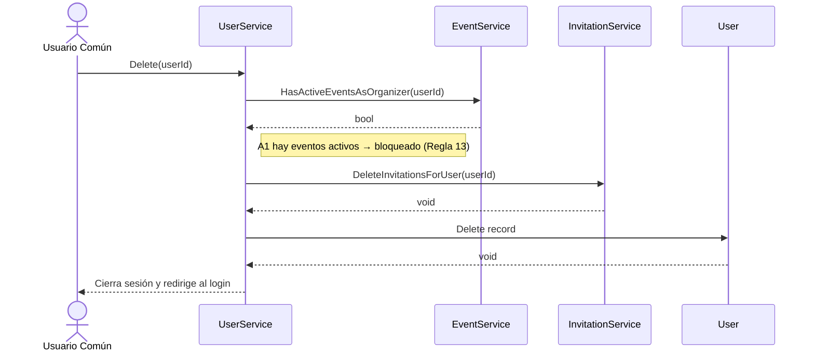
```mermaid
sequenceDiagram
    actor UC as Usuario Común
    participant US as UserService
    participant ES as EventService
    participant IS as InvitationService
    participant U as User

    UC ->> US: Delete(userId)
    US ->> ES: HasActiveEventsAsOrganizer(userId)
    ES -->> US: bool
    Note right of US: A1 hay eventos activos → bloqueado (Regla 13)
    US ->> IS: DeleteInvitationsForUser(userId)
    IS -->> US: void
    US ->> U: Delete record
    U -->> US: void
    US -->> UC: Cierra sesión y redirige al login
```

---

## Crear evento

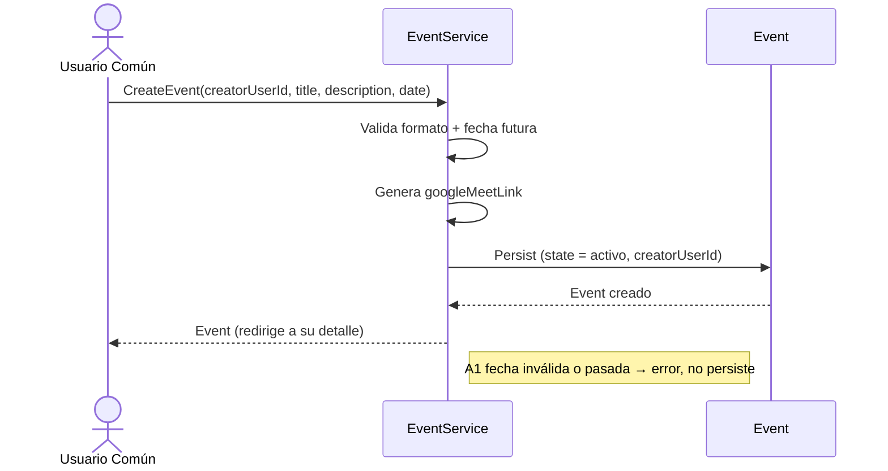
```mermaid
sequenceDiagram
    actor UC as Usuario Común
    participant ES as EventService
    participant E as Event

    UC ->> ES: CreateEvent(creatorUserId, title, description, date)
    ES ->> ES: Valida formato + fecha futura
    ES ->> ES: Genera googleMeetLink
    ES ->> E: Persist (state = activo, creatorUserId)
    E -->> ES: Event creado
    ES -->> UC: Event (redirige a su detalle)
    Note right of ES: A1 fecha inválida o pasada → error, no persiste
```

---

## Modificar evento

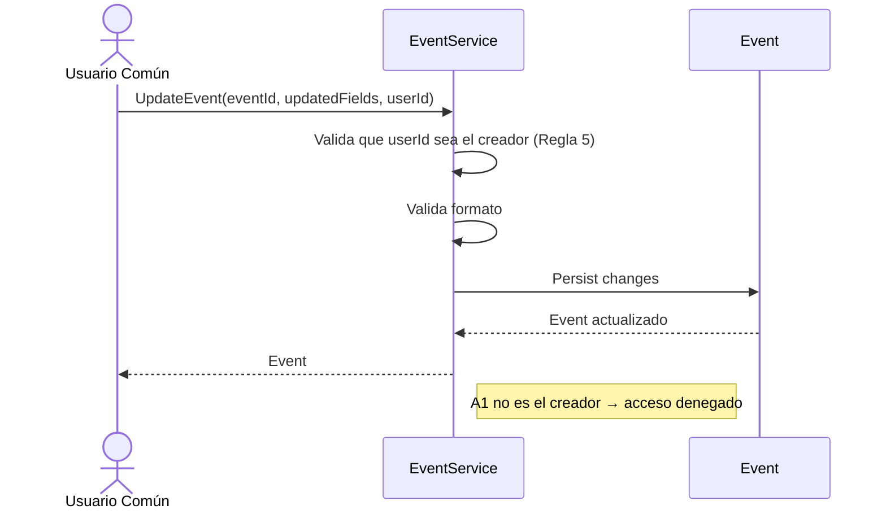
```mermaid
sequenceDiagram
    actor UC as Usuario Común
    participant ES as EventService
    participant E as Event

    UC ->> ES: UpdateEvent(eventId, updatedFields, userId)
    ES ->> ES: Valida que userId sea el creador (Regla 5)
    ES ->> ES: Valida formato
    ES ->> E: Persist changes
    E -->> ES: Event actualizado
    ES -->> UC: Event
    Note right of ES: A1 no es el creador → acceso denegado
```

---

## Eliminar evento

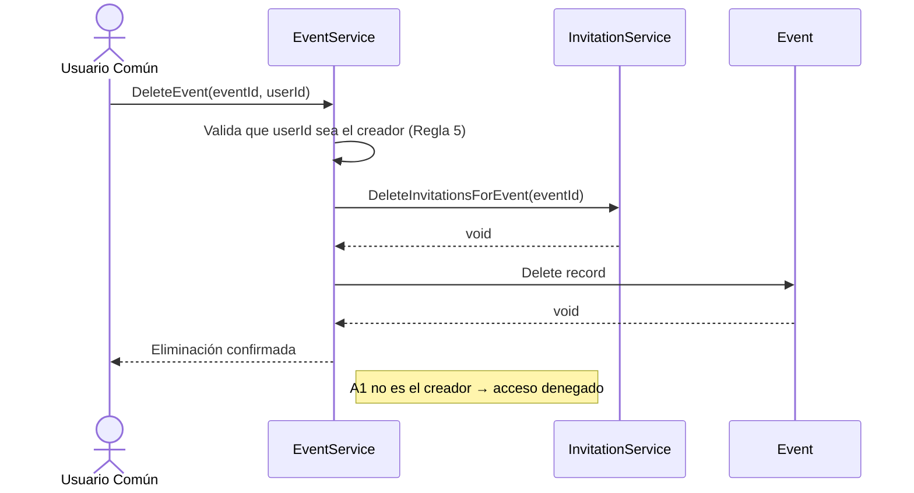
```mermaid
sequenceDiagram
    actor UC as Usuario Común
    participant ES as EventService
    participant IS as InvitationService
    participant E as Event

    UC ->> ES: DeleteEvent(eventId, userId)
    ES ->> ES: Valida que userId sea el creador (Regla 5)
    ES ->> IS: DeleteInvitationsForEvent(eventId)
    IS -->> ES: void
    ES ->> E: Delete record
    E -->> ES: void
    ES -->> UC: Eliminación confirmada
    Note right of ES: A1 no es el creador → acceso denegado
```

---

## Invitar asistentes

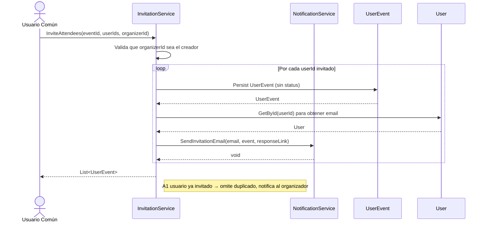
```mermaid
sequenceDiagram
    actor UC as Usuario Común
    participant IS as InvitationService
    participant NS as NotificationService
    participant UE as UserEvent
    participant U as User

    UC ->> IS: InviteAttendees(eventId, userIds, organizerId)
    IS ->> IS: Valida que organizerId sea el creador
    loop Por cada userId invitado
        IS ->> UE: Persist UserEvent (sin status)
        UE -->> IS: UserEvent
        IS ->> U: GetById(userId) para obtener email
        U -->> IS: User
        IS ->> NS: SendInvitationEmail(email, event, responseLink)
        NS -->> IS: void
    end
    IS -->> UC: List<UserEvent>
    Note right of IS: A1 usuario ya invitado → omite duplicado, notifica al organizador
```

---

## Ver detalle de evento propio

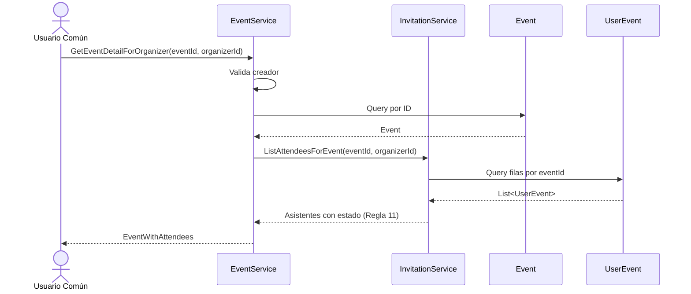
```mermaid
sequenceDiagram
    actor UC as Usuario Común
    participant ES as EventService
    participant IS as InvitationService
    participant E as Event
    participant UE as UserEvent

    UC ->> ES: GetEventDetailForOrganizer(eventId, organizerId)
    ES ->> ES: Valida creador
    ES ->> E: Query por ID
    E -->> ES: Event
    ES ->> IS: ListAttendeesForEvent(eventId, organizerId)
    IS ->> UE: Query filas por eventId
    UE -->> IS: List<UserEvent>
    IS -->> ES: Asistentes con estado (Regla 11)
    ES -->> UC: EventWithAttendees
```

---

## Ver listado de asistentes

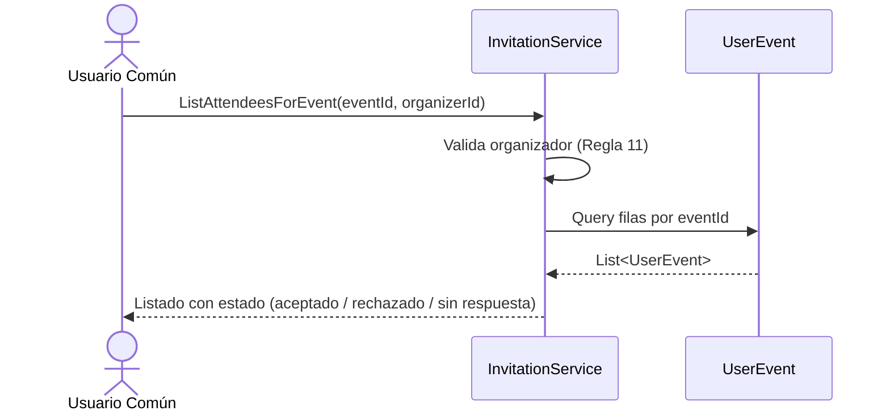
```mermaid
sequenceDiagram
    actor UC as Usuario Común
    participant IS as InvitationService
    participant UE as UserEvent

    UC ->> IS: ListAttendeesForEvent(eventId, organizerId)
    IS ->> IS: Valida organizador (Regla 11)
    IS ->> UE: Query filas por eventId
    UE -->> IS: List<UserEvent>
    IS -->> UC: Listado con estado (aceptado / rechazado / sin respuesta)
```

---

## Ver mis invitaciones

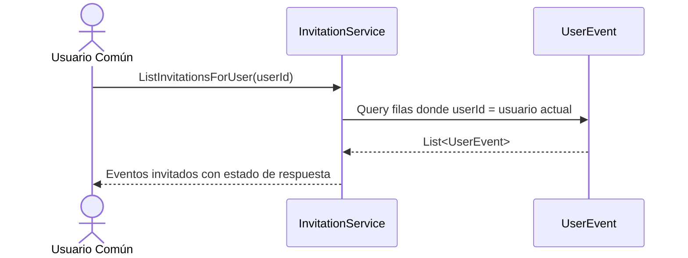
```mermaid
sequenceDiagram
    actor UC as Usuario Común
    participant IS as InvitationService
    participant UE as UserEvent

    UC ->> IS: ListInvitationsForUser(userId)
    IS ->> UE: Query filas donde userId = usuario actual
    UE -->> IS: List<UserEvent>
    IS -->> UC: Eventos invitados con estado de respuesta
```

---

## Aceptar invitación

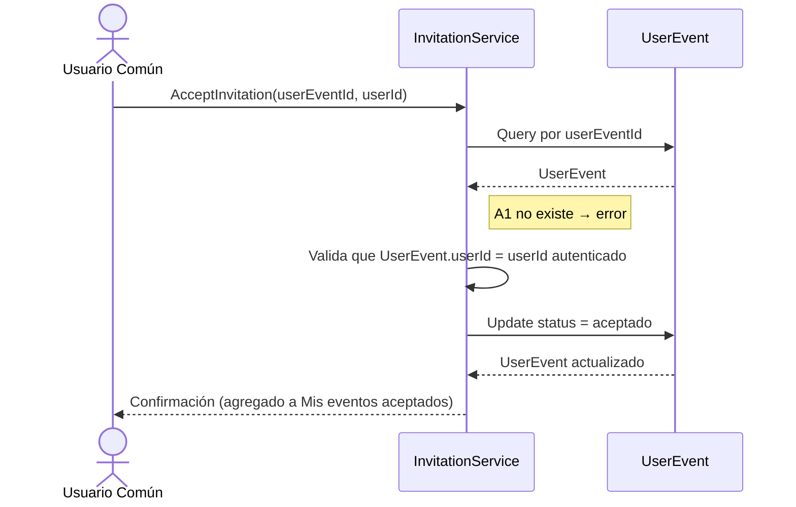
```mermaid
sequenceDiagram
    actor UC as Usuario Común
    participant IS as InvitationService
    participant UE as UserEvent

    UC ->> IS: AcceptInvitation(userEventId, userId)
    IS ->> UE: Query por userEventId
    UE -->> IS: UserEvent
    Note right of IS: A1 no existe → error
    IS ->> IS: Valida que UserEvent.userId = userId autenticado
    IS ->> UE: Update status = aceptado
    UE -->> IS: UserEvent actualizado
    IS -->> UC: Confirmación (agregado a Mis eventos aceptados)
```

---

## Rechazar invitación

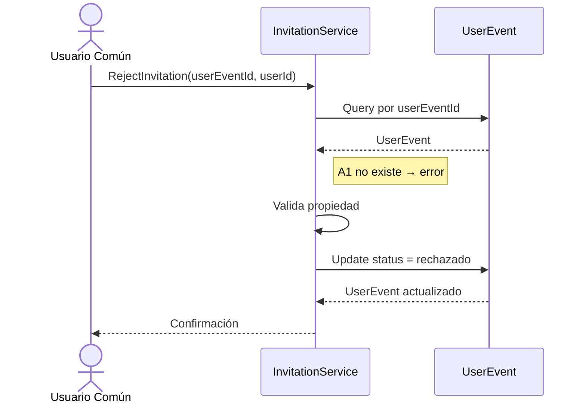
```mermaid
sequenceDiagram
    actor UC as Usuario Común
    participant IS as InvitationService
    participant UE as UserEvent

    UC ->> IS: RejectInvitation(userEventId, userId)
    IS ->> UE: Query por userEventId
    UE -->> IS: UserEvent
    Note right of IS: A1 no existe → error
    IS ->> IS: Valida propiedad
    IS ->> UE: Update status = rechazado
    UE -->> IS: UserEvent actualizado
    IS -->> UC: Confirmación
```

---

## Ver detalle de evento como asistente

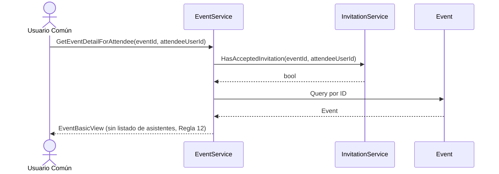
```mermaid
sequenceDiagram
    actor UC as Usuario Común
    participant ES as EventService
    participant IS as InvitationService
    participant E as Event

    UC ->> ES: GetEventDetailForAttendee(eventId, attendeeUserId)
    ES ->> IS: HasAcceptedInvitation(eventId, attendeeUserId)
    IS -->> ES: bool
    ES ->> E: Query por ID
    E -->> ES: Event
    ES -->> UC: EventBasicView (sin listado de asistentes, Regla 12)
```

---

## Unirse al evento

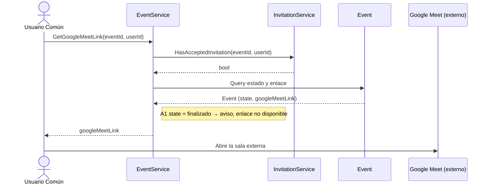
```mermaid
sequenceDiagram
    actor UC as Usuario Común
    participant ES as EventService
    participant IS as InvitationService
    participant E as Event
    participant GM as Google Meet (externo)

    UC ->> ES: GetGoogleMeetLink(eventId, userId)
    ES ->> IS: HasAcceptedInvitation(eventId, userId)
    IS -->> ES: bool
    ES ->> E: Query estado y enlace
    E -->> ES: Event (state, googleMeetLink)
    Note right of ES: A1 state = finalizado → aviso, enlace no disponible
    ES -->> UC: googleMeetLink
    UC ->> GM: Abre la sala externa
```
